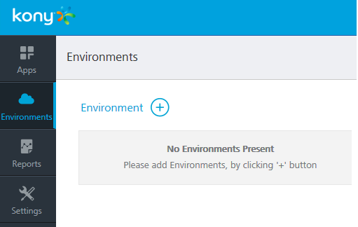
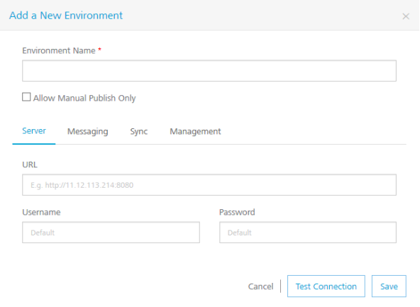
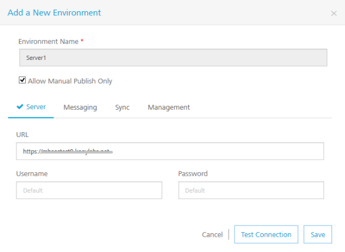

  

Environments
============

You need to create an environment to publish your apps. Environments can include at least one server or a combination of all such as VoltMX Foundry Server, VoltMX Foundry Messaging, VoltMX Foundry Sync, and VoltMX Foundry Management.

As a user, you must be an admin or owner to access the Environments page and perform different tasks based on the role.  
  
Ensure that your environments include all required servers that are part of an app.  
  
For example, if your environment contains only VoltMX Foundry Sync, and you try to publish an app with VoltMX Foundry Messaging, the system throws an error.

How to Add an Environment
-------------------------

You can add as many environments with different combinations of servers.

To add an environment, follow these steps:

1.  In your Foundry account, click **Environments**. The **Environments** page appears.
    
    
    
2.  Click the **Add a New Environment** button.
3.  In the **Add a New Environment**, enter an environment name.
    
    
    
4.  Select the **Allow Manual Publish Only** check box to confirm this environment to be a manual publish environment. By default, the **Allow Manual Publish Only** check box is cleared.
    
      If you create an environment by selecting the **Allow Manual Publish Only** check box, in the **Publish** tab, the **Manual Publish** icon appears for the environment. The Manual Publish icon denotes that the environment is configured for manual publish. For more details about how to use manual publish, refer to the [Publish the App](Publishing the Service.md) section.
    
5.  In the Server tab, provide the following details:
    *   **URL**: Enter the URL for your VoltMX Foundry Server.
    *   **Username**: By default, this field shows the default username of VoltMX Foundry Server. You can modify if required.
        
         You need to modify the username and password only if these credentials are changed via the VoltMX Foundry Server console.
        
    *   **Password**: By default, this field shows the default password of VoltMX Foundry Server. You can modify if required.   
6.  To configure VoltMX Foundry Messaging or VoltMX Foundry Sync or VoltMX Foundry Management, click the respective tabs and enter details.
7.  Once you enter details, click **Test Connection**. If the server details are correct, the system displays a check mark next to a service, shown below:
    
    
    
8.  Click **Save** to apply the environment capabilities. The environment is created in the **Environments** page.
