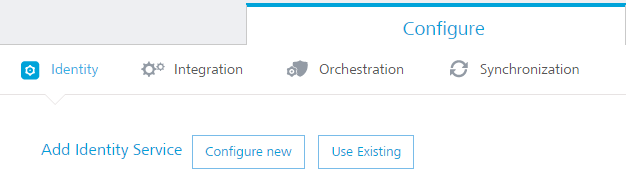
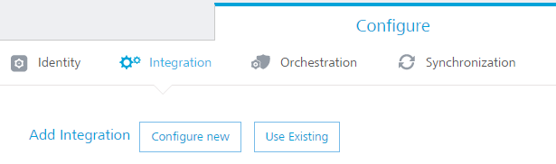
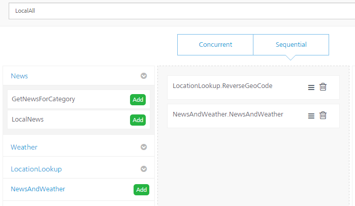
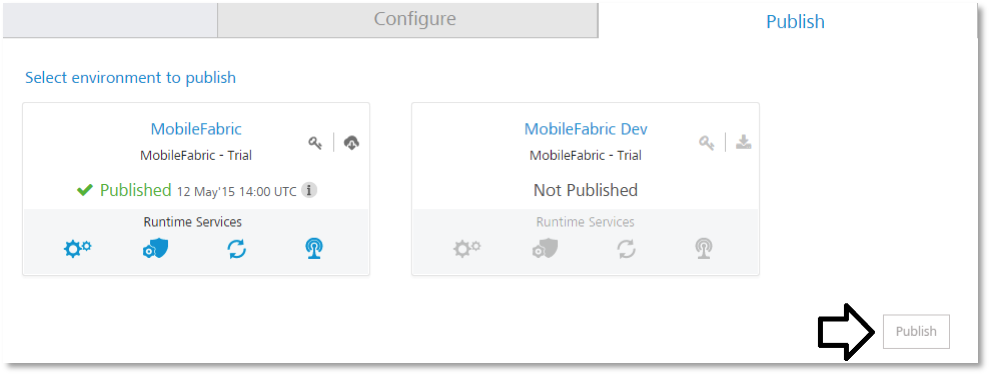

   

11\.   News and Weather Application

This section discusses the details of building and configuration of a sample News and Weather application using VoltMX Foundry. Following details are included in this section  for the News and Weather application:

Overview of the application

    Creation of a Foundry Application

    Creation of Identity Service

Creation of the integration service

Creation of the Orchestration Service

10.1  Overview of the News and Weather Application

This document describes how to create a VoltMX Foundry Integration Services and Orchestration Services to get News (by category, Local News) & Weather Forecast from different web-services..

10.2  Creation of News and Weather Application in Foundry

Follow the steps below to create a Foundry Application using the account that has been created using the VoltMX Cloud Portal.

*   Log-in to your VoltMX Cloud Portal
*   Click Apps in the left menu
*   Under Apps click on Applicationsà Custom Apps to create a new Application

*   A new VoltMX Foundry Application is created, and you will be navigated to the app configuration page
*   To change the app name, click on the pencil (edit) icon next to the app title (see below)

10.3  Identity Service

Follow Identity is a service that validates the authentication of your users before they can access your application. In this application we are not configuring any Identity services so that any user can access the application..

You can configure Identity Service under IdentityTab(See below) the steps below to create a Foundry Application using the account that has been created using the VoltMX Cloud Portal.

10.3  Integration Service

The Integration tab is where you define services for your application.

A service is an application component that represents the application interaction with the external data source. A service definition comprises the meta-data or the configurations required to exchange data with the external data source. For example, the configurations can be service type, service ID, input parameters, output parameters, preprocessors and postprocessors, target URL, authentication credentials if required, and type (HTTP/HTTPS).

The service definition enables the application to exchange data with any external data source. The Foundry provides back-end for connecting to a Web service and an XML service. Even if the external data source does not expose the services to these well-known interfaces, the developer can build a Java service.

Let’s create three different services for our application:

1.  News
2.  Weather
3.  Location Lookup

10.3.1  How to create and configure News service

We need to configure these services in Integration Tab (see below).

*   Select “Configure New”, in the screen shown above, to continue
*   Provide a name for integration service. Let’s give name as “News”
*   From Service Type dropdown select “XML”
*   Give [https://news.google.com/news/section?output=rss&](https://news.google.com/news/section?output=rss&) in BaseUrl field
*   Click on “Save and Continue” to add the operations
*   Give “GetNewsForCategory” in Operation name field and click on Configure Operation. You will be redirected to another page where you can configure the operation.

Steps to configure the GetNewsForCategory operation.

1.  Add this value “topic=$category” in New operation path field
2.  Configure “GET” in Http Methods Dropdown
3.  Now Select “Public” in Operation security Level dropdown. We are making this service public which means we don’t any authentication to access this operation
4.  Click on Input label. In this section we will configure the Input parameters for the operation
5.  Add category as input field and test value “w” which will retrieve the world news and click on “Test” button which is at bottom of the page. You will see the “<testdata></testdata>”in Result section which is on right pane. The result will be converted to a JSON before being sent to the device
6.  Now click on Response tab which will show the xml response from the service. To send the response to the client we have to configure the output tab
7.  Click on “+” sign to insert the output fields

Below are the output fields you have to create which will be sent to the mobile client.

<table class="table_2"><colgroup><col style="width: 71pt;"> <col style="width: 71pt;"> <col style="width: 64pt;"> <col style="width: 65pt;"> <col style="width: 65pt;"> <col style="width: 71pt;"> <col style="width: 51pt;"> <col style="width: 50pt;"></colgroup><tbody><tr style="height: 38pt;"><td class="td_10">
ID
</td><td class="td_11">
Path
</td><td class="td_11">
Scope
</td><td class="td_11">
Datatype
</td><td class="td_11">
Collection ID
</td><td class="td_11">
Record ID
</td><td class="td_11">
Format
</td><td class="td_11">
Format Value
</td></tr><tr style="height: 30pt;"><td class="td_12">
news_list
</td><td class="td_13">
Channel
</td><td class="td_13">
Response
</td><td class="td_13">
Collection
</td><td class="td_13">
&nbsp;
</td><td class="td_13">
&nbsp;
</td><td class="td_13">
None
</td><td class="td_13">
&nbsp;
</td></tr><tr style="height: 17pt;"><td class="td_12">
news_item
</td><td class="td_13">
Item
</td><td class="td_13">
Response
</td><td class="td_13">
Record
</td><td class="td_13">
news_list
</td><td class="td_13">
&nbsp;
</td><td class="td_13">
None
</td><td class="td_13">
&nbsp;
</td></tr><tr style="height: 22pt;"><td class="td_12">
Title
</td><td class="td_13">
Title
</td><td class="td_13">
Response
</td><td class="td_13">
String
</td><td class="td_13">
&nbsp;
</td><td class="td_13">
news_item
</td><td class="td_13">
None
</td><td class="td_13">
&nbsp;
</td></tr><tr style="height: 30pt;"><td class="td_12">
Link
</td><td class="td_13">
link
</td><td class="td_13">
Response
</td><td class="td_13">
String
</td><td class="td_13">
&nbsp;
</td><td class="td_13">
news_item
</td><td class="td_13">
None
</td><td class="td_13">
&nbsp;
</td></tr><tr style="height: 30pt;"><td class="td_12">
Description
</td><td class="td_13">
description
</td><td class="td_13">
Response
</td><td class="td_13">
String
</td><td class="td_13">
&nbsp;
</td><td class="td_13">
news_item
</td><td class="td_13">
None
</td><td class="td_13">
&nbsp;
</td></tr></tbody></table>

Once you create above all fields you click on Test to see the Result tab.

Now you will see all the data which will be sent to mobile client. Then click on “Save Operation”.

We will create one more operation “LocalNews”

Steps to configure the LocalNews operation:

1.  Add this value “q=$cityName” in New operation path field
2.  Configure “GET” in Http Methods Dropdown
3.  Now Select “Public” in Operation security Level dropdown. We are making this service public which means we don’t any authentication to access this operation
4.  Click on Input label. In this section we will configure the Input parameters for the operation
5.  Add cityName as input field and test value “New York” which will retrieve the local news and click on “Test” button which is at bottom of the page. You will see the “<testdata></testdata>”in Result section which is on right pane
6.  Now click on Response tab which will show the xml response from the service. To send the response to the client we have to configure the output tab. The result will be converted to a JSON before being sent to the device
7.  Click on “+” sign to insert the output fields

Below are the output fields you have to create which will be sent to mobile client.

<table class="table_2"><colgroup><col style="width: 71pt;"> <col style="width: 71pt;"> <col style="width: 64pt;"> <col style="width: 65pt;"> <col style="width: 65pt;"> <col style="width: 71pt;"> <col style="width: 51pt;"> <col style="width: 50pt;"></colgroup><tbody><tr style="height: 38pt;"><td class="td_10">
ID
</td><td class="td_11">
Path
</td><td class="td_11">
Scope
</td><td class="td_11">
Datatype
</td><td class="td_11">
Collection ID
</td><td class="td_11">
Record ID
</td><td class="td_11">
Format
</td><td class="td_11">
Format Value
</td></tr><tr style="height: 30pt;"><td class="td_12">
news_list
</td><td class="td_13">
Channel
</td><td class="td_13">
Response
</td><td class="td_13">
Collection
</td><td class="td_13">
&nbsp;
</td><td class="td_13">
&nbsp;
</td><td class="td_13">
None
</td><td class="td_13">
&nbsp;
</td></tr><tr style="height: 17pt;"><td class="td_12">
news_item
</td><td class="td_13">
Item
</td><td class="td_13">
Response
</td><td class="td_13">
Record
</td><td class="td_13">
news_list
</td><td class="td_13">
&nbsp;
</td><td class="td_13">
None
</td><td class="td_13">
&nbsp;
</td></tr><tr style="height: 22pt;"><td class="td_12">
Title
</td><td class="td_13">
Title
</td><td class="td_13">
Response
</td><td class="td_13">
String
</td><td class="td_13">
&nbsp;
</td><td class="td_13">
news_item
</td><td class="td_13">
None
</td><td class="td_13">
&nbsp;
</td></tr><tr style="height: 30pt;"><td class="td_12">
Link
</td><td class="td_13">
Link
</td><td class="td_13">
Response
</td><td class="td_13">
String
</td><td class="td_13">
&nbsp;
</td><td class="td_13">
news_item
</td><td class="td_13">
None
</td><td class="td_13">
&nbsp;
</td></tr><tr style="height: 30pt;"><td class="td_12">
Description
</td><td class="td_13">
description
</td><td class="td_13">
Response
</td><td class="td_13">
String
</td><td class="td_13">
&nbsp;
</td><td class="td_13">
news_item
</td><td class="td_13">
None
</td><td class="td_13">
&nbsp;
</td></tr></tbody></table>

Once you create above all fields you click on Test to see the Result tab.

Now you will see all the data which will be sent to mobile client. Then click on “Save Operation”.

10.3.1  How to create and configure Weather service

1.  Select Configure New
2.  Provide a name for integration service. We will give name as “Weather”
3.  From Service Type dropdown select “SOAP”
4.  Then enter the following URLs to complete the service definition:

*   In the Base URL box, type: http://wsf.cdyne.com/WeatherWS/Weather.asmx 

*   In the WSDL URL box, type: http://wsf.cdyne.com/WeatherWS/Weather.asmx?wsdl

5.  Click Save & Continue to retrieve the WSDL. Each of the available operations are listed in a drop-down box. Select GetCityForecastByZip and GetCityWeatherByZip
6.  Click Add Operation. This will create two operations under your Weather service that maps to the SOAP web service methods
7.  To test and edit the GetCityWeatherByZip, click the settings icon and choose Edit
8.  The operation details window opens. A sample web service request is provided showing a placeholder for any input parameters. For the GetCityWeatherByZip, the ZIP is the only input parameter displayed as <ns1:ZIP>?XXX?</ns1:ZIP> in the sample request. At this point, we could hard code a value, but since we want our app to provide the zip code, we need to provide an input variable name: <ns1:ZIP>$zip</ns1:ZIP>. We then need to define that variable under the input tab including a test value of 10036

         On the Output tab, enter the following parameters and path.

         city //City

         state //State

        temp //Temperature

9.  Click the Test button again and the result will be displayed as XML. The result will be converted to a JSON before being sent to the device.
10.  Edit the GetCityForecastByZip in the same way. This service returns a repeating data structure for each day providing that day’s weather forecast. This requires the use of the collection ID under the output tab to create a repeating set of JSON objects. After creating the ZIP input parameter the same way as the previous service, enter the following output parameters:

<table class="table_2"><colgroup><col style="width: 83pt;"> <col style="width: 206pt;"> <col style="width: 71pt;"> <col style="width: 92pt;"></colgroup><tbody><tr style="height: 28pt;"><td class="td_10">
ID
</td><td class="td_11">
Path
</td><td class="td_11">
Datatype
</td><td class="td_11">
Collection ID
</td></tr><tr style="height: 31pt;"><td class="td_12">
ForecastList
</td><td class="td_13">
//ForecastResult/Forecast
</td><td class="td_13">
Collection
</td><td class="td_13">
&nbsp;
</td></tr><tr style="height: 17pt;"><td class="td_12">
Date
</td><td class="td_13">
Forecast/Date
</td><td class="td_13">
Record
</td><td class="td_13">
ForecastList
</td></tr><tr style="height: 17pt;"><td class="td_12">
Desc
</td><td class="td_13">
Forecast/Description
</td><td class="td_13">
String
</td><td class="td_13">
ForecastList
</td></tr><tr style="height: 22pt;"><td class="td_12">
Low
</td><td class="td_13">
Forecast/Description
</td><td class="td_13">
String
</td><td class="td_13">
ForecastList
</td></tr><tr style="height: 31pt;"><td class="td_12">
High
</td><td class="td_13">
Forecast/Temperatures/MorningLow
</td><td class="td_13">
String
</td><td class="td_13">
ForecastList
</td></tr><tr style="height: 31pt;"><td class="td_12">
Daypct
</td><td class="td_13">
Forecast/Temperatures/DaytimeHigh
</td><td class="td_13">
String
</td><td class="td_13">
ForecastList
</td></tr><tr style="height: 31pt;"><td class="td_12">
Nightpct
</td><td class="td_13">
Forecast/ProbabilityOfPrecipiation/Nighttime
</td><td class="td_13">
String
</td><td class="td_13">
ForecastList
</td></tr></tbody></table>

Test your service and you will see the resulting XML showing the repeating collections of forecasts.

10.3.1  How to create and configure Location Lookup service

1.  Select Configure New
2.  Provide a name for integration service. We will give name as “LocationLookup”
3.  From Service Type dropdown select “XML”
4.  Give http://nominatim.openstreetmap.org/reverse?format=xml in BaseUrl field
5.  Click on “Save and Continue” to add the operations

Give “ReverseGeoCode” in Operation name field and click on Configure Operation. You will be redirected to another page where you can configure the operation.

Steps to configure the ReverseGeoCode operation.

1.  Add this value “&lat=$lat&lon=$lon” in New operation path field
2.  Configure “GET” in Http Methods Dropdown
3.  Now Select “Public” in Operation security Level dropdown. We are making this service public which means we don’t any authentication to access this operation
4.  Click on Input label. In this section we will configure the Input parameters for the operation
5.  Add lat as input field and test value “40.7127”
6.  Add lon as input field and test value “-74.0059” which will retrieve the location details and click on “Test” button which is at bottom of the page. You will see the “<testdata></testdata>”in Result section which is on right pane. The result will be converted to a JSON before being sent to the device
7.  Now click on Response tab, which will show the xml response from the service. To send the response to the client we have to configure the output tab
8.  Click on “+” sign to insert the output fields

<table class="table_2"><colgroup><col style="width: 51pt;"> <col style="width: 206pt;"> <col style="width: 71pt;"> <col style="width: 92pt;"> <col style="width: 68pt;"></colgroup><tbody><tr style="height: 28pt;"><td class="td_14">
ID
</td><td class="td_15">
Path
</td><td class="td_15">
Datatype
</td><td class="td_15">
Collection ID
</td><td class="td_15">
Record ID
</td></tr><tr style="height: 31pt;"><td class="td_12">
zip
</td><td class="td_13">
//addressparts/postcode
</td><td class="td_13">
String
</td><td class="td_13">
&nbsp;
</td><td class="td_13">
&nbsp;
</td></tr><tr style="height: 17pt;"><td class="td_12">
city
</td><td class="td_13">
//addressparts/city
</td><td class="td_13">
String
</td><td class="td_13">
&nbsp;
</td><td class="td_13">
&nbsp;
</td></tr></tbody></table>

10.4  Orchestration Service

The Integration tab is where you define services for your application.

Orchestration is the coordination or integration of several services and exposing them as a single service. The mix of services supports the automation of business processes.

The following types of Orchestration services are available in VoltMX Foundry:

Composite Services: Allows you to run two or more services either concurrently or sequentially.

Looping Services: Allows you to run a single service in a loop till the loop ends or exit criteria is met.

We will create the two orchestration services.

1.  NewsAndWeather – Concurrent Service
2.  LocalAll – Sequential Service

  
Creating News and Weather Orchestration service:

Give service name as “News and Weather” and  select Concurrent tab

Now add the below Integration services, by clicking add button beside each service (see below).

1.  LocalNews
2.  GetCityWeatherByZip
3.  GetCityForecastByZip

Now click on save button.

Creating LocalAll Orchestarion service:

Give service name as “LocalAll” Select Sequential tab (see below).

Now add the below services by clicking add button beside each service.

1.  ReverseGeoCode
2.  NewsandWeather which is created in above step

Now click on save button.

Now click on Publish tab (see below) to publish the app into cloud.

