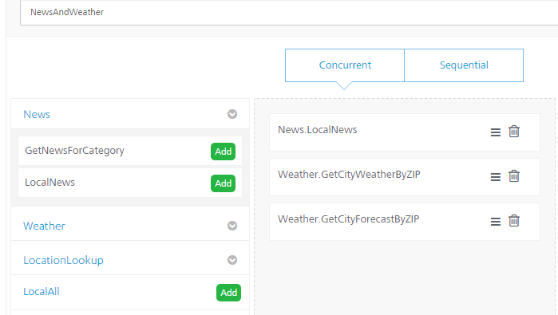

  

News and Weather Application
============================

This section discusses the details of building and configuration of a sample News and Weather application using VoltMX Foundry. Following details are included in this section for the News and Weather application:

*   Overview of the application
*   Creating a Foundry Application
*   Creating the Identity Service
*   Creating the integration service
*   Creating the Orchestration Service

Overview of the News and Weather Application
--------------------------------------------

This document describes how to create a VoltMX Foundry Integration Services and Orchestration Services to get News (by category, Local News) and Weather Forecast from different Web services.

Creation of News and Weather Application in Foundry
--------------------------------------------------------

Follow the steps below to create a Foundry Application using the account that has been created using the VoltMX Cloud Portal.

1.  Log in to your VoltMX Cloud Portal.
2.  Click **Apps** in the left menu.
3.  Under the Applications, click **Custom Apps** to create a new application.
    
    
    
    A new VoltMX Foundry Application is created, and you will be navigated to the app configuration page.
    
4.  To change the app name, click on the pencil (edit) icon next to the app title, shown below:
    
      
    

Identity Service
----------------

An identity is a service that validates the authentication of your users before they can access your application. In this application we are not configuring any identity services so that any user can access the application.

You can configure an identity service under the **Identity** tab, shown below:

The following sections helps you to create a Foundry Application using the account that is created using the VoltMX Cloud Portal.

Integration Service
-------------------

The Integration tab is where you define services for your application.

A service is an application component that represents the application interaction with the external data source. A service definition comprises the meta-data or the configurations required to exchange data with the external data source. For example, the configurations can be service type, service ID, input parameters, output parameters, preprocessors and postprocessors, target URL, authentication credentials if required, and type (HTTP/HTTPS).

The service definition enables the application to exchange data with any external data source. The Foundry provides back-end for connecting to a Web service and an XML service. Even if the external data source does not expose the services to these well-known interfaces, the developer can build a Java service.

Let us create three different services for our application:

1.  News
2.  Weather
3.  Location Lookup

### How to Create and Configure a News Service

We need to configure these services in **Integration** tab, shown below:

1.  Click Configure New.
2.  In the **Service Name** text box, provide a name for the integration service - for example, News.
3.  From the **Service Type** dropdown, select XML.
4.  In the **Base URL** box, type [https://news.google.com/news/section?output=rss&](https://news.google.com/news/section?output=rss&).
5.  Click **Save and Continue** to add the operations.
6.  In **Operation name** field, type GetNewsForCategory, and click **Configure Operation**. You will be redirected to operation details page where you can configure the operation.

To configure the GetNewsForCategory operation, follow these steps:

1.  In the **New Operation Path** field, add the value `topic=$category`.
2.  From the **HTTP** **Methods** drop-down, select GET method for this operation.
3.  Now Select “Public” in Operation security Level dropdown. We are making this service public which means we don’t any authentication to access this operation
4.  Click on **Input** tab. In this section we will configure the input parameters for the operation.
5.  Add category as input field and test value  `w`  which will retrieve the world news. Click the **Test** button, which is at bottom of the page. You will see the <testdata></testdata>in **Result** section, which is on right pane. The result will be converted to a JSON before being sent to the device.
6.  Now click **Response** tab that will show the XML response from the service. To send the response to the client we have to configure the output tab.
7.  Click the **Output** tab. Click the **Plus(+)** button to insert the output fields.
    
    The following is a list of output fields you have to create. These fields will be sent to the mobile client.
    
    | 
    ID
    
     | 
    
    Path
    
     | 
    
    Scope
    
     | 
    
    Datatype
    
     | 
    
    Collection ID
    
     | 
    
    Record ID
    
     | 
    
    Format
    
     | 
    
    Format Value
    
     |
    | --- | --- | --- | --- | --- | --- | --- | --- |
    | 
    
    news\_list
    
     | 
    
    Channel
    
     | 
    
    Response
    
     | 
    
    Collection
    
     | 
    
     | 
    
     | 
    
    None
    
     | 
    
     |
    | 
    
    news\_item
    
     | 
    
    Item
    
     | 
    
    Response
    
     | 
    
    Record
    
     | 
    
    news\_list
    
     | 
    
     | 
    
    None
    
     | 
    
     |
    | 
    
    Title
    
     | 
    
    Title
    
     | 
    
    Response
    
     | 
    
    String
    
     | 
    
     | 
    
    news\_item
    
     | 
    
    None
    
     | 
    
     |
    | 
    
    Link
    
     | 
    
    link
    
     | 
    
    Response
    
     | 
    
    String
    
     | 
    
     | 
    
    news\_item
    
     | 
    
    None
    
     | 
    
     |
    | 
    
    Description
    
     | 
    
    description
    
     | 
    
    Response
    
     | 
    
    String
    
     | 
    
     | 
    
    news\_item
    
     | 
    
    None
    
     | 
    
     |
    

1.  Once you create above all fields, click the **Test** button to see the **Result** tab.
    
    Now you will see all the data, which will be sent to mobile client.
    

1.  Click **Save Operation**.

**To create one more operation for LocalNews, follow these steps:**

1.  In the **New Operation Path** field, add the value `q=$cityName`.
2.  From the **HTTP** **Methods** drop-down, select GETmethod for this operation.
3.  Now Select “Public” in Operation security Level dropdown. We are making this service public which means we don’t any authentication to access this operation
4.  Click on **Input** tab. In this section we will configure the input parameters for the operation.
5.  Add `cityName` as input field and test value  `New York`  which will retrieve the local news. Click the **Test** button, which is at bottom of the page. You will see the <testdata></testdata>in **Result** section, which is on right pane. The result will be converted to a JSON before being sent to the device.
6.  Now click **Response** tab that will show the XML response from the service. To send the response to the client we have to configure the output tab. The result will be converted to a JSON before being sent to the device.
7.  Click the **Output** tab. Click the **Plus(+)** button to insert the output fields.
    
    The following is a list of output fields you have to create. These fields will be sent to the mobile client.
    
    | 
    ID
    
     | 
    
    Path
    
     | 
    
    Scope
    
     | 
    
    Datatype
    
     | 
    
    Collection ID
    
     | 
    
    Record ID
    
     | 
    
    Format
    
     | 
    
    Format Value
    
     |
    | --- | --- | --- | --- | --- | --- | --- | --- |
    | 
    
    news\_list
    
     | 
    
    Channel
    
     | 
    
    Response
    
     | 
    
    Collection
    
     | 
    
     | 
    
     | 
    
    None
    
     | 
    
     |
    | 
    
    news\_item
    
     | 
    
    Item
    
     | 
    
    Response
    
     | 
    
    Record
    
     | 
    
    news\_list
    
     | 
    
     | 
    
    None
    
     | 
    
     |
    | 
    
    Title
    
     | 
    
    Title
    
     | 
    
    Response
    
     | 
    
    String
    
     | 
    
     | 
    
    news\_item
    
     | 
    
    None
    
     | 
    
     |
    | 
    
    Link
    
     | 
    
    Link
    
     | 
    
    Response
    
     | 
    
    String
    
     | 
    
     | 
    
    news\_item
    
     | 
    
    None
    
     | 
    
     |
    | 
    
    Description
    
     | 
    
    description
    
     | 
    
    Response
    
     | 
    
    String
    
     | 
    
     | 
    
    news\_item
    
     | 
    
    None
    
     | 
    
     |
    

1.  Once you create above all fields, click the **Test** button to see the **Result** tab.
    
    Now you will see all the data, which will be sent to mobile client.
    

1.  Click **Save Operation**.

### How to Create and Configure a Weather Service

1.  In the **Integration** page, click Configure New.
2.  In the **Service Name** text box, provide a name for the integration service - for example, Weather.
3.  From the **Service Type** dropdown, select SOAP.
4.  Enter the following URLs to complete the service definition:
    
    *   In the **Base URL** box, type: [http://wsf.cdyne.com/WeatherWS/Weather.asmx](http://wsf.cdyne.com/WeatherWS/Weather.asmx) 
    *   In the **WSDL URL**box, type: [http://wsf.cdyne.com/WeatherWS/Weather.asmx?wsdl](http://wsf.cdyne.com/WeatherWS/Weather.asmx?wsdl)
5.  Click **Save and Continue** to retrieve the WSDL. Each of the available operations are listed in the **Operation name** drop-down list. Select GetCityForecastByZip and **GetCityWeatherByZip** check boxes from the drop-down.

5.  Click Add Operation. This will create two operations under your Weather service that maps to the SOAP web service methods.
6.  To test and edit the GetCityWeatherByZip, click the **Settings** button and choose Edit.
7.  The operation details window appears. A sample Web service request is provided showing a placeholder for any input parameters. For the GetCityWeatherByZip, the ZIP is the only input parameter displayed as `<ns1:ZIP>?XXX?</ns1:ZIP>` in the sample request. At this point, we could hard code a value, but since we want our app to provide the zip code, we need to provide an input variable name: `<ns1:ZIP>$zip</ns1:ZIP>`. We then need to define that variable under the Input tab including a test value of 10036.

1.      On the **Output** tab, enter the following parameters and path.
    *   city //City
    *   state //State
    *   temp //Temperature

9.  Click the Test button again and the result will be displayed as XML. The result will be converted to a JSON before being sent to the device.
10.  Edit the GetCityForecastByZip in the same way. This service returns a repeating data structure for each day providing that day’s weather forecast. This requires the use of the collection ID under the output tab to create a repeating set of JSON objects. After creating the ZIP input parameter the same way as the previous service, enter the following output parameters:
    
       
    | 
    ID
    
     | 
    
    Path
    
     | 
    
    Datatype
    
     | 
    
    Collection ID
    
     |
    | --- | --- | --- | --- |
    | 
    
    ForecastList
    
     | 
    
    //ForecastResult/Forecast
    
     | 
    
    Collection
    
     | 
    
     |
    | 
    
    Date
    
     | 
    
    Forecast/Date
    
     | 
    
    Record
    
     | 
    
    ForecastList
    
     |
    | 
    
    Desc
    
     | 
    
    Forecast/Description
    
     | 
    
    String
    
     | 
    
    ForecastList
    
     |
    | 
    
    Low
    
     | 
    
    Forecast/Description
    
     | 
    
    String
    
     | 
    
    ForecastList
    
     |
    | 
    
    High
    
     | 
    
    Forecast/Temperatures/MorningLow
    
     | 
    
    String
    
     | 
    
    ForecastList
    
     |
    | 
    
    Daypct
    
     | 
    
    Forecast/Temperatures/DaytimeHigh
    
     | 
    
    String
    
     | 
    
    ForecastList
    
     |
    | 
    
    Nightpct
    
     | 
    
    Forecast/ProbabilityOfPrecipiation/Nighttime
    
     | 
    
    String
    
     | 
    
    ForecastList
    
     |
    

Test your service and you will see the resulting XML showing the repeating collections of forecasts.

### How to Create and Configure a Location Lookup Service

1.  In the **Integration** page, click Configure New.
2.  In the **Service Name** text box, provide a name for the integration service - for example, LocationLookup.
3.  From the **Service Type** drop-down, select XML.
4.  In the **Base URL** box, type h[ttp://nominatim.openstreetmap.org/reverse?format=xml](ttp://nominatim.openstreetmap.org/reverse?format=xml).
5.  Click **Save and Continue** to add the operations.
6.  In **Operation name** field, type ReverseGeoCode, and click **Configure Operation**. You will be redirected to operation details page where you can configure the operation.

To configure the ReverseGeoCode operation, follow these steps:

1.  In the **New Operation Path** field, add the value `&lat=$lat&lon=$lon`.
2.  From the **HTTP** **Methods** drop-down, select GETmethod for this operation.
3.  Now Select “Public” in Operation security Level dropdown. We are making this service public which means we don’t any authentication to access this operation
4.  Click on **Input** tab. In this section we will configure the input parameters for the operation.
5.  Add lat as input field and test value  `40.7127`. Add lon as input field and test value  `-74.0059`, which will retrieve the location details. Click the **Test** button, which is at bottom of the page. You will see the <testdata></testdata>in **Result** section, which is on right pane. The result will be converted to a JSON before being sent to the device.
6.  Now click **Response** tab that will show the XML response from the service. To send the response to the client we have to configure the Output tab.
7.  Click the **Output** tab. Click the **Plus(+)** button to insert the output fields.
    
    The following is a list of output fields you have to create. These fields will be sent to the mobile client.
    
    | 
    ID
    
     | 
    
    Path
    
     | 
    
    Datatype
    
     | 
    
    Collection ID
    
     | 
    
    Record ID
    
     |
    | --- | --- | --- | --- | --- |
    | 
    
    zip
    
     | 
    
    //addressparts/postcode
    
     | 
    
    String
    
     | 
    
     | 
    
     |
    | 
    
    city
    
     | 
    
    //addressparts/city
    
     | 
    
    String
    
     | 
    
     | 
    
     |
    

Orchestration Service
---------------------

The Integration tab is where you define services for your application.

Orchestration is the coordination or integration of several services and exposing them as a single service. The mix of services supports the automation of business processes.

The following types of orchestration services are available in VoltMX Foundry:

*   **Composite Services**: Allows you to run two or more services either concurrently or sequentially.
*   **Looping Services**: Allows you to run a single service in a loop till the loop ends or exit criteria is met.

We will create the two orchestration services.

*   NewsAndWeather – Concurrent Service.
*   LocalAll – Sequential Service.

### Creating News and Weather Orchestration Service  

We need to configure these services in **Orchestration** tab, shown below:

1.  Click **Create Composite**.
2.  In the service name, enter **NewsandWeather** and click the **Concurrent** tab.
3.  Now add the below integration services, by clicking the **Add** button next to each service, shown below:
    
    *   LocalNews
    *   GetCityWeatherByZip
    *   GetCityForecastByZip
    
    
    
4.  Click the **Save** button.

### Creating **LocalAll** Orchestration Service

1.  In the **Orchestration** page, click **Create Composite**.
2.  In the service name, enter **LocalAll** and click the **Sequential** tab.
3.  Now add the below integration services, by clicking the **Add** button next to each service, shown below:
    
    *   ReverseGeoCode
    *   NewsandWeather that you have created in previous section step.
    
    
    
4.  Click the **Save** button.
5.  Now click the **Publish** tab (see below) to publish the app into cloud.
    
    
    

1.  Select the environment and click the **Publish** button.
