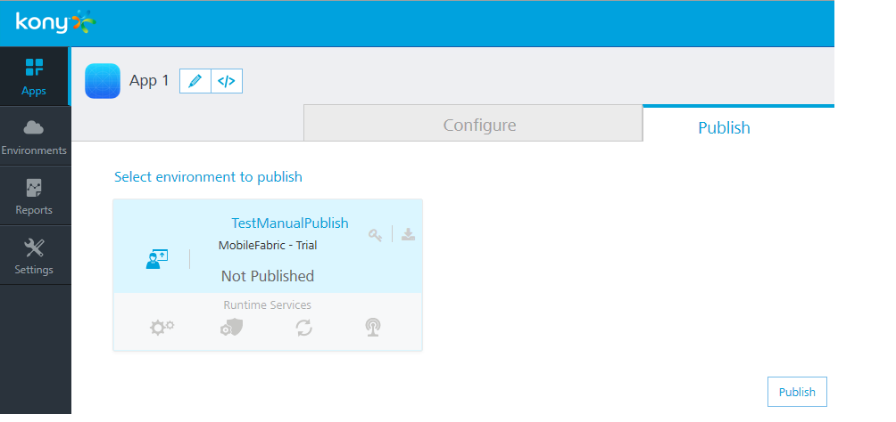
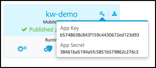

 

Publishing the App
==================

Once you have configured your demo app to use VoltMX User Repository identity service, you need to publish the app.

Based on environments created, VoltMX Foundry Console allows you to publish apps by using automated publish or manual publish.

*   With automated publish, your apps are published to clouds or environments.
*   Manual Publish is required only because of some limitations with publishing custom code associated with integration services.

To publish a service, follow these steps:

1.  Click the **Publish** tab to view your available environments.
2.  Select your target environment, and then click **Publish**.
    
    
    

Testing the Service
-------------------

Now that the identity service for our app has been published, we can test the service by trying to authenticate as our demo user. To do this, we need the app key, app secret, and the identity service URL of our runtime environment.

For testing the service, follow these steps:

1.  From the **Publish** tab, click the key icon of our runtime environment.
    
    
    
    The app key and app secret are displayed.
    
    The App key, App secret, and Service URL are used to initialize a client app to use Foundry services.
    
    App Key is unique to each environment.
    
2.  Click the download icon, and then click **App Service Document**.
    
    
    
    This will display a configuration JSON used by the client app to discover what services are available to this app in this environment. The configuration also contains the **login URL** to the user store (highlighted in red).
    
3.  Test the service using the following cURL command for authenticating a user.
    
     cURL - a command line tool for getting or sending files using URL syntax. This guide uses the cURL command to represent a mobile device making HTTPS API calls to a VoltMX Foundry environment. cURL is typically pre-installed on Linux and Mac systems.  
    For Windows, go to [http://curl.haxx.se/download.html](http://curl.haxx.se/download.html), download cURL, and the SSL libraries required to connect to HTTPS URLs.  
      
    For cURL commands and documentation, refer to [http://curl.haxx.se/docs/](http://curl.haxx.se/docs/)
    
    curl -X POST -H "X-VoltMX-App-Key: 24662f8e60c8a5cd2b2117e37d22fe32" -H "X-VoltMX-App-Secret: 75aa0fe163ace8f5c4a92245b97d95c6" -H "Accept: application/json" -H "Content-Type: application/x-www-form-urlencoded" -d 'userid=demo%40voltmx.com&password=Pass1234' 'https://100000032.auth.voltmxcloud.com/login?provider=userstore'
    
4.  The JSON response contains the following elements:
    
    1.  **profile**: Includes user profile information. In this case, it is the user profile attributes from VoltMX User Repository. If this identity services were connected to an enterprise identity service provider, this would include user profile information from that system.
        
    2.  **provider token**: This is the security token returned from the external identity service provider such as Active Directory or Salesforce. In this case, it is the token returned from the VoltMX User Repository.
        
    3.  **refresh token**: The refresh token has a longer timeout than the provider token. The refresh token can be used to get a new provider token, but it requires the use of the app key and app secret to request a new provider token.
        
    4.  **claims token**: This is a VoltMX Foundry claims token that will be used for any subsequent calls to Integration, Orchestration, Sync, or Messaging services.
        
    
    The token values are formatted as JWT tokens and are digitally signed by the server so they can be validated by the server on subsequent calls. They can be decoded using a JWT decoder such as [https://developers.google.com/wallet/digital/docs/jwtdecoder](https://developers.google.com/wallet/digital/docs/jwtdecoder) to view the data it includes.
    
    The following is a sample JSON response from the cURL command:
    
```
{  
        "profile": {
            "email": "demo@voltmx.com",  
            "userid": "demo@voltmx.com",  
            "firstname": "Demo",  
            "lastname": "User"
        },  
        "provider\_token": {  
           "exp": 1412190752000,  
           "value":  
    "eyAiYWxnIjogIk5PTkUiLCAidHlwIjogImp3cyIgfQ.eyAiX2FjcyI6ICIxMDAw  
    MDAwMzIiLCAiZXhwIjogMTQxMjE5MDc1MiwgIl9pc3NtZXRhIjogIi9hcGkvdjEv  
    bWV0YWRhdGEvVXl3M0pDdVU4XzVnUEZFNzdCM3ZGdz09IiwgIl92ZXIiOiAidjEu  
    MSIsICJfcHJvdl91c2VyaWQiOiAiZGVtb0Brb255LmNvbSIsICJfaWRwIjogInVz  
    ZXJzdG9yZSIsICJpc3MiOiAiaHR0cHM6Ly8xMDAwMDAwMzIuYXV0aC5rb255Y2xv  
    dWQuY29tIiwgIl9lbWFpbCI6ICJkZW1vQGtvbnkuY29tIiwgImp0aSI6ICJlMDUw  
    MmFiNS05OTY4LTQzNzctOWRkNC04ZWI4OWJhMGVhMjEiLCAiaWF0IjogMTQxMjE4  
    NzE1MiB9.MCwCFAa5lgjc8PKc3lZwXydRviPtrJXjAhRWSssiS86n4oWyuCZEscZ  
    wkn7aHw",  
        "provider": "userstore",  
        "params": {}  
        },  
        "refresh\_token":
    "eyAiYWxnIjogIk5PTkUiLCAidHlwIjogImp3cyIgfQ.eyAiX3Njb3BlIjogImci  
    LCAiX2FjcyI6ICIxMDAwMDAwMzIiLCAiZXhwIjogMTQxMjI3MzU1MiwgIl9pc3Nt  
    ZXRhIjogIi9hcGkvdjEvbWV0YWRhdGEvVXl3M0pDdVU4XzVnUEZFNzdCM3ZGdz09  
    IiwgIl92ZXIiOiAidjEuMSIsICJfcHJvdl91c2VyaWQiOiAiZGVtb0Brb255LmNv  
    bSIsICJfaWRwIjogInVzZXJzdG9yZSIsICJfYXBwIjogImRlZjljNzM4LTAxNjMt  
    NDgzZS05NzdmLTM1MDIxMjVjMTk4YyIsICJpc3MiOiAiaHR0cHM6Ly8xMDAwMDAw  
    MzIuYXV0aC5rb255Y2xvdWQuY29tIiwgIl9lbWFpbCI6ICJkZW1vQGtvbnkuY29t  
    IiwgImp0aSI6ICI0MTI1ZmE5Yy1lZDlmLTRjMTItYTYzNC02OGJkOTAwYTNhMTgi  
    LCAiaWF0IjogMTQxMjE4NzE1MiwgIl9wdWlkIjogMjgwODI0NjA0OTc5NDU1MDg2  
    IH0.MCwCFACJQFUW0C4pYFV2GIvOB0erHrENAhQQ3-Dvfe9ytvCzu-tbJZ\_630lu
    XA",
        "claims\_token": {  
            "value": 
    "eyAiYWxnIjogIk5PTkUiLCAidHlwIjogImp3cyIgfQ.eyAiX3Njb3BlIjogImci  
    LCAiX2FjcyI6ICIxMDAwMDAwMzIiLCAiX3ZlciI6ICJ2MS4xIiwgIl9pZHAiOiAi  
    dXNlcnN0b3JlIiwgIl9hcHAiOiAiZGVmOWM3MzgtMDE2My00ODNlLTk3N2YtMzUw  
    MjEyNWMxOThjIiwgImlzcyI6ICJodHRwczovLzEwMDAwMDAzMi5hdXRoLmtvbnlj  
    bG91ZC5jb20iLCAiX2VtYWlsIjogImRlbW9Aa29ueS5jb20iLCAiaWF0IjogMTQx  
    MjE4NzE1MiwgImV4cCI6IDE0MTIxOTA3NTIsICJfaXNzbWV0YSI6ICIvYXBpL3Yx  
    L21ldGFkYXRhL1V5dzNKQ3VVOF81Z1BGRTc3QjN2Rnc9PSIsICJfcHJvdl91c2Vy  
    aWQiOiAiZGVtb0Brb255LmNvbSIsICJqdGkiOiAiY2M4MGFkNGEtNGQ0NS00MmFk  
    LTk2ZjUtZTY0NzYwZWViZjI2IiwgIl9hdXRoeiI6ICJleUp3WlhKdGFYTnphVzl1  
    Y3lJNmUzMHNJbkp2YkdWeklqcGJYWDAiLCAiX3B1aWQiOiAyODA4MjQ2MDQ5Nzk0  
    NTUwODYgfQ.MC0CFQCP\_1JSQe9stMYjr8P4vrgKYuTn5gIUSx6j\_R9dbjFFCcTCL
    AiD6AOdqh0"
    ,  
            "exp": 1412190752000  
        }  
    }
```
