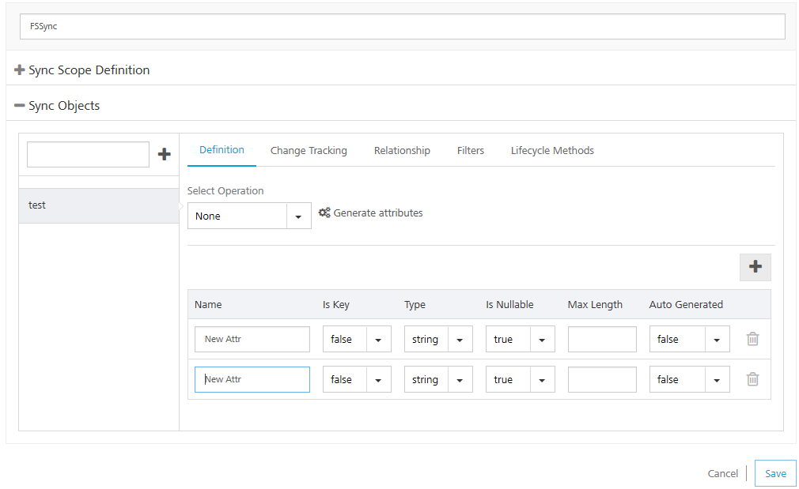
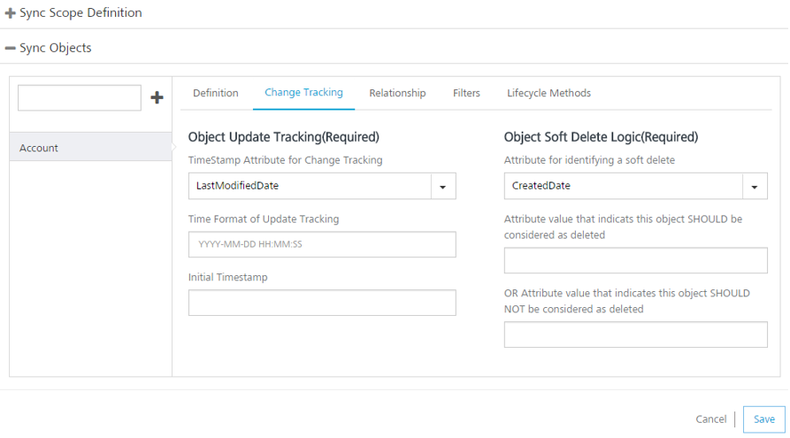
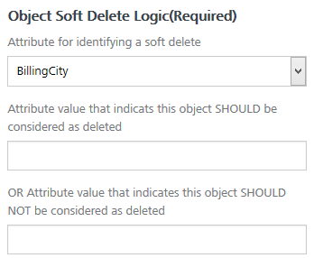
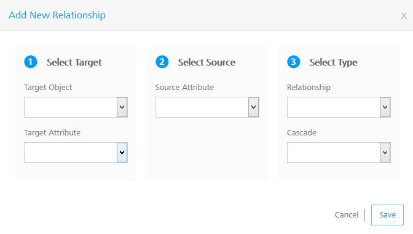
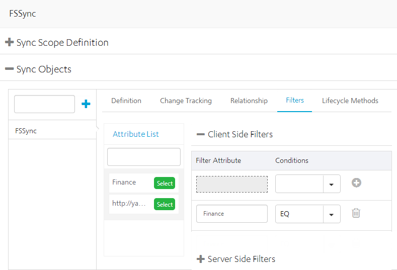
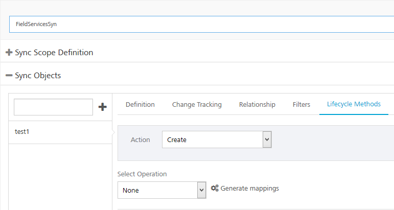
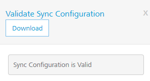
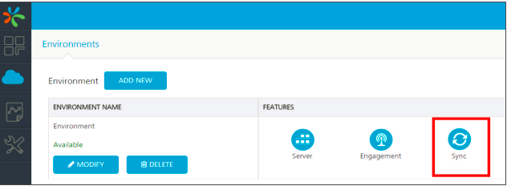

  

Synchronization
===============

VoltMX Synchronization is a comprehensive data synchronization platform that enables developers to add synchronization capabilities to mobile applications. Fundamental to Sync Framework is the ability to support offline and collaboration of data between devices and the backend systems.

To enable synchronization capability for an app, you need to define a Sync Configuration file.

Sync Configuration file
-----------------------

A Sync Configuration captures details of the data synchronization characteristics of an application. These details are captured in a file typically referred to SyncConfig.xml (the name really does not matter) adhering to the SyncConfig.xsd schema. A SyncConfig.xml represents the below structure.

The two most important elements of this schema are:

*   [Sync Scope](#sync-scope)
*   [Sync Object](#sync-object)

### Sync Scope

A Sync Scope groups together the Sync Objects that share common synchronization characteristics like Sync Strategy, Datasource and so on.

A Sync Configuration can have multiple Sync Scopes. It is not possible to define relationships between Sync Objects belonging to different Sync Scopes.

### Sync Object

Conceptually, you can consider a Sync Object as a business object that has some public attributes and some methods. The public attributes correspond to the fields visible to client devices, and they are used for synchronization. The methods correspond to the CRUD operations that map to the backend services exposed for the object. The parameter values methods /operations based on both public attribute values.

**A Sync Object is meta-data:**

*   Defining the business object model of an application.
*   Defining the way data is exchanged between mobile devices and backend.

A Sync Object is data:

Sync Object data is a business object instance exchanged between client and server.

Adding a New Synchronization Scope
----------------------------------

The following section explains setting up a Sync scope for Salesforce account.

To add a new Synchronization scope, follow these steps:

1.  From the **Synchronization** page, click **CONFIGURE NEW**.
2.  Under **Sync Scope Definition**, provide the following details:
    
    1.  Provide a name for the new Sync scope. (For example, _FSSync_)
    2.  Specify a **Namespace** for the Sync scope. The Namespace should follow a prescribed format such as _com.voltmx_.
        
    3.  Select the required service from the **Integration Service** list.
    4.  Select a **Sync Strategy**. The available options are **OTA Sync** and **Persistent Sync**.
        
        To understand which strategy to use for your sync scope, refer section [Appendix - Sync Strategy](Appendix - Sync Strategy.md).
        
    5.  Select a Change Tracking Policy (CTP) if you want to track the changes happening in the server database. Select Provided by data source, if you have a provision to track changes in the data source. For database this would be like a timestamp column which updates for any changes made to the row. Set CTP as VoltMX Sync Server, if you want SyncServer to track the changes. This option will be available only if you had selected Persistent Sync as Sync Strategy.
        
    6.  In case of conflicts between the data at the client and server end, specify any of the following under **Conflict Resolution Policy**:
        
        *   Client Wins: The changes on the client side take precedent over the changes on the server side.
        *   Server Wins: The changes on the server side take precedent over the changes on the client side.
        *   Custom: Enables you to upload an Interceptor class, which comprises the logic or policy for conflict resolution.
    
    1.  In the **Change Tracking Columns**:
        1.  Select the **Last Updated Timestamp** check box when you have column that represents the latest edited values.
            
        2.  Select the **Soft Delete Flag** check box when the database has the column that represents soft deletes. Soft delete field in a record represents that a particular record is deleted by changing the status to deleted. This record will exist in the database. Thus by selecting this field VoltMX Sync server does not sync records whose status is set as deleted.
            
    2.  Under **Data Source Type**, select one of the following:
        
        *   Integration/Orchestration Services: If you select a service that does not have an identity service, set the scope method mappings for the Sync Scope. If you select a service that has an Identity service, specify the user ID and password.
            
            To use an Integration service or Orchestration service as the data source, follow these steps:
            
            Click in the Select the service field. A drop-down menu appears. Select the service from the menu.
            
        *   **Database**: Use this option if you want the Synchronization service to connect directly with the data source without going through an Integration service. This option is typically used for a persistent sync strategy.
            
            To use a database as the data source, specify the following connection details of the backend database:
            
            *   Database Type
                
            *   Database Connection URL
                
            *   User ID
                
            *   Password
                
        
        Click **Test Connection** to verify the connection to the database.
        
        *   **Object Services**: This is a Sync scope mapped to an object service. An object service has all the information to auto-generate the Sync scope, including objects, relationships, change tracking, and lifecycle methods. You need only provide the scope specific data, such as sync strategy and filters; the rest of the Sync scope is inferred. If the object service changes, the scope is refactored to incorporate those changes.
            
            Note that a persistent sync strategy is not supported for a Sync scope that uses an object service as the data source type.
            
            To use an object service as the data source:
            
            *   Click in the Select the service field. A drop-down menu appears. Select the object service from the menu.
3.  Expand **Sync Objects**.
4.  Under **Sync Objects**, provide the following details:
    1.  On the left pane, provide a name for your Sync object, and then click the **Plus** button.
    2.  On the **Definition** tab of the new Sync object, select an operation from the **Select Operation** list, and click **Generate attributes**.
        
        The list of operations available for a new Sync object depends on the Integration Service selected in the Sync Scope.
        
        
        
5.  On the **Change Tracking** tab, do the following:
    1.  From the **TimeStamp Attribute for Change Tracking** list, select an attribute that denotes a particular record is modified.
    2.  From the **Attribute for Identifying a soft deleted** list, select an attribute that denotes a soft delete.
        
        You need to select **TimeStamp Attribute for Change Tracking**, only if you have selected **Last Update Timestamp** check box under the **Change Tracking Columns** respectively.
        
        You need to select **Attribute for Identifying a soft delete** only if you have selected **Soft Delete Flag** check box under the **Change Tracking Columns**.
        
        
        
        For non Boolean attributes, enter additional values that will be considered for soft deleting. For example, from the list if you select **BillingCity**, the system displays the following fields.
        
        *   **Attribute value that indicates this object SHOULD be considered as deleted**: if this value matches with the main attribute, the system deletes this attribute.
        *   **OR Attribute value that indicates this object SHOULD NOT be considered as deleted**: if this value matches with the main attribute, the system does not delete this attribute.
            
            
            
    3.  Change _Time Format of Update Tracking_, if required. By default, Salesforce time format is _YYYY-MM-DD HH:MM:SS_.
    4.  In **Initial Timestamp** box, enter the date from which the records are to fetched.
    5.  Click **Save**.
6.  On the **Relationship** tab
    
    
    
    Click the **Plus** button to open **Add New Relationship** dialog.
    
    1.  Provide the following details:
        
        
        
        1.  Select the required object from the **Target Object** list.
        2.  Select the required attribute from the **Target Attribute** list.
        3.  Select the required attribute from the **Source Attribute** list.
        4.  Select the type of relation between Source attribute and target attribute from the **Relationship** list.
        5.  Select _True_ from the **Cascade** list if you want to delete a record in the parent table and its child tables.
7.  On the **Filters** tab, provide the following details:
    
    
    
    1.  In the **Client Side Filters**, from the **Attribute List**, select an attribute.
    2.  For the selected attribute, provide a condition.
    3.  To save the current filter and add another filter, click the **Plus** button.
    4.  In the **Server Side Filters**, from the **Attribute List**, select an attribute.
    5.  For the selected attribute, provide a condition.
    6.  To save the current filter and add another filter, click the **Plus** button.
8.  On the **Lifecycle Methods** tab, provide the following details:
    1.  From the **Action** list, select an action.
    2.  From the **Select Operation** list, select an operation.
    3.  Click **Generate Mappings**.
        
        
        
        Input mapping is generated only for _Create_, _Update_ and _Delete_ operations.
        
        Output mapping is generated for all the operations: _Create_, _Update_, _Delete_, _get, getUpdated_, _getDeleted_ and _getBatch_.
        
        Header Mapping needs to be added manually.  
        
    4.  Add Input parameters from the **Input Mapping** by clicking the **Plus** button. Provide the following details:
        1.  From the **Source Type** list, select the type of the source.
        2.  From the **Source Value** list, select a value.
        3.  From the **Service Input Param** list, select an input parameter.
        4.  Click **Save**.

Validate Sync Configuration
---------------------------

VoltMX Foundry allows you to validate the Sync configuration before you can utilize the scope in your application.

To validate the your Sync configuration, on the **Synchronization** page, click **Validate Sync Configuration**.

You receive the following message if your scope is valid:

To download the file, click **Download**. This file is useful when the Sync Scope is invalid, and you wanted to know the details of the errors encountered while validating the Sync Scope.

Download the Sync Configuration
-------------------------------

Click **Download Sync Configuration** to download the Sync configuration file _Syncconfig.xml_ file on your computer.

Sync Console
------------

The details of your sync scope will be available in Sync Services after you _publish_ the app.

VoltMX Sync Management Console provides a single point of control for monitoring and configuring the VoltMX sync console creation process.

To view your Sync Console, click **Sync Services** from your cloud account.

For more details on Sync Console, refer to the following document: [http://opensource.voltmxtechsw.com/volt-mx-docs/voltmxlibrary/sync/voltmx\_sync\_console\_user\_guide/Default.html](http://opensource.voltmxtechsw.com/volt-mx-docs/voltmxlibrary/sync/voltmx_sync_console_user_guide/Default.html)
