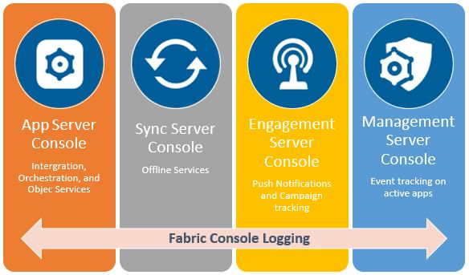

 

Testing Services from Server Consoles
=====================================

The **Logging Service** module displays the logs generated in the **Integration** and **Storage** services. If your application uses other capabilities of VoltMX Foundry, such as **Sync** and **Engagement**, you can use the individual feature's console interface to retrieve the desired logs.

You can test the specific service in the individual feature's console interface only after publishing the service in VoltMX Foundry environment.

As in previous sections of this tutorial, we discussed a scenario of an online bookstore that received orders from customers. Let us consider an example related to the scenario.

Retrieving the list of books based on the Published Date
--------------------------------------------------------

To retrieve the books available in the inventory based on the specified published date, we need to create a service ](related to the scenario) and test it. For more information on creating a service and corresponding operations to the service, refer to [Integration Service Designer](http://opensource.voltmxtechsw.com/volt-mx-docs/voltmxlibrary/voltmxfoundry/voltmx_foundry_user_guide/Default.html#Services.md).

You can generate logs for the following consoles.

To access server consoles from **VoltMX Foundry Console**, follow the steps below :

1.  Log on to your **VoltMX Foundry Console** account and click **Environments/Clouds**.
2.  ​Under the **Environments/Clouds** section, you can view the different consoles available for your cloud account.
    
    
    

App Server Console
------------------

The App server console helps you to test in **Integration** and **Object** services that are published in VoltMX Foundry.

The **Logging** section in the **App Services Console** allows you to customize the type logs generated on the server. You can customize the generated logs by modifying few logging settings in the User Interface (UI). VoltMX Foundry will then record only logs pertaining to your settings.

To customize server logs, follow these steps:

1.  Under the **Environment/Clouds** tab, click the **App Services** icon.
2.  Click **Settings** from the left pane of the **App Services** console.
    
    The **Settings** page appears containing **Logging**, **Runtime Configuration**, and **Environment** details. The **Logging** page displays the settings of various server logs.
    
    
    
3.  Customize the settings to fit your requirement.

Sync Console
------------

The logs section in VoltMX **Sync Console** shows the data synchronization logs between client devices and the enterprise data source.

To access the logs in **Sync Console**, follow these steps:

1.  From the **Environment/Clouds** tab, click **Sync Services**.
2.  On the **Sync Console Services** page, click **Logs** from the left pane.
    
    
    

Engagement Console
------------------

VoltMX **Engagement Console** helps the administrator list out all Engagement services and related actions initiated by their registered users.

To view the logs in VoltMX **Engagement Console**, follow these steps:

1.  From the **Environment/Clouds** tab, click **Engagement Services**.
2.  In the **Engagement Console**, go to **Settings/Configuration**.
3.  On the **Configuration** screen, click the **Logging** tab to view and control **Engagement Server** logs.
    
    
    

Management Console
------------------

VoltMX **Management Console** displays the list of actions of a device, device set, or policy that you initiated.

To access the logs section in **Management Console**, follow these steps:

1.  From the **Environment/Clouds** tab, click **Management Services** from the list of consoles displayed.
2.  On the **Management Console** screen, under the **Settings** section in the left pane, click **Event Log** to view the **Management Console** logs.
    
      
    Let's take the case of pulling out logs for the **Books API** in detail from the **App Services Console**.
    

Testing a Service from Admin Console
------------------------------------

As we saw in previous parts of this course, it is possible for us to test a service from the VoltMX Foundry Console. We can also test the API after publishing it from the **App Services** Console. This lets you debug your live API, to find the **Root Cause** for the failure quickly.

You can test the service in **App Services Console** only after publishing the service in VoltMX Foundry environment.

To try out services from the App Services Console, follow these steps:

1.  From the **App Services** console, click the **Integration** tab from the left pane.
    
    You will be able to view the list of Integration services created and published in VoltMX Foundry.
    
2.  Search for your service name. In our case, we used the **Books API** service.
3.  Select an operation from the **Operations** List.
4.  The **Request Input** window displays the server URL along with **Header** and **Body** parameters. You can modify parameter values, and hit the **Get Response** button to try out the AI for different combinations.
    
    Here's what this interface looks like :
    
    
    
    Hope you found this tutorial useful, please reach out to us for any queries on [basecamp](https://basecamp.voltmx.com/s/).
    

<table madcap:conditions="Default.HTML,PrintGuides.Not Ready to Publish" style="margin-left: 0;margin-right: auto;mc-table-style: url('Resources/TableStyles/RevisionTable.css');" class="TableStyle-RevisionTable" cellspacing="0"><colgroup><col class="TableStyle-RevisionTable-Column-Column1"> <col class="TableStyle-RevisionTable-Column-Column1"> <col class="TableStyle-RevisionTable-Column-Column1"></colgroup><tbody><tr class="TableStyle-RevisionTable-Body-Body1"><td class="TableStyle-RevisionTable-BodyE-Column1-Body1" style="background-color: #ff4500;">Rev</td><td class="TableStyle-RevisionTable-BodyE-Column1-Body1" style="background-color: #ff4500;">Author</td><td class="TableStyle-RevisionTable-BodyD-Column1-Body1" style="background-color: #ff4500;">Edits</td></tr><tr class="TableStyle-RevisionTable-Body-Body1"><td class="TableStyle-RevisionTable-BodyB-Column1-Body1" style="background-color: #ff4500;">8.0</td><td class="TableStyle-RevisionTable-BodyB-Column1-Body1" style="background-color: #ff4500;">AU</td><td class="TableStyle-RevisionTable-BodyA-Column1-Body1" style="background-color: #ff4500;">AU</td></tr></tbody></table>
