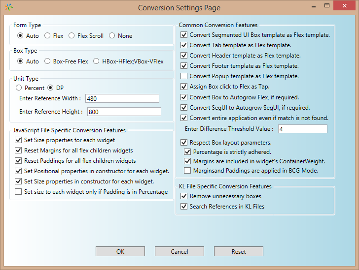

  

Conversion Process for Android Platform
=======================================

There are three phases to convert a Box-based application to a Flex based application.

*   [Record](#record)
*   [Apply](#apply)
*   [Test](#test)

Record
------

1.  Create the androidbuild.properties file in the project folder of your workspace with the `EnableBox2FlexConversion` property set to `true`.
2.  Add the following permission to grant external storage access in applications that use targetSDK API level 29 (or earlier).  
    `android.permission.WRITE_EXTERNAL_STORAGE`
3.  Add the following code snippet in the `app-init()` lifecycle callback of the voltmx application to display a new record button on the top-left corner of the screen.  
    `voltmx.application.setupWidgetDataRecording({ mode: 1 // manual mode });`
    
    This button enables you to capture the frame coordinates of the current Form and its child widgets that are rendered on the screen into an XML file.
    
    The XML file will be saved at the following path on the mobile/emulator:  
    `/sdcard/XMLGen/<AppName>/WidgetInfo.xml`
    
    Ensure that all the necessary widgets are visible on the screen before you click the record button and dump the XML of the current Form.
    
4.  If you add or remove widgets dynamically, you can dump the XML file multiple times after each use case is performed.
    
    All the data in the XML file that is related to the same Form is automatically merged as long as it is not killed and restarted.
    
5.  In case you have multiple test scenarios that involves an application restart, dump your current XML state using the record button before restarting the app. You can then use the [XMLMerger.exe](Menu Items.md#Merge) to merge multiple XML files from each app, run, and generate a single merged XML file. Feed this merged XML to the Box to Flex Converter tool.
    

Run the following command to merge the multiple XML files into a single XML file:

```
XMLMerger.exe <XmlFilesPath> <OutputFolderPath> <MergedXMLName>
```

Replace the values of the paths as follows:

*   **XmlFilesPath**: Folder Path where multiple XML files are placed.
*   **OutputFolderPath**: Folder Path where the merged XML file must be saved.
*   **MergedXMLName**: File name of the Merged XML file.

For example, `XMLMerger.exe D:\xmlgen\SanityXMLs D:\TargetFolder Sanity.xml`

Apply
-----

This section explains how you can use the Flex Converter tool to apply recorded data on an existing Eclipse project, and produce a Flex-based Eclipse project.

### Input Details

To convert box based applications to flex based applications, you must provide the widget-data XML file that you had created in the [Apply](#apply) phase and the box-based application.

### Target Folder Details

Provide the location of the target folder where you want to save the converted flex project.

Specify a Name for the Converted Flex Project in the **Enter Target Eclipse Project Name** field.


### Conversion Settings

Configure the following options in the **Settings** → **Conversion Settings** section:



**Form Type**: Specifies the arrangement of the widgets in the flex-based application.

The available options are as follows:

*   **Auto** - Based on the child widgets rendered in the box container, the tool coverts the Box Form to a corresponding Flex Form automatically.  
    On the Android platform, the Form will be converted to a Vertical Flex Form, by default.
*   **FreeForm** - The Form will be converted to a Free Flex Form.
*   **VerticalForm** - Form will be converted to Vertical Flex Form.

**Box Type**: Specifies the arrangement of the widgets in the box-based application.

The available options are as follows:

*   **Auto** - By default, the horizontal box widgets will be converted to horizontal flex widgets and vertical box widgets will be converted to vertical flex widgets.
*   **Box-FreeFlex** - All the box widgets will be converted to free flow flex widgets.
*   **HBox-HFlex;VBox-VFlex** - The horizontal box widgets will be converted to horizontal flex widgets, and the vertical box widgets will be converted to vertical flex widgets.

**Unit Type**: The entire application can be generated either in DP mode or percentage mode. However, HCL recommends that you use a percentage unit so that the application supports different device resolutions and provides a uniform cross-platform experience.

**Set Child Height Conversion Unit Type**: When the height of the parent widget is set as **Preferred**, ensure that the height of the child widgets is also set as **Preferred**. Otherwise, the height of the child widgets is set in device-independent pixels. This option is visible when the **Unit Type** is set as Percentage.

Test
----

1.  Open Iris.
2.  Import the project that you had created in the [Apply](#apply) phase.
3.  Build the application, and then run it.
4.  The application must start and function without any issues, and the functionality of the application must be the same as the older Box-based application.

For the application to be portable across different form factors replicating the same look and feel, you must select the following options:  
\- Set the Form Type as VerticalForm  
\- Set the Box Type as HBox-HFlex and VBox-VFlex  
\- Set the Unit Type as Percentage  
\- Set the SetChildHeighttoPreferred as Preferred  

The hierarchy of all the boxes is retained as the hierarchy of the respective Flexes and the tool does not have the capability to perform optimizations during conversion. Therefore, to improve the performance of the tool, HCL recommends that you change the design of the Form to Free Form and remove the unnecessary Flex layers.
