  

Conversion Process
==================

There are three phases to convert a Box-based application to a Flex based application.

*   [Record](#record)
*   [Apply](#apply)
*   [Test](#test)

Record
------

The **voltmx.application.setupWidgetDataRecording()** API records all the navigated forms. This API is available in VoltMX Iris version 6.0 and 6.5. Existing 5.0/5.5/5.6 applications must be opened in 6.0 and run at least once to record the application. All pre 6.0 box-based applications work on 6.0 and above without any issues.

### setupWidgetDataRecording

setupWidgetDataRecording, a JavaScript function, displays a button on every form. This button appears on all layers of view (popup/alert/form). When you click the button, all the widgets present in a form are recorded. You must ensure that the control is visible on a form, when you click the button to record data. Once clicked, from the second time onwards, the button captures information of newly-created widgets.

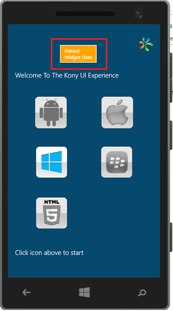

Syntax

voltmx.application.setupWidgetDataRecording({mode : <modevalues>})

Input Parameters

*   mode – number
*   Possible Values: 0 - Auto, 1 - Manual
*   Default or fallback: 0 - Auto

JavaScript Example

```
//You can load module2 in module1 as shown here.
function buttonClick (){
voltmx.application.setupWidgetDataRecording(){
voltmx.print("setupWidgetDataRecording is done ");
}

```

Platform Availability

Windows Phone 8 .1 and Android.

Apply
-----

This section explains how you can use the Flex Converter tool to apply recorded data on an existing Eclipse project, and produce a Flex-based Eclipse project.

### Prerequisites

*   .NET framework 4.0 must be installed on the target system.
*   The Box-to-Flex Converter tool works on Windows 7 and Windows 8/8.1 systems.
*   Eclipse is not mandatory.
*   The Box-to-Flex Converter tool works with 6.0/6.5 Windows Phone plugins.
*   The Box-to-Flex Converter tool converts 5.0/5.5/5.6 Eclipse projects.
*   Partial 6.0 Flex-based projects cannot be converted.

### How to Use

The steps involved in the Apply phase of the application-conversion process are as follows:

1.  [Start the application](#start-the-application)
2.  [Load recorded data](#load-recorded-data)
3.  [Specify source code details](#specify-source-code-details)
4.  [Load source code (JavaScript/KL files)](#load-source-code)
5.  [Adjust conversion Settings](#adjust-conversion-settings)
6.  [Convert the data](#convert)
7.  [Validate the results](#validate-the-results)
8.  [Provide output details](#provide-output-details)
9.  [Save the changes](#save-the-changes)

#### Start the Application

The Box2FlexConverter.exe appears in full-screen mode. The preferred screen resolution is 1366×768.

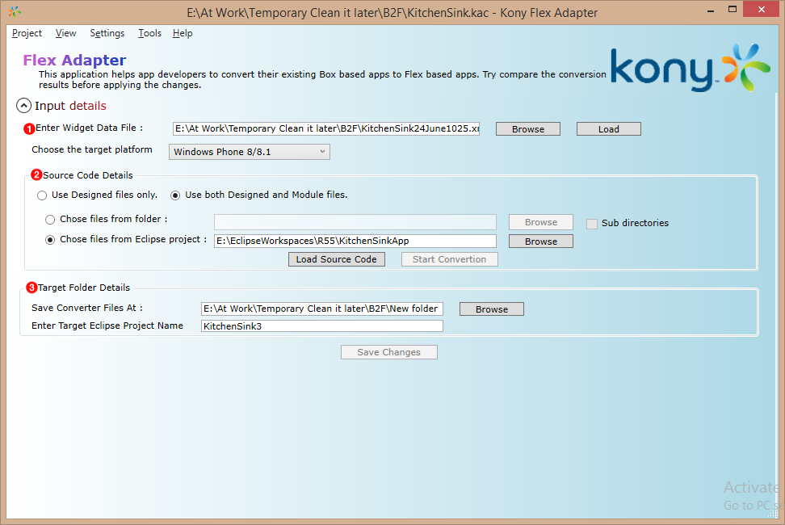

You can either create a new project to convert or open an existing project.

#### Load Recorded Data

1.  In the **Enter Widget Data File** box, enter the path to the location of the widget recording xml/json file. Alternatively, click the **Browse** button to select a file from your local system.
2.  Click **Load** to view the Widget Data File in a tree hierarchical structure. A dialog box appears, with a message indicating the success or failure of the data loading process. On successful widget data load, the recorded data is displayed in a tree hierarchical structure.  
    Clicking a data item from the tree structure displays the recorded information in the right pane as follows.  
    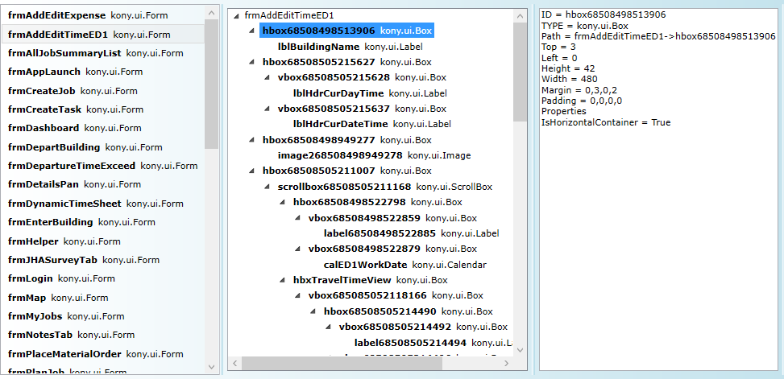  
    

#### Specify Source Code Details

1.  Select the type of file that you want to convert. You can convert files present in an Eclipse project or any JavaScript or designer files.  
    
2.  Upload the source code of the project. You can either select a folder where all the .kl or .js files are located, or convert an existing Eclipse project.  
    If you choose to convert an Eclipse project, provide the path of the Eclipse project in the **Choose files from Eclipse project** box.  
    If you choose to convert a folder with .kl or .js files, all the .kl or .js files present in the folder are considered for conversion.
3.  Select the **Sub-directories** check box to search for KL/JS files in all the sub-directories present in the specified folder. We recommend that you use this option to convert the **jssrc** build folder, or to convert only a few forms or modules.

*   Option to select an eclipse project
    
    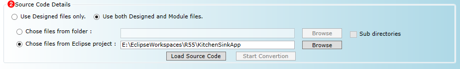
    
*   Option to select a folder where all KL/JS files are saved
    
    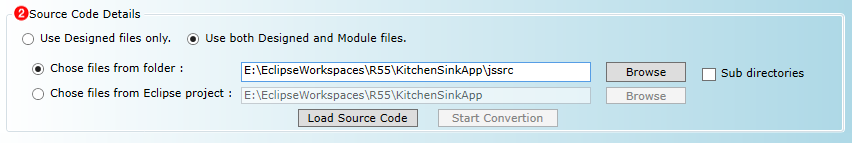
    

#### Load Source Code

1.  After you provide the valid input details, click **Load Source Code**.
2.  The success/failure status is displayed after the entire source code has loaded.
3.  All the widgets captured from the source code are shown in the right pane in a tree hierarchical structure. You can load widgets from both KL and JS files. Clear the **Show Empty Files** to remove files that do not have widgets.

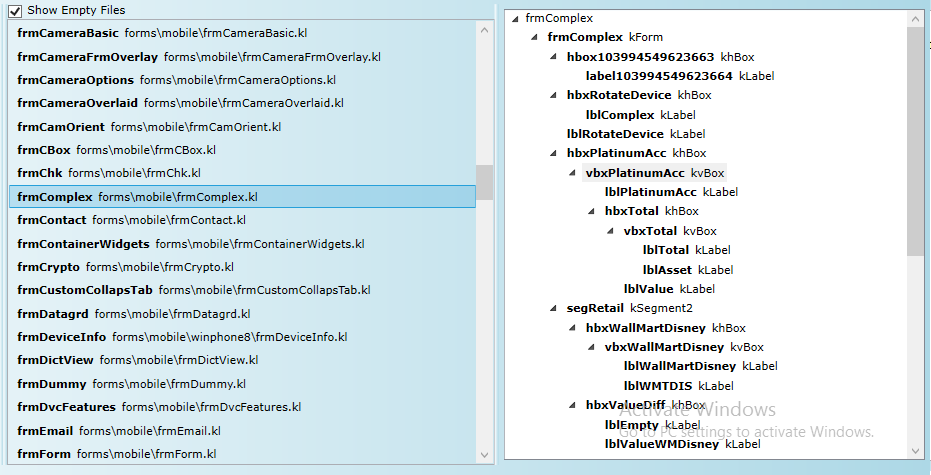

#### Adjust Conversion Settings

1.  From the main menu, click **Settings** > **Conversion Settings**. The **Settings** dialog box appears.

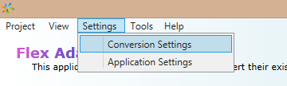

Refer the [Settings](Menu Items.md#Settings) section for a detailed description on the available settings.

4.  After the settings have been adjusted, click **OK**.

#### Convert

1.  Click **Start Conversion** to begin the conversion process.

The conversion process takes some time to complete. The conversion time is dependent on the number of files that are converted.

3.  On successful conversion, the results appear on the **Results** page. You can view detailed logs in the log viewer.

There are four tabs on the Results pane:

*   **Dashboard**: This tab displays the results of the conversion by using simple, interactive charts. Click any chart segment to navigate to and view more details on the other tabs.
    
    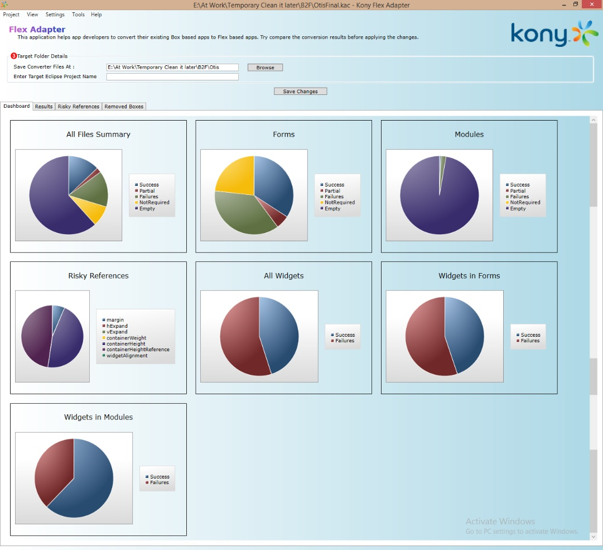
    
*   **Results**: This tab displays all the conversion details. There is also an option to filter the results. The list view displays all the files in the left pane. Select a file from the list to view the available child widgets, with the tree hierarchical structure.
    
    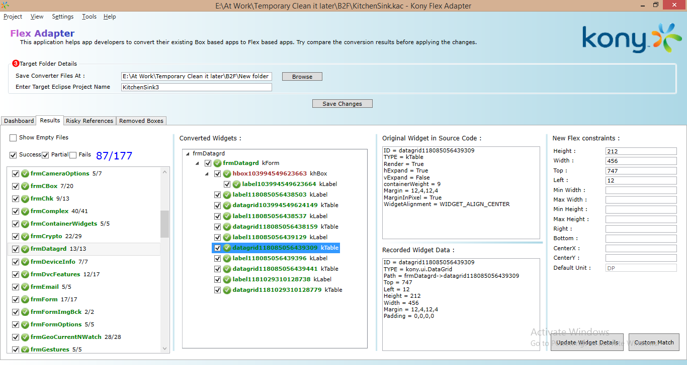
    
    The tree hierarchical structure of the converted widgets appears in the following four colors:
    
    *   **Green** – Successfully converted
    *   **Red** – Failed to convert
    *   **Blue** – Some were successfully converted, but some failed to convert
    *   **Brown** – Removed Box widget
*   **Risky References**: This tab displays all the code references found in JavaScript modules or designer forms’ snippets. These might not work in Flex-based apps, such as setting margins, padding, containerHeight, containerheightReference, widgetAlignment, referenceWidth, and referenceHeight.
    
    
    
    *   Select a risky reference item to display a code suggestion that can be implemented in Flex-based applications.
    *   You can also save the Risky Reference suggestions as a report to analyze the code later and fix the references.  
        By saving it as a report, you do not need to remember or run the tool several times to identify the risky references. Refer “Risky Reference Report Loader” for more information about how to load the saved report.
*   **Removed Boxes**: This tab displays all the unnecessary boxes that are to be removed after the application in converted. Double-click an item to go to the Box widget in the results pane, and view the full details.
    
    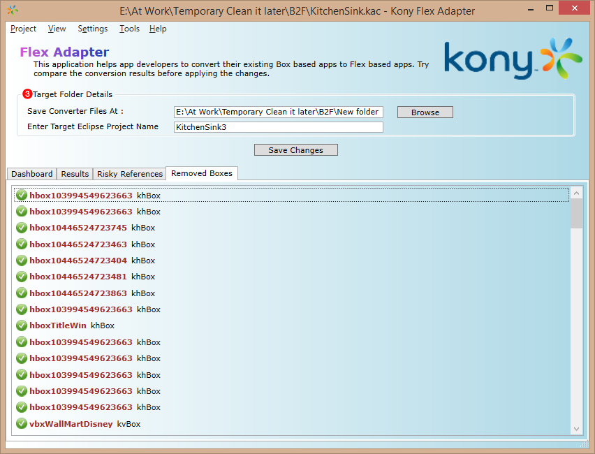
    

#### Validate the Results

1.  Verify the conversion results shown on the **Results Tab**, and then click **Save**.
    
    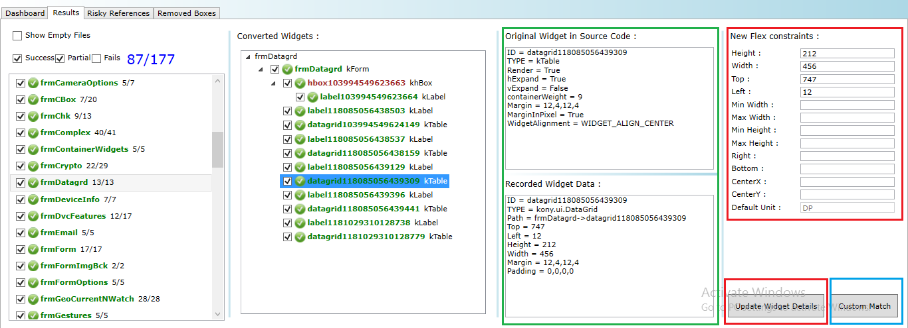
    
2.  Detailed logs appear in the right pane, and can help you identify any errors that occur. Some warnings can be safely ignored, and some might be of interest before proceeding to save.
3.  Click any converted result widget to verify the difference in outputs shown for KL and JS files.
4.  You can change the converted widget’s constructor/properties, and then click **Update Widget Details** to save the changes.
5.  Updating a failed widget changes its state to **Success**, and it will turn green.
6.  From the list or tree view, select the check box for the items that you want to save.
7.  You can change the values of successfully-converted widgets by enter new values in the **New Flex Constraints** box, and then clicking **Update Widget Details**. You can enter the values in the **New Flex Constraints** box by any of the following sample formats:
    1.  **DP**: 90DP
    2.  **%**: 25PERCENTAGE
    3.  **px**: 60PX
    4.  Just the value if the default unit matches
8.  Dynamically-specified widgets may not have an ID; so, they may not be matched and might appear as Failed. Select those failed widgets in the tree view, and then click **Custom Match**.
    
    The **OrphanDataWidgetsWindow** dialog box appears.
    
9.  Select one or more recorded data widgets to display the clubbed/merged data in the right pane.
10.  Clicking a match closes the dialog box, and applies the data to the failed widget.
    
    You can view the Path details on the screen to match the data to widgets.
    
    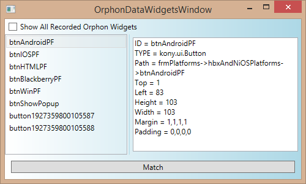
    

#### Provide Output Details

1.  After you have verified all the conversion results, save them.
    
    You can save the results as files, or you can generate an Eclipse project with the results.
    
    You can directly import this generated Eclipse project into the Eclipse project.
    
2.  In the **Save Converted Files At** box, enter the location of a folder at which to store the results of the converted files. Ensure that the specified target folder is not a restricted one. The tool must have access to write files to that location.
3.  If you provide a valid project name, a new Eclipse project with the converted results is created.
    
    If you do not provide a project name, the Eclipse project is not created.
    
4.  If you had chosen to convert an Eclipse project,
    1.  The specified project is considered as the input project.
    2.  The Eclipse project is copied to the output folder.
    3.  The converted files are applied.
    4.  The Eclipse project is renamed with the given name.
    
    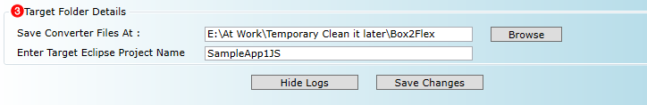
    
5.  If you had chosen to convert loose files, you must provide the reference Eclipse project to create a new Eclipse project.
    

1.  The reference project is considered as the input project.
2.  The Eclipse project is copied to the output folder.
3.  The converted files are applied.
4.  The Eclipse project is renamed with the given name.

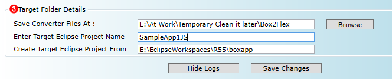

#### Save the Changes

1.  After you provide the output details, click **Save Changes**.
2.  If the save files operation and the **Generate New Eclipse Project** operation are successful, the output folder will have two new folders. One folder with the given project name and another folder named **ConvertedFiles**, which has all the converted files.
3.  If the **Project Name** is not provided, the Eclipse project is not created. As a result, only the **ConvertedFiles** folder is available at the target location.  
    If the folder with that name already exists, the folder is deleted before the results are saved.
4.  You can either import the Eclipse project or copy the converted files to the existing Eclipse project.

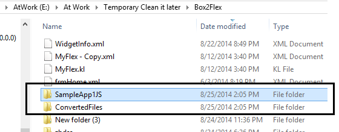

Test
----

1.  Open Eclipse.
2.  Import the project that you had created in the [Apply](#apply) phase.
3.  Build the application, and then run it.
4.  The application must start and function without any issues, and the functionality of the application must be the same as the older Box-based application.
