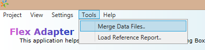
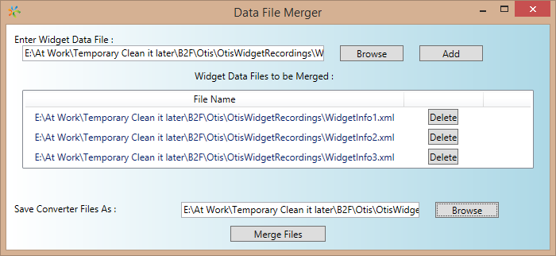
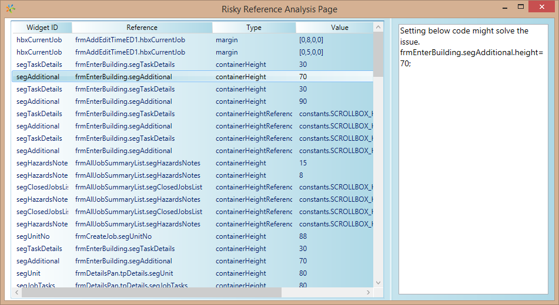
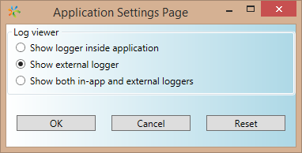
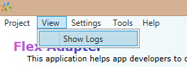
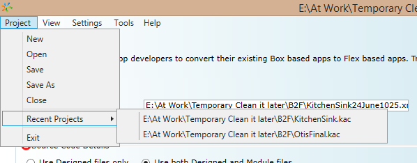
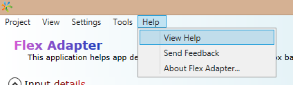
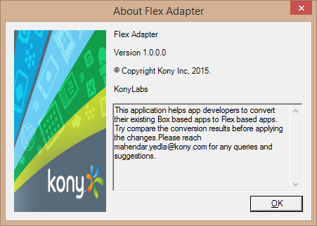

  

Menu Items
==========

Settings
--------

The following image illustrates the options that are available on the Settings page to customize the conversion.

1.  The form can be converted into a free-flow FlexForm with Vertical Flex.
    
    Currently, Horizontal Flex has not been implemented.
    
2.  Each Box can be converted into a free flow FlexContainer; HBOX is converted into Horizontal Flex and VBOX is converted into Vertical Flex.
    
    HBOX to Horizontal Flex and VBOX to Vertical Flex is in progress.
    
3.  Unnecessary Box hierarchy can be removed and flattened. This is available only when the Eclipse project is chosen for conversion with KL files.
    
    This feature is also in progress.
    
4.  You can generate the entire application in either DP mode or percentage mode. Use the percentage mode to make the application available across different platforms. Use the DP mode if you want the existing automation to work as is, with the Flex ported from the Box.
    
5.  You can choose different reference height/width to generate in other platform DP mode.
    
    Currently, assigning the Box click as **Tap to Flex** works only for JavaScript files, and not for KL files.
    

Tools
-----

### Merge Tool

You may not be able to capture all the record flows in an application at one-go. Use the Merge sub tool from the **Tools** > **Merge Data Files** option in the main menu to seamlessly merge multiple recordings into a single record.

The **Data File Merger** dialog box appears.

Add the required data widget recordings, and merge them into a single file.

### Risky Reference Report Loader

This feature helps you to view the risky references and suggestions, whenever required. Using this report, you can fix code issues in JavaScript modules and designer forms’ snippets.

Click **Tools** -> **Load Reference Report** from the main menu to start the Risky Reference Report Loader.

The **Risky Reference Analysis Page** dialog box appears.

View
----

You can choose to have an inbuilt logger, external logger, or both. Enable the logger from **Settings** > **Application Settings**. The application settings dialog box appears, where you can select the required logger type.

You can show or hide the logger by clicking **View** > **Show Logs**.

Project
-------

An option to save all the specified details and settings as a project is provided. You can retrieve this data whenever required. All the saved projects will have an extension of **.kac**. The functionalities of the options are self-explanatory.

Help
----

The **Help** menu has the following options.

*   **View Help** – Starts the help guide.
*   **Send Feedback** – Starts the default email client. You can send your feedback, queries, concerns, and suggestions via an email.
*   **About Flex Adapter** – Displays the version information of this tool.

