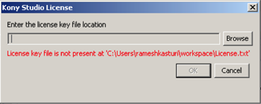
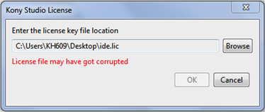

FAQ - Frequently Asked Questions
--------------------------------

The following are the frequently asked questions which you might encounter while working on licensing:

1.  **What has changed in release 5.0?**
    
    From release 5.0 onwards, we are moving to a new licensing system that helps track the licenses. This was introduced in VoltMX Studio release 4.1, however in release 4.1, this was a secondary mechanism.
    
2.  **I am upgrading from release 4.1 to release 5.0. Will my license work?**
    
    Yes, the licensing system is backward compatible. If you are already using the VoltMX Studio with release 4.1 plugins, you can easily upgrade it to release 5.0. Your existing licenses will continue to work without any prompt for a license request.
    
3.  **How to know if my license file is an old version or the latest license file?**
    
    The old license file (for VoltMX Studio 4.1 and prior versions) had a **.txt** extension. The new license file (for VoltMX Studio 5.0) is encoded and has **.lic** extension.
    
4.  **What's new in the new licensing system?**
    
    The new licensing system requires licenses which are to be activated with the licensing backend. This enables the tracking of the license usage and catering the customer in a better way.
    
5.  **I need a license for 20 members. Can I use the same license?**
    
    If you need a license for multiple users, you need to mention the number of licensees along with the other details. The license file may then be used by multiple users.
    
6.  **I receive the error Number of copies exceeded. What do I do?**
    
    This error is received if the license activations exceed the allowed number of activations. If this error occurs before you reach the expected limit, contact: [product.license@voltmx.com](mailto:product.license@voltmx.com?subject=Error - Number of Copies Exceeded).
    
7.  **I don't have an internet connection, how do I activate the license?**   
                   or**  
    I run into activation issues if the Internet connection is using a proxy. The licensing wizard's proxy setting does not seem to be working right. What do I do?**
    
    The license activation requires an Internet connection. However, if you do not have an internet connection, you can request for a license that is pre-activated. For this type of license, you need to mention the username of the person who wishes to use the license.
    
    To get the username, run the following on the Windows command prompt of your machine:
    
    **echo %username%**
    
8.  **I need to move to a new machine. How do I use the license there?**
    
    If you intend to move your license, you need to deactivate it on the first machine, and then activate it on the second machine. For deactivation, please refer to [License Deactivation](License Deactivation.md#Deactivate_the_License.html#Deactivate_the_VoltMX_Studio_License_) section of the VoltMX Licensing Guide.
    
9.  **I am facing licensing issues when I run Windows on Parallels for MAC, what do I do?**
    
    Licensing issues occur when you upgrade from Parallels 7 to Parallels 8 and because of a bug in Java ([http://bugs.sun.com/view\_bug.do?bug\_id=4787931](http://bugs.sun.com/view_bug.do?bug_id=4787931)).  
    If you are using releases prior to VoltMX Studio 5.0.2, you have to run VoltMX Studio as an administrator. If you are using releases from VoltMX Studio 5.0.2, you need not run VoltMX Studio as an administrator.
    
    To upgrade plugins licenses from 5.0 or 5.0.1 to 5.0.2, you need to request for new licenses.
    
10.  **I have a valid license, but I get an error message "license is expired", what do I do?**  
    This error message appears if the system date is tampered with or when the Time zone is changed. To eliminate this error, delete the file `.voltmx\ide.dat` and `.keditor/keditor.dat`.
11.  **What are .voltmx and .keditor folders in my USERHOME location.**
    
    These folders are used to track the licensing information. They must not be modified or deleted.
    
12.  **I am using VoltMX Studio 4.1 and activated it with** _.lic_ **license file. I still get the license prompt. How do I get away with this?**  
      
      
    
    If you have activated VoltMX Studio 4.1 with _.lic_ file, then you need to click **Cancel** to close the prompt and proceed. We stopped releasing _.lic_ licenses for 4.1 release to avoid this error. We now only issue _.txt_ licenses for VoltMX Studio 4.1.  
    
13.  **When I select the license file, I get a message as "License file may have got corrupted". What do I do?**  
      
    
    The license prompt in VoltMX Studio 4.1 accepts _.txt_ licenses. If you have activated VoltMX Studio 4.1 with _.lic_ file, then you need to click **Cancel** to close the prompt and proceed. You will be prompted again with a wizard, where you can select your _.lic_ license file. We stopped releasing _.lic_ licenses for 4.1 release to avoid this error. We now only issue _.txt_ licenses for VoltMX Studio 4.1.
    
14.  **Can I get additional information about the license file that I am using ? If yes, from where?**  
    Yes, you can use the VoltMX Licensing Tool (command line licensing tool) for additional information about license file. It is available at [http://developer.voltmx.com/VoltMXReleases](http://developer.voltmx.com/VoltMXReleases).
