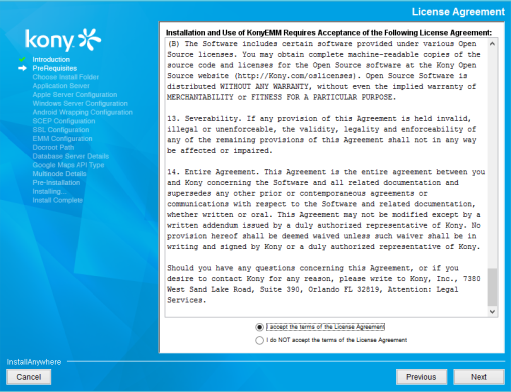
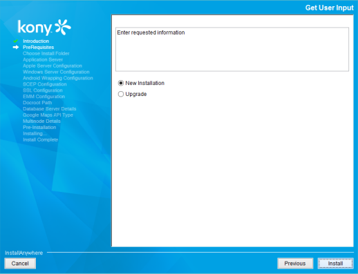
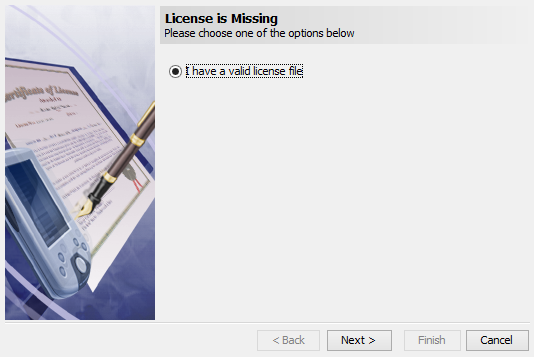
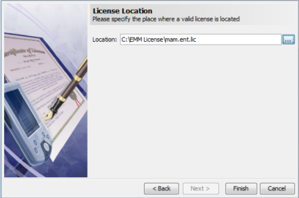

Activating VoltMX Management Suite License through Installer
----------------------------------------------------------

This section enables you to activate VoltMX Management Suite Installer license.

Based on your requirement we will provide you the following license file:

*   ide.lic

To activate the VoltMX Management Suite license through installer, follow these steps:

1.  While installing the VoltMX Management Suite, Accept the License Agreement pane appears. Select the **"I accept the terms of the License Agreement"** option after carefully reading the text.
    
    
    
2.  Click **Next** to continue.
    
    The **Get User Input** window appears.
    
3.  Select the installation option. By default, it is set to **New Installation**.
    
    
    
4.  Click **Next** to continue. The **Please Wait** window appears.
    
    The **VoltMX Management Suite–Licensing Assistant** window then appears.
    
    
    
    If you use a MAM Only or Store Only license, then you cannot use the SCEP services.
    
5.  Click **Next** to continue.
    
    The **VoltMX Management Suite-Licensing Assistant** window displays the Location search field.
    
    
    
6.  Click **Browse**, select the license location, and click Finish.
    
    The **Please Wait** window appears and informs a user that VoltMX Management Suite configuration is in progress.
    
    VoltMX Management Suite runs only with a valid license, which you must supply. The License File activates the installation, identifying which products you can run.Store the license file in an accessible location, such as in the default Downloads folder on your computer.
    
    Your license will deactivated based on the expiry date.
