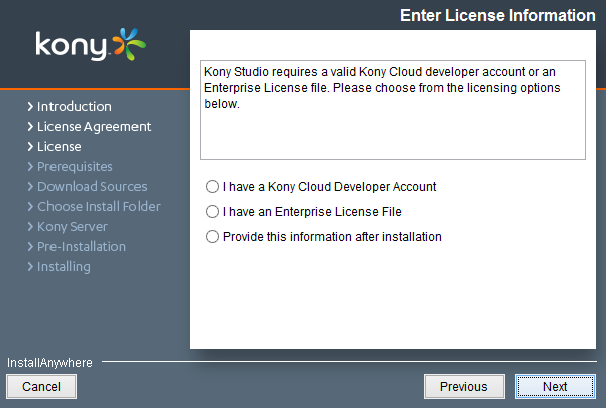



Activating the VoltMX Studio License through Installer
----------------------------------------------------

This section enables you to activate VoltMX Studio Installer license.

Based on your requirement we will provide you the following license file:

*   ide.lic

To activate the VoltMX Studio license through installer, follow these steps:

1.  While installing the VoltMX Studio, accept the License Agreement, and then click **Next**. The **Licensing Assistant** dialog appears during a fresh installation. For subsequent installations, this dialog box appears only if you do not have a valid license or if the license file has expired.
    
    
    
2.  You can reference your license agreement in any one of the following ways:
    *   **I have a VoltMX Cloud Developer Account** - Select this option if you have manage.voltmx.com account. If you select the option and click **Next**, a dialog to enter your credentials appears. If you face any log on issues in this step, see [Cloud Issue](#cloud-log-on-environment-issue-solution).
    *   **I have an Enterprise License File** - Select this option if you have an enterprise license file. The Studio license file governs the time-based usage of VoltMX Studio.
    *   **Provide this information after installation** - Select if you can provide your license information after installation.
3.  If you have selected **I have an Enterprise License File** option, click **Choose** and select your license file.
4.  Select an appropriate **Internet Connection** and then enter the respective details.
5.  Click **Finish**. This activates the license and navigates you to the **Prerequisites** dialog.

### Cloud Log On Environment Issue - Solution

VoltMX Studio IDE does not allow you to log on with VoltMX Cloud credentials if no environment is configured in `eclipse.ini` file. The environment details of VoltMX Studio is stored in `eclipse.ini` file. To configure environment details in VoltMX Studio IDE, include MBaaS and OAuth URL in `eclipse.ini` file. The `eclipse.ini` file is located in the installation folder of VoltMX Studio. For example, `C:\Program Files\VoltMX\VoltMX_Studio`.

To include MBaaS and OAuth URL in Eclipse.ini file, follow these steps:

1.  Navigate to the installation folder of VoltMX Studio. For example, `C:\Program Files\VoltMX\VoltMX_Studio`.
2.  Open `eclipse.ini` file with a text editor application.
3.  Based on your environment, add the following lines at the end: 
    *   \-Dvoltmx.mBaaS.login.url=<URL>
    *   \-Dvoltmx.accounts.url=<URL> 
    
    For example, if you are using a SIT environment, the <URL> value for MBaaS and accounts looks like:
    
    *   \-Dvoltmx.mBaaS.login.url=https://accounts.auth.sit-voltmxcloud.com/login
    *   \-Dvoltmx.accounts.url=https://api.sit-voltmx.com/api/v1\_0
    
    Modify the value of <URL> based on your environment (SIT/QA/STG).
    
4.  Save and close the file.
5.  Restart VoltMX Studio and log on with VoltMX Cloud credentials.

Even if you are not an MBaaS user, configure both the MBaaS and OAuth URLs to log on using Cloud credentials.
