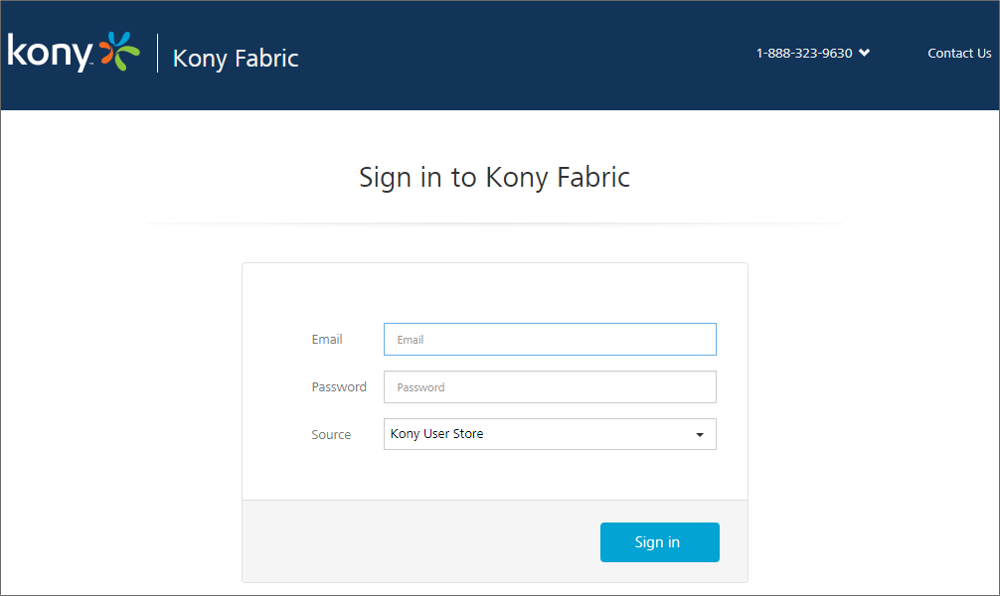
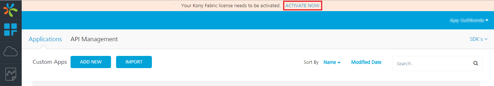
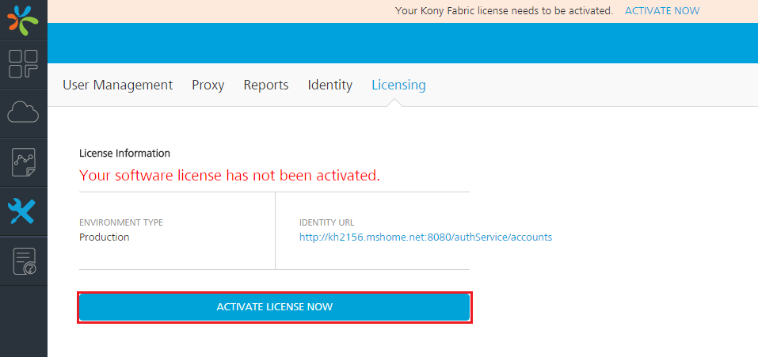
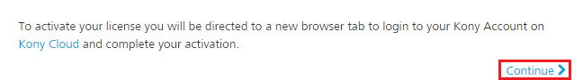
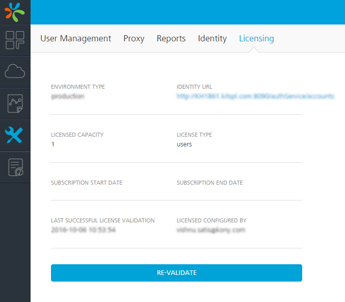

            

VoltMX Foundry
-----------

VoltMX Foundry needs licenses for the following components:

*   VoltMX Foundry Integration
*   VoltMX Foundry Engagement Services
*   VoltMX Foundry Sync

Based on type of installation, following licenses will be provided:

*   Production License \[for the production instance\]
*   Non-Production License \[for UAT environments\]
*   Development License \[for single machine instance\]

The license will be deactivated based on the expiry date.

### Prerequisites

The following are the prerequisites for activating a VoltMX Foundry license.

*   VoltMX Cloud Account.
*   A valid VoltMX Foundry license issued by the VoltMX Licensing Team.

### Activating VoltMX Foundry License

#### Activating License for The First Time

**To activate the VoltMX Foundry license, follow these steps:**

1.  Download VoltMX Foundry from the [DeveloperPortal](http://community.voltmx.com/downloads) and install it.
2.  Go to **VoltMX Foundry Console URL**. The **Sign in to VoltMX Foundry** page appears.
    
    
    
    To activate the license, your account must have minimum one valid license.
    
3.  Enter your credentials and click on **Sign in**. After your credentials are validated, you will be directed to the dashboard of your Foundry console.
    
    
    
4.  A license notification is displayed on top of the console, click on **ACTIVATE NOW**. The **Licensing** section appears.
    
    
    
5.  Click **ACTIVATE LICENSE NOW** button. A confirmation dialog appears.
    
    
    
6.  Click **Continue**. You will be redirected to VoltMX Cloud account Sign-in page.
7.  Enter your VoltMX account credentials and click on **Sign in**. After your credentials are validated, you will be redirected to **Licensing Activation** page.
    
    
    
8.  From **ACCOUNT NAME** list, select an account name. Based on the license validity, a message is displayed under **On-Premise Product license**.
    
    *   If the account does not have a valid license, you cannot proceed further. Please contact VoltMX Support.
    
    
    
    *   If the account has a valid license, click on **Activate** button. The license will be activated and you will be redirected to the **Licensing** section of your VoltMX Foundry console. The page displays all the license related information.

VoltMX blocks your VoltMX Foundry Console if you do not activate the license within 60 days from the day of installation. Initially, VoltMX creates a default license which is valid for 30 days and provides an additional grace period of 30 days before blocking the console.
