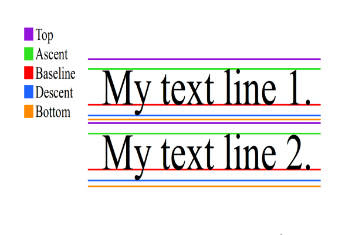

layout: documentation---
category: iris_widget_prog_guide
---

Label Widget
============

The Label widget is used to display static text on a form. It can be used as a form label or an area header with various text alignments and styles.

Following are the key concepts of Label widget:

*   **Naming widgets:** Label widget is used to provide static names to other widgets. For instance, consider a login form that has Employee details as the title of the form.
    
*   **Providing Information:** Label widget is used to provide static data. For instance, consider the following employee details form providing employee details such as Employee ID, Name, and Designation.
    
*   **Tool Tip:** Using Label widget, you can display a message on hovering the mouse pointer over a widget. It is very helpful for a new user to know more about various functionalities.
    
*   **Text Copyable:** Label widget enables you to copy a text and paste it elsewhere.
    

Widgets are normally added to your application using VoltMX Iris, but can also be added from code. For general information on using widgets in VoltMX Iris, see [Designing an Application](http://docs.hcl.com/hcllibrary/iris/iris_user_guide/Default.htm#Part_II_CreatingAnApplication.htm) in the [Iris User Guide](http://docs.hcl.com/hcllibrary/iris/iris_user_guide/Default.htm#Iris_User_Guide.htm).

For general information on the Label widget see the [Label](http://docs.hcl.com/hcllibrary/iris/iris_user_guide/Default.htm#Label.htm) topic in the VoltMX Iris User Guide.

This widget supports drag and drop of text for iOS 11 on iPad.

The Label widget capabilities can be broadly categorized into the following:

*   [Layout](#Layout)
*   [Animations](#Animations)
*   [Data Management](#Data)
*   [User Input Handling](#Gestures)
*   [3D Touch](#3D)
*   [UI Appearance](#UI)
*   [Enabling RTL](#Enabling)
*   [Miscellaneous](#Miscellaneous)
*   [Configurations Common To All Widgets](#Configurations)

#### Layout

  
| Events | Description |
| --- | --- |
| [doLayout](Label_Events.htm#doLayout) | Invoked for every widget when the widget position and dimensions are computed. |

 

| Properties | Description |
| --- | --- |
| [anchorPoint](Label_Properties.htm#anchorPo) | Specifies the anchor point of the widget bounds rectangle using the widget's coordinate space. |
| [bottom](Label_Properties.htm#bottom) | Determines the bottom edge of the widget and is measured from the bottom bounds of the parent container. |
| [centerX](Label_Properties.htm#centerX) | Determines the center of a widget measured from the left bounds of the parent container. |
| [centerY](Label_Properties.htm#centerY) | Determines the center of a widget measured from the top bounds of the parent container. |
| [contentAlignment](Label_Properties.htm#contentAlignment) | Specifies the alignment of the text for a widget with respect to its boundaries. |
| [left](Label_Properties.htm#left) | Determines the lower left corner edge of the widget and is measured from the left bounds of the parent container. |
| [maxHeight](Label_Properties.htm#maxHeigh) | Specifies the maximum height of the widget and is applicable only when the height property is not specified. |
| [maxWidth](Label_Properties.htm#maxWidth) | Specifies the maximum width of the widget and is applicable only when the width property is not specified. |
| [minHeight](Label_Properties.htm#minHeigh) | Specifies the minimum height of the widget and is applicable only when the height property is not specified. |
| [minWidth](Label_Properties.htm#minWidth) | Specifies the minimum width of the widget and is applicable only when the width property is not specified. |
| [padding](Label_Properties.htm#padding) | Defines the space between the content of the widget and the widget boundaries. |
| [paddingInPixel](Label_Properties.htm#paddingInPixel) | Indicates if the padding is to be applied in pixels or in percentage. |
| [top](Label_Properties.htm#top) | Determines the top edge of the widget and measured from the top bounds of the parent container. |
| [width](Label_Properties.htm#width) | Determines the width of the widget and is measured along the x-axis. |
| [zIndex](Label_Properties.htm#zIndex) | Specifies the stack order of a widget. |

  

#### Animations

| Methods | Description |
| --- | --- |
| [animate](Label_Method.htm#animate) | Applies an animation to the widget. |

 

| Properties | Description |
| --- | --- |
| [transform](Label_Properties.htm#transfor) | Contains an animation transformation that can be used to animate the widget. |
| [widgetSwipeMove](Label_Properties.htm#widgetSwipeMove) | Used to enable and configure the left or right swipe actions for a widget. |

 

#### Data Management

| Methods | Description |
| --- | --- |
| [clone](Label_Method.htm#clone) | When this method is used on a container widget, then all the widgets inside the container are cloned. |

 

| Properties | Description |
| --- | --- |
| [breakStrategy](Label_Properties.htm#breakStrategy) | Specifies the method to perform line breaks on paragraphs of Label text. |
| [fontMetrics](Label_Properties.htm#fontMetrics) | Enables apps to obtain information about the metrics of a Label widget's text. |
| [hyphenationFrequency](Label_Properties.htm#hyphenationFrequency) | Sets the periodicity in which words break in a Label text. |
| [pasteboardType](Label_Properties.htm#pasteboa) | Enables an application to share data within the application or with another application using system-wide or application-specific pasteboards. |
| [text](Label_Properties.htm#text) | Specifies a general or descriptive text for a Label widget. |
| [textCopyable](Label_Properties.htm#textCopy) | Enables you to copy a text from a Label widget when the widget is enabled state. |
| [textStyle](Label_Properties.htm#textSyle) | Enables apps to get and set values that control the appearance of the Label widget's text. |
| [textTruncatePosition](Label_Properties.htm#textTruncatePosition) | Enables the appearance of ellipses at a particular position (start, middle, and end of the line) if the text gets truncated due to the maxNumberOfLines property. |
| [toolTip](Label_Properties.htm#toolTip) | Specifies the hint text when the cursor hovers over a widget, without clicking it. |
| [wrapping](Label_Properties.htm#wrapping) | When the content of the label reaches the boundaries, it starts wrapping. |

 

#### 3D Touch

| Methods | Description |
| --- | --- |
| [registerForPeekandPop](Label_Method.htm#register) | Registers a widget to enable 3D Touch peek and pop gestures. |
| [setOnPeek](Label_Method.htm#setOnPek) | Sets and overrides the existing onPeekCallback for the widget. |
| [setOnPop](Label_Method.htm#setOnPop) | Overrides the existing onPopCallback for the widget. |
| [unregisterForPeekandPop](Label_Method.htm#unregist) | Unregisters a widget from 3D Touch peek and pop gestures. |

 

#### User Input Handling

| Events | Description |
| --- | --- |
| [onScrollWidgetPosition](Label_Events.htm#onScrollWidgetPosition) | This event callback is invoked by the platform when the widget location position gets changed on scrolling. |
| [onTouchEnd](Label_Events.htm#onTouchEnd) | An event callback is invoked by the platform when the user touch is released from the touch surface. |
| [onTouchMove](Label_Events.htm#onTouchMove) | An event callback is invoked by the platform when the touch moves on the touch surface continuously until movement ends. |
| [onTouchStart](Label_Events.htm#onTouchStart) | An event callback is invoked by the platform when the user touches the touch surface. |

 

| Methods | Description |
| --- | --- |
| [addGestureRecognizer](Label_Method.htm#addGestureRecognizer) | Allows you to set a gesture recognizer for a specified gesture for a specified widget. |
| [removeGestureRecognizer](Label_Method.htm#removeGestureRecognizer) | Allows you to remove the specified gesture recognizer for the specified widget. |
| [setGestureRecognizer](Label_Method.htm#setGestureRecognizer) | Allows you to set a gesture recognizer for a specified gesture for a specified widget. |

 

#### UI Appearance

| Properties | Description |
| --- | --- |
| [backgroundColor](Label_Properties.htm#backgrou) | Specifies the background color of the widget in hex format. |
| [backgroundColorMultiStepGradient](Label_Properties.htm#backgroundColorMultiStepGradient) | Specifies the multi-step gradient color for the background of the widget. |
| [backgroundColorTwoStepGradient](Label_Properties.htm#backgroundColorTwoStepGradient) | Specifies the two-step gradient color for the background of the widget. |
| [backgroundImage](Label_Properties.htm#backgroundImage) | Sets the image for the background of the widget. |
| [borderColor](Label_Properties.htm#borderColor) | Specifies the border color of the widget. |
| [borderColorGradient](Label_Properties.htm#borderColorGradient) | Specifies the multi-step gradient color for the border of the widget. |
| [borderStyle](Label_Properties.htm#borderStyle) | Specifies the border style for the widget. |
| [borderWidth](Label_Properties.htm#borderWidth) | Specifies the width of the border for the widget in pixels. |
| [cornerRadius](Label_Properties.htm#cornerRadius) | Specifies the radius of the border for the widget. |
| [disabledStateSkinProperties](Label_Properties.htm#disabledStateSkinProperties) | Specifies the skin properties that define the look and feel of the widget, when the widget is disabled or blocked. |
| [focusStateSkinProperties](Label_Properties.htm#focusStateSkinProperties) | Specifies the skin properties that define the look and feel of the widget, when the widget is in focus. |
| [fontColor](Label_Properties.htm#fontColor) | Specifies the font color of the widget. |
| [fontFamily](Label_Properties.htm#fontFamily) | Specifies the font family for the font of the widget. |
| [fontSize](Label_Properties.htm#fontSize) | Specifies the font size for the widget in percentage (%) units. |
| [fontStyle](Label_Properties.htm#fontStyle) | Specifies the font style for the widget. |
| [fontWeight](Label_Properties.htm#fontWeight) | Specifies the weight for the font of the widget. |
| [hoverStateSkinProperties](Label_Properties.htm#hoverStateSkinProperties) | Specifies the skin properties that define the look and feel of the widget, when the cursor hovers on the widget. |
| [pressedStateSkinProperties](Label_Properties.htm#pressedStateSkinProperties) | Specifies the skin properties that define the look and feel of the widget, when the widget is pressed or clicked. |
| [shadowColor](Label_Properties.htm#shadowColor) | Specifies the color for the shadow of the widget. |
| [shadowOffset](Label_Properties.htm#shadowOffset) | This property specifies the current coordinates of the shadow region in the widget. |
| [shadowRadius](Label_Properties.htm#shadowRadius) | Specifies the radius for the blur value of the shadow. |
| [textShadowColor](Label_Properties.htm#textShadowColor) | Specifies the color for the text shadow of the widget. |
| [textShadowOffset](Label_Properties.htm#textShadowOffset) | This property specifies the current coordinates of the text shadow region in the widget. |
| [textShadowRadius](Label_Properties.htm#textShadowRadius) | Specifies the radius for the blur value of the text shadow. |
| [blur](Label_Properties.htm#blur) | You can enable or disable a blur-effect for a widget |
| [clipView](Label_Properties.htm#clipView) | Defines a shape to clip the widget view. |
| [hoverSkin](Label_Properties.htm#hoverSki) | Specifies the look and feel of a widget when the cursor hovers on the widget. |
| [opacity](Label_Properties.htm#opacity) | Specifies the opacity of the widget. |
| [renderAsAnchor](Label_Properties.htm#renderAs) | Most of the Mobile Web browsers do not offer a very good user experience when the entire segment is made clickable. |
| [shadowDepth](Label_Properties.htm#shadowDepth) | Defines the depth of the shadow effect applied to the Label Widget. |
| [shadowType](Label_Properties.htm#shadowType) | Sets a type of the shadow effect to apply to the Label Widget. |

 

#### Enabling RTL

| Properties | Description |
| --- | --- |
| [retainContentAlignment](Label_Properties.htm#retainContentAlignment) | Helps to retain the content alignment of the widget while applying RTL. |
| [retainFlexPositionProperties](Label_Properties.htm#retainFlexPositionProperties) | Helps to retain the left, right and padding properties while applying RTL. |
| [retainFlowHorizontalAlignment](Label_Properties.htm#retainFlowHorizontalAlignment) | Enables you to change the horizontal flow of the widget from left to right. |

#### Miscellaneous

| Properties | Description |
| --- | --- |
| [cursorType](Label_Properties.htm#cursorType) | Specifies the type of the mouse pointer used. |
| [maxNumberOfLines](Label_Properties.htm#maxNumberOfLines) | Defines the maximum number of lines of text allowed in a Label Widget. |
| [newUnderlineBehaviour](Label_Properties.htm#newUnderlineBehaviour) | Underlines the text in Label widget for iOS platform. |

 

| Methods | Description |
| --- | --- |
| [getBadge](Label_Method.htm#getBadge) | Enables you to read the badge value (if any) attached to the specified widget. |
| [setBadge](Label_Method.htm#setBadge) | Enables you to set the badge value to the given widget at the upper, right corner of the widget. |

 

#### Configurations Common To All Widgets

| Methods | Description |
| --- | --- |
| [blur](Label_Properties.htm#blur) | Enables you to make the widget look unfocused. |
| [convertPointFromWidget](Label_Method.htm#convertPointFromWidget) | Allows you to convert the coordinate system from a widget to a point (receiver's coordinate system). |
| [convertPointToWidget](Label_Method.htm#convertPointToWidget) | Allows you to convert the coordinate system from a point (receiver's coordinate system) to a widget. |
| [removeFromParent](Label_Method.htm#removeFromParent) | Allows you to remove a child widget from a parent widget. |
| [setEnabled](Label_Method.htm#setEnabled) | Specifies the widget that must be enabled or disabled. |
| [setFocus](Label_Method.htm#setFocus) | Specifies the widget on which there must be focus. |
| [setVisibility](Label_Method.htm#setVisibility) | Sets the visibility of the widget. |

 

| Properties | Description |
| --- | --- |
| [accessibilityConfig](Label_Properties.htm#accessibilityConfig) | Enables you to control accessibility behavior and alternative text for the widget. |
| [enable](Label_Properties.htm#enable) | Allows you to make a widget visible but not actionable. |
| [enableCache](Label_Properties.htm#enableCa) | Enables you to improve the performance of Positional Dimension Animations. |
| [id](Label_Properties.htm#id) | id is a unique identifier of Image consisting of alpha numeric characters. |
| [info](Label_Properties.htm#info) | A custom JSObject with the key value pairs that a developer can use to store the context with the widget. |
| [isVisible](Label_Properties.htm#isVisibl) | Controls the visibility of a widget on the Form. |
| [parent](Label_Properties.htm#parent) | Helps you access the parent of the widget. |

 

Label Widget Basics
-------------------

When do I use a Label Widget?

You can use a Label widget in the following scenarios:

*   To identify or name a neighboring widget.
*   To provide instructions to the user on the usage of a feature or a widget. For example, if you want to inform a user to select one of the options from a [CheckBoxGroup](CheckBox.htm), you can place a Label before the CheckBoxGroup widget with the text "Choose one of the following".

### Creating a Label Using a Constructor: hcl.ui.Label

​​​​​var lbl1 = new hcl.ui.Label(basicConf, layoutConf, pspConf);​
​​​​​

*   **basicConf** is an object with basic properties.
*   **layoutConf** is an object with layout properties.
*   **pspConf** is an object with platform specific properties.

> **_Note:_** The configuration properties should be passed only in the respective configuration objects otherwise they are ignored.

Example

​​​​​//Defining the properties for a label with id:"label"
var lblBasic = {
    id: "label",
    skin: "lblSkn",
    text: "Hello world",
    isVisible: true
};
var lblLayout = {
    containerWeight: 100,
    padding: \[5, 5, 5, 5\],
    margin: \[5, 5, 5, 5\],
    hExpand: true,
    vExpand: false
};
var lblLayout = {
    renderAsAnchor: true,
    wrapping: constants.WIDGET\_TEXT\_WORD\_WRAP
};
//Creating the label.
var lbl = new hcl.ui.Label(lblBasic, lblLayout, lblLayout);

//Reading the id of the label.
alert("Label id::" + lbl.id);​
​​​​​

### Customizing a Label's Appearance

You can customize the appearance of the Label widget using the following properties:

*   contentAlignment: Specifies the alignment of the content within widget boundaries.
*   margin: Defines the space around a widget.
*   padding: Defines the space between the content of the widget and the widget boundaries.
*   [skin](Label_Properties.htm#skin): Specifies the skin.
*   [fontMetrics](Label_Properties.htm#fontMetrics). Controls the label's characteristics that govern the Label's appearance such as the top, bottom, ascent, descent, and point size of the text.
*   [textStyle](Label_Properties.htm#textSyle). Defines properties such as the line spacing, letter spacing, strikethrough, base line, and line height of a Label's text.

### Changing the Text Size through the Larger Text option in iOS

You can now change the text size of Label widget through the Larger Text option from Settings -> General -> Accessibility -> Larger Text in iOS.

To support this feature, you must implement the 'dynamicTypeList' dictionary in the hcl.application.setApplicationBehaviors function as follows:

​​​​​hcl.application.setApplicationBehaviors({
    dynamicTypeList: {
        enableChangeTextSizeFromAccessibility: true,
        fontTextStyle: constants.FONT\_TEXT\_STYLE\_BODY
    }
});​
​​​​​

Input Parameters

*   enableChangeTextSizeFromAccessibility (BOOL): If set to true, you can change the text size through the Larger Text option from Settings -> General -> Accessibility -> Larger Text in iOS. Otherwise, the text size will not be changed.
    
*   fontTextStyle: This is the font style applied on the Label widget. If you pass only the enableChangeTextSizeFromAccessibility key-value pair in the dictionary and don’t send the fontTextStyle key-value pair, the default value for fontTextStyle will be constants.FONT\_TEXT\_STYLE\_BODY. The values for fontTextStyle are as follows:
    *   constants.FONT\_TEXT\_STYLE\_BODY
        
    *   constants.FONT\_TEXT\_STYLE\_HEADLINE
        
    *   constants.FONT\_TEXT\_STYLE\_SUBHEADLINE
        
    *   constants.FONT\_TEXT\_STYLE\_FOOTNOTE
        
    *   constants.FONT\_TEXT\_STYLE\_CAPTION1
        
    *   constants.FONT\_TEXT\_STYLE\_CAPTION2
        
    *   constants.FONT\_TEXT\_STYLE\_TITLE1 (available in iOS 9.0 and later)
        
    *   constants.FONT\_TEXT\_STYLE\_TITLE2 (available in iOS 9.0 and later)
        
    *   constants.FONT\_TEXT\_STYLE\_TITLE3 (available in iOS 9.0 and later)
        
    *   constants.FONT\_TEXT\_STYLE\_CALLOUT (available in iOS 9.0 and later)
        
    *   constants.FONT\_TEXT\_STYLE\_LARGETITLE (available in iOS 11.0 and later)

Platform Availability

*   iOS

Limitations

*   If you enable this feature, the font size and font family from the respective skin is not respected.
    
*   This feature is available only in iOS.
    

### Font Metrics and Text Style

To gain finer control over the appearance of the text in a Label widget, your app can use the fontMetrics and textStyle properties. Both the fontMetrics and textStyle properties contain JavaScript objects that hold the font information.

A font's metrics and text style as defined for Android and iOS as shown in the following diagrams.

**Android:**

iOS:

The fontMetrics property is contains an object that encapsulates about how to render a particular font. Specifically, it controls the following properties of the Label's text.

| Property | Platform Availability |
| --- | --- |
| 
top
 | Android |
| bottom | Android |
| ascent | Android, iOS |
| descent | Android, iOS |
| leading | Android, iOS |
| pointSize | iOS |
| capHeight | iOS |
| xHeight | iOS |
| lineHeight | Android, iOS |

The fontMetrics property is read-only. The following example shows how an app can read the fontMetrics property.

​​​​​var fontMatricesObject = form.label.fontMetrics;  
hcl.print ("ascent :" + fontMatricesObject.ascent);  
hcl.print ("descent:" + fontMatricesObject.descent);​
​​​​​

The textStyle property enables your app to set or get the following text properties of a Label widget. It contains a JavaScript object of key/value pairs. The keys are shown in the following table.

| Property | Platform Availability |
| --- | --- |
| 
lineSpacing
 | Android, iOS |
| letterSpacing | Android, iOS |
| strikeThrough | Android, iOS |
| strikeThroughStyle | iOS |
| baseLine | iOS |
| minLineHeight | iOS |
| maxLineHeight | iOS |

The textStyle property is read/write. The following code provides an example of how an app might use the textStyle property.

​​​​​//Writing values to the textStyle property.
form.label.textStyle = {
    "lineSpacing": 10,
    "letterSpacing": 10,
    "strikeThrough": true,
    "strikeThroughStyle": constants.TEXTSTYLE\_STRIKETHROUGH\_STYLE\_THICK,
    "baseline": 0.5
};
//Reading values from the textStyle property.
var textStyleInfo = form.label.textStyle;​
​​​​​

### Important Considerations

Label has the following considerations:

*   If the text in the Label is occupying more space than the allocated height of the Label widget, the Label is stretched vertically to accommodate the full text (infinite wrapping) and does not stretch in the horizontal direction.
*   If you place a Label in the Form and do not enter a text, when rendered, the height and width occupied by the Label depends on the following:
    *   If the [Expand](Widget_Common_Properties.htm#Expand) property is _false_, the Label occupies zero height and width.
    *   If the [Expand](Widget_Common_Properties.htm#Expand) property is _true_, the Label occupies the width and height as determined by the [Expand](Widget_Common_Properties.htm#Expand) property.

