                          

2 Way SMS Quick Start Guide: Configuring the Engagement Server to send 2way SMS

Configuring the Engagement Server to send 2-way SMS
===================================================

The section explains how to configure the Engagement server to send and receive 2-way SMS messages. Follow these steps:

1.  Open an Internet browser.
2.  Enter the URI: _manage.hclvoltmx.com_ in the address field and press the **Enter** key.
    
    The **Sign in to your HCL Account** page appears.
    
    
    
3.  Enter your email and password as account credentials. Click the **Sign in** button to continue.
    
    The system displays the **VoltMX Foundry** homepage.
    
    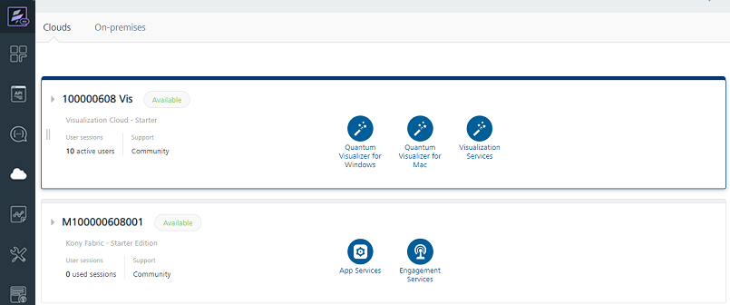
    
4.  On the **VoltMX Foundry** home page, click **Environments** in the left panel.
    
    The **Clouds** page appears.
    
5.  On the **Clouds** page, click the **Engagement Services** tab.
    
    The **Engagement Services** home page (Dashboard) appears.
    
6.  **Engagement** Services: From the left panel, under **Settings**, click **Configuration**.
    
    The **Configuration** home page appears.
    
    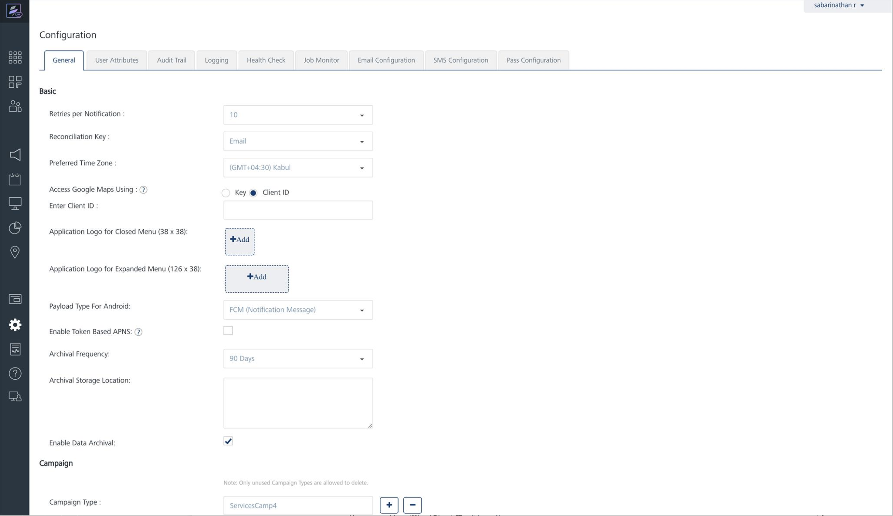
    
7.  Click the **SMS Configuration** tab.
    
    The **SMS Configuration** page appears. There are two tabs:
    
    *   [Outbound](#outbound)
    *   [Inbound](#inbound)
    
    Outbound
    --------
    
    By default the **Outbound** tab is set to active.
    
8.  **Outbound**: In the **SMS Configuration** section, select the provider from the drop-down list to setup the account. The following example displays the **Twilio** as the selected **SMS** service provider.
    
    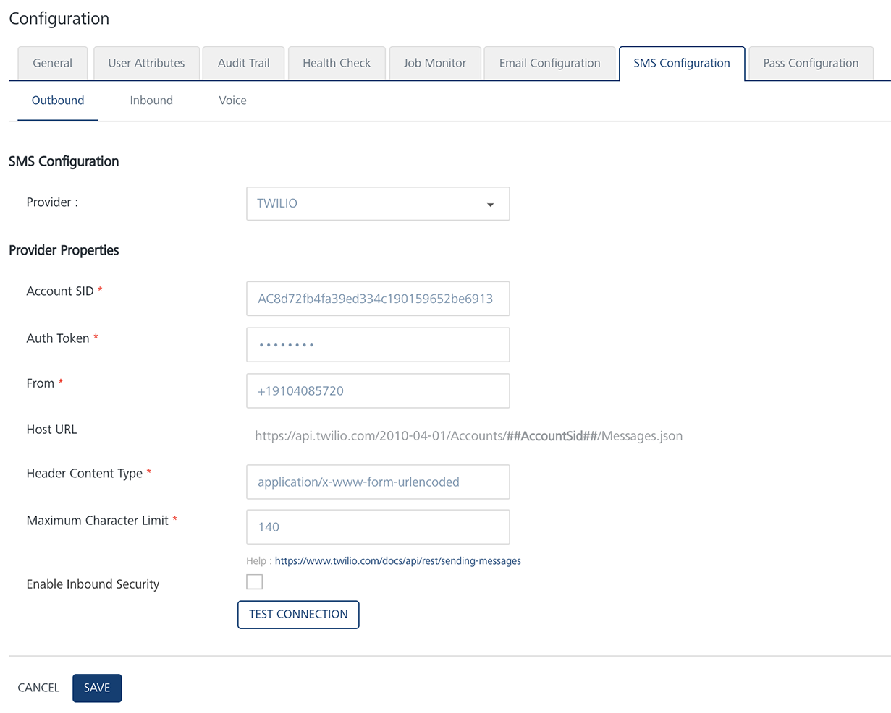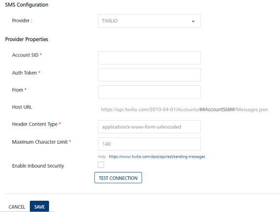
    
9.  Enter details for the following fields:
    *   **Account SID**: TWILIO provides you a unique **Account SID** for your account. Enter the **Account SID** in the **Account SID** field.
    *   **Auth Token**: TWILIO provides you a unique **Auth Token** for your account. Enter the **Auth Token** in the **Auth Token** field.
        
        > **_Note:_** TWILIO uses an **Account SID** and an **Auth Token** to authenticate you with its servers. Your **Account SID** and **Auth Token** are only known to you and TWILIO. It is important to keep both keys confidential to protect your account.
        
    *   **From**: Enter the phone number or client identifier that initiated the call.
        
        Phone numbers are formatted with a + sign and a country code, such as +16175551212. The client identifiers begin with the client URL scheme. For example, for a call from a client named xxxx, the **From** parameter is client:xxxx. The data in the **From** field can be the long code or the short code received from the SMS API provider.
        
    *   **Host URL**: Based on a selected provider, the field is populated with the **Host URL** details.
    *   **Header Content Type**: Based on a selected provider, the field is populated with the header content type as `application/x-www-form-urlencoded`.
    *   **Maximum Character Limit**: Based on a selected provider, the field is populated with the maximum number of characters allowed in a SMS message.
    *   **Enable Inbound Security**: To enable the inbound security, select the check box. Inbound security is applicable only for http and not for SMPP. For SMPP request origin is always from a trusted source.
    *   Click **Test Connection** to check if the connectivity is successful. The system displays the notification that connection is successful. Click **OK** to continue.
10. Click **Save** to save the user credentials.
    
    Inbound
    -------
    
11. Next, click **Inbound.**
    
    The **Inbound** page appears.
    
12. Click the **Add Number** button to add a new inbound number.
    
    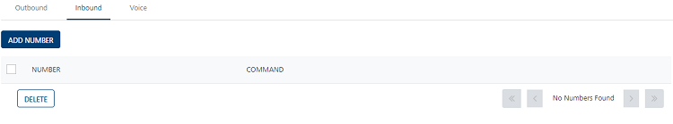
    
    The **Add Number** window appears.
    
    ### Add Number
    
13. Enter details for the following fields:
    
    *   **Name**: Enter a logical name for the number such as **Balance Enquiry**.
    *   **Code**: Code is the purchase number for the provider. This value should be same as displayed on provider's number page, for example 57676.
    *   **Description**: Enter a logical description for the number such as **Balance Enquiry Portal**.
    *   **Reply for Invalid Message**: The message is applicable if wrong command is given. Enter a reply if the inbound response fails such as **Invalid Message**, **Type** **BAL** **for enquiry**.  
        The message is delivered to the user (if subscribed for SMS) when the inbound message does not contain any of the commands configured for that number. For example, you send an SMS for a command that is not registered with this number.
    *   Click **Cancel** if you do not want to save the entered details.
    *   Click **Save**. The inbound number appears in the **Inbound Number** list view. The system displays the confirmation message that the inbound number is saved successfully.
    
    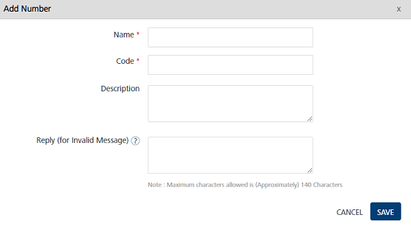
    
    The added number appears in the list view on the **Inbound** home page.
    
    ### Add Command
    
14. Next, click Add Command to create a command that will be used to communicate with the Engagement server.
    
    The **Add Command** window appears. All inbound SMS communication with Volt MX Engagement Services happens with these commands. An inbound number can be configured with one or more commands. The Add command window includes three sections:
    
    *   [Generic Details](#generic-details)
    *   [Configure API](#configure-api)
    *   [Response Message](#response-message)
    
    #### Generic Details
    
15. Enter details for the following fields:
    
    *   **Name**: In the **Name** field type a logical name of the command. In the example, it is called as **Balance Enquiry** as the command retrieves the balance of the user account based on entered month and year.
    *   **Command**: In the **Command** field, enter the short command, for example, BAL. In the example, the BAL command takes two parameters (month and year).
    *   **Description**: In the **Description** field, provide a brief description of the command.
    *   **Reply (for invalid message)**: Enter the message to be returned when invalid input parameters are used along with the command.
    *   **Reply (for fail over case)**: Enter the message to be returned when the system fails to fetch the desired details.
    *   **Command Parameters**: Enter the command parameters that need to be submitted with the command. In this example, the BAL command takes two parameters (month and year).
        
        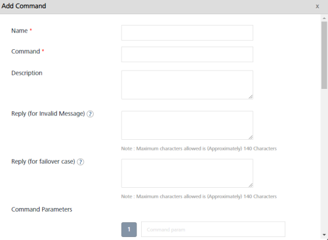
        
    
    #### Configure API
    
    The Configure API section captures all the details pertaining to the API to which the Engagement server will route the incoming request.
    
16. **Configure API**: Enter the details for the following fields:
    
    *   **API URL**: Enter the API URL that provides a response to the incoming request from the Engagement server.
    *   **Request Method**: The request method is a drop-down list with **GET** and **POST** as options. In the example, **POST** method is chosen since the service supports both GET and POST.
        
        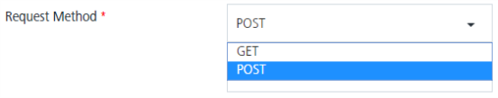
        
    *   **Authentication Type**: The **Authentication Type** drop-down list has three options as **None**, **VoltMX Foundry**, and **Basic** Authentication. In the example, **Basic Authentication** is selected.
        
        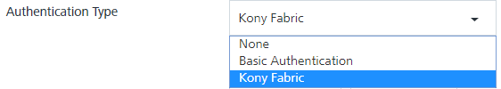
        
    *   **API Authentication**: Enter your credentials for basic authentication.
        
        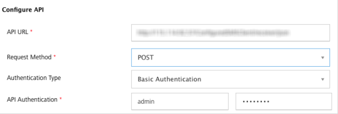
        
        > **_Note:_** For this example, it is assumed that the application to which the request is routed from the Engagement server is configured and set up in a publicly accessible IP address. The sample server takes command of BAL with month and year as the input and returns a balance value for that month and year.
        
    
    *   **Request Headers**: Select the request header as **User Attribute**, **Command Params**, or **Custom Value**. The **Request Headers** section captures data pertaining to any header information that needs to be sent to the invoking service. Based on the option chosen, the values are populated in the drop-down box next to it.
        
        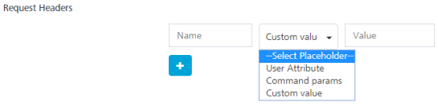  
        
        1.  **User Attribute**: If you select the place holder as **User Attribute**, select the desired option from the drop-down list such as First Name.
            
            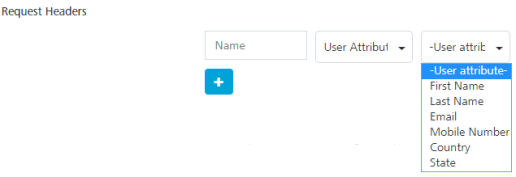
            
        2.  **Command Params**: You can select the already set params under the **Command Parameters** option from the drop-down list.
            
            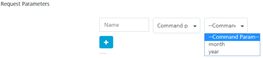
            
        3.  **Custom Values**: Enter a value in the **Custom Value** field.
            
            
            
    *   **Request Parameters**: Similar to the **Request Headers**, the **Request Parameters** can also be sent to the invoking service, if needed.
        
        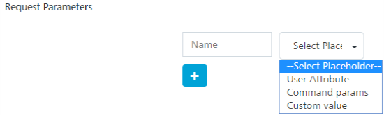
        
    *   **Advanced**: The **Advanced** option allows you to use a template to send the data to the invoking service.
        
        
        
    *   **Response Content Type**: Choose the **Response Content Type** from the drop-down list. The **Response Content Type** is the format in which the response is formatted. In this example, JSON is the content type.
        
        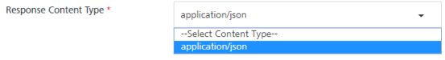
        
    
    #### Response Message
    
    The section helps you to configure the rules to parse the response sent by the backend REST service and construct the SMS reply message to be sent to the user.
    
17. **Response Parameters**: Enter the parameter name along with the Xpath in the response payload so that the value of the parameter can be retrieved.
18. **Secure**: Select this check box if you want the Engagement server to mask the value, so that it is not displayed to a user.
19. **Response Message**: Enter the response message that will be displayed to the user when the correct SMS code is sent.
    
    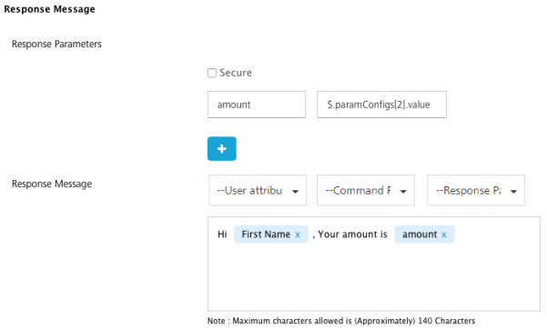
    
    The **Response Message** box displays the selected user attributes, command params and response params.
    
20. Click **Save** to save the settings.
