                           

Overview
========

This document highlights the OAuth sample application which was developed using the services that are set up on Volt MX Foundry. The OAuth application allows users to log in using various social identities and then invoke a few sample services from each provider. The OAuth application demonstrates the capability of Volt MX Foundry to successfully manage the backend tokens automatically and inject them into the subsequent integration service calls.

The purpose of this sample is to highlight the Volt MX Foundry Identity Services for authentication and how it secures and manages backend tokens when using other Volt MX Foundry Integration Services.

Volt MX  Foundry Identity Services provides various identity connectors to integrate into existing enterprise’s identity providers and/or social identities such as Google, Facebook, etc. In addition to providing simple identity connectors, the Volt MX Foundry Identity Service also provides robust backend security token management and automatically manages those tokens and adds the tokens to outgoing subsequent API invocations. This allows the client app to avoid the complexity and security risk of managing backend security tokens.

The following Figure 1 shows the logical architecture of the Volt MX Foundry Identity Services. The Identity Manager connects to backend identity sources and receives one or more backend security token. The identity manager then generates a Volt MX Foundry Token for the client that is a signed JSON Web Token (JWT) token. Then the client makes an API call to other Volt MX Foundry services using the Volt MX Foundry Token and the Identity Service will automatically manage backend tokens as required.

Figure 1: Volt MX Foundry End to End Identity Management

The OAuth sample app and the backend Volt MX Foundry services that are discussed in this user guide focus on using the Volt MX Foundry Identity to connect to social identities via OAuth and then using Volt MX Foundry Integration to invoke OAuth-protected APIs to return user specific data from that provider.

Audience
--------

This manual is intended for developers and IT professions using or intending to use Volt MX Foundry to build, integrate and deploy mobile applications across multiple channels and invoke back-end services that require OAuth authentication.

Overview of the OAuth Application
---------------------------------

The OAuth application includes five identity services for Facebook, Microsoft, Box, LinkedIn, and Volt MX OAuth for authenticating the user within the client app. These identity services are then used by the integration services to invoke the provider APIs with the acquired OAuth access token. The screen shots of the sample app are below. In this example, the user selects to log in using their LinkedIn credentials. The app displays their user profile and enables them to share a link using the OAuth protected REST APIs exposed by LinkedIn.

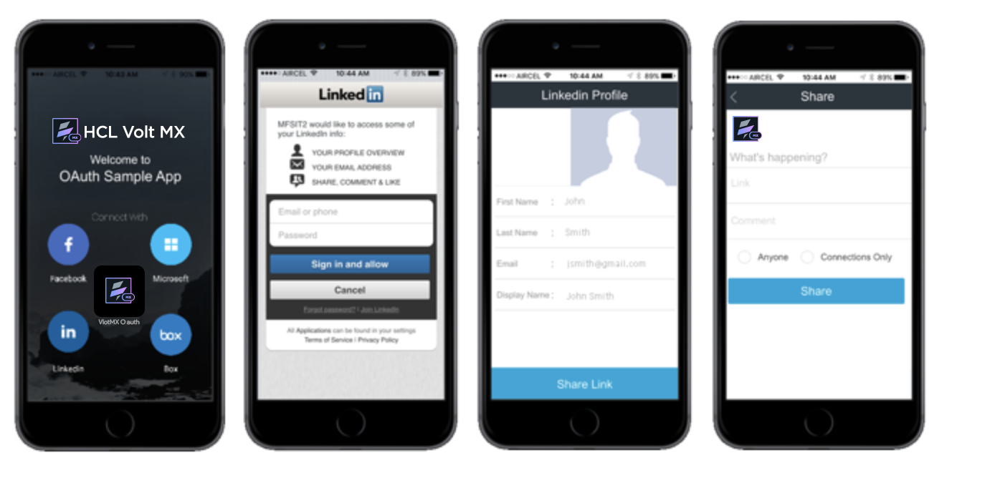

Prerequisites
-------------

*   You have access to a Volt MX Foundry server that has a sample OAuth application installed.  If you do not have access to Volt MX Foundry, sign up for a 90 day trial at [http://www.voltmx.com/products/konfoundry/trial](http://www.voltmx.com/products/voltmxfoundry/trial).

Service Configuration Detail
----------------------------

This section covers the details of the configuration of the Box identity service that comes along with the instance of the Volt MX Foundry. Volt MX Foundry is preconfigured with the certain service providers. They are Facebook, LinkedIn, Microsoft, Instagram, Amazon, Yahoo, and Box Identity services. In this section, you will learn only about configuring the Box Identity service.

For the Box provider, the identity service authenticates using the Box OAuth provider. In this example, the integration service is integrated with the Google Calendar service to retrieve a user’s events. The following section will walk you through the Google Identity Service and the Google Integration Service configuration.

**Log in to Volt MX Foundry**

*   Navigate to the URL for Volt MX Foundry sent to you in your email after you registered for the Volt MX Foundry. Click the URL, and the Volt MX Foundry log-in screen for your cloud appears. To log in to the console, type in the username and password for Volt MX Foundry that was provided in the email.
    
    
    

Applications

Once you log into Volt MX Foundry, the application screen appears as shown below.

Click on the **Apps** icon that is shown below to see the list of all applications that are currently installed in Volt MX Foundry.

The screen shows the icon of OAuth Sample application.

*   Click the **voltmxSampleOAuth** Sample application to review the services that will be used in the client application.

### Volt MX Foundry Integration Services

After you click on the **voltmxSampleOAuth** icon, seven tabs that you can configure appear in the console. They are identity, integration, orchestration, objects, logic, offline sync, and engagement. This section will focus on the following tabs:

*   The Identity tab helps you configure identity providers such as Active Directory, OAuth, SAP, and other as identities that can quickly map to each of your orchestrations and integrations.
*   The Integration tab allows you to configure back-end services as mobile optimized services.
*   The Orchestration service helps you combine integration services into a single service. An orchestration service reduces the need to make multiple calls from the mobile application that slow the performance of the mobile application. 

### **VoltMX Foundry Box Identity Service**

This section provides the details of the Box’s identity service which is set up in the Volt MX Foundry that will connect to Box backend using the OAuth protocol. The following are the steps to review the Box’s Identity service.

1.  Click **VoltMXSampleOAuth** to display all the configuration details of the OAuth application.  
    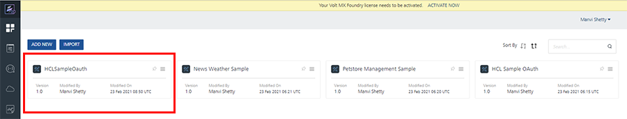  
    
2.  The **Identity** tab of the Configuration details appears by default and all the identity services that are set up display. Click **BoxOauth** to review the identity service that is set up for Box.  
    
    
3.  In the **BoxOauth** identity details screen, the name of the identity service appears in the **Name** field. The **Type of Identity** is **Box**.
    
    The **Provider Details** section provides the details of the back-end enterprise provider, which is Box in this case. The **Authorize End Point** is the URL that will be used to authorize with Box. The **Token End Point** is the end point to retrieve the tokens from Box. The **Callback URL** is the callback URL of the Volt MX Foundry that will be used by Box for callback functionality. This call back URL must be used when configuring the OAuth provider clientID. These values along with the OAuth client id and client secret must be obtained from the OAuth provider.
    
    
    
4.  In the Advanced section of the identity screen, you will see the details that you must provide to fetch the user profile. The **URL** field displays the URL that will be used to fetch the user profile. The **Resource Authentication Scheme** field indicates that the authentication information will be in the header of the request. The **Profile Request Method** field indicates that **Get** method is used to fetch the profile information.
    
    Click **Test Login** to test the identity service that has been set up.
    
    
    
5.  A Grant Access dialog box appears. You must grant permissions to the Identity service. Note the list of permissions shown. More permissions can be added from the Box developer account.
    
    
    
6.  After the successful log in, you will see a message **Log in successful**. You will also see that the profile information of the user from Box is retrieved and is displayed in the **Identity Response**.
    
    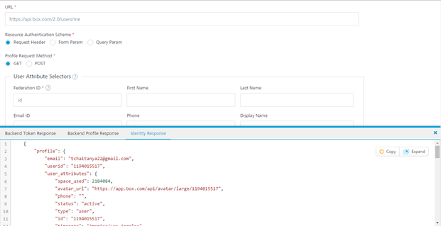
    

### Volt MX Foundry Box Integration Service

This section provides the details of the Box’s integration service that is set up in the Volt MX Foundry that will connect to Box backend and retrieve the user’s Box folders and files list. The following are the steps to review the Box Integration service.

1.  After logging into the Volt MX Foundry and click **VoltMXSampleOAuth** application ( shown as 1 below). This will display all of the application details.  
    
2.  Click the **Integration** (shown as 2 below) tab to review all the integration services that have been set up.
    
    
    
3.  Click **BoxServicesList** to review the details of this integration service.
    
4.  You will notice that **Service Definition** is selected by default. The **Name** will contain the name of integration service. The **Client Authentication** shows that the previously created identity service will be used with this integration service. This is how Volt MX Foundry Identity knows which backend token to automatically add the OAuth access token from Box Login into the outbound call to the OAuth protected REST APIs.
    
    
    
5.  Click **Operations List** to review the list of all the operations.
    
6.  Click **get\_folders\_folderId** operation to review the operation details.
    
    
    
7.  The **Name** displays the name of the service. The **Operation Security Level** indicates that the user has to be authenticated to invoke the service. The **Http Method** indicates that HTTP GET will be used to retrieve the data from the backend service. The **Target URL** will be used to retrieve the data from the backend.
    
8.  In the **Advanced** section of the operation details, you will notice that **Request Input** is selected by default. Also in the **Body**, you will notice that there is a **folderId** filed with a test value. This value of the parameter will get appended to the URL to invoke the service.
    
    At the bottom of the page, select a test environment and click on **Save and Fetch Response** to test the operation and the fetch the data.
    
    
    
9.  Once the token is generated and the operation is successfully invoked, you will see the response as shown below.
    
    
    
10. Click **Response Output** to review the XPath mappings that were created for this operation.
    
    Click **Test** to test the mappings.
    

Configuring Volt MX Foundry OAuth Service
----------------------------------------

In this section, you will learn how to configure developer accounts of Facebook, Box, Google, LinkedIn, and Microsoft with Volt MX Foundry’s OAuth services. The Volt MX Foundry comes with preconfigured identity services to connect to various identities however you can follow the steps below to create your own social identity credentials with various identity providers like Microsoft, Google etc. and then use those credentials to configure the services in Volt MX Foundry.

### Configuring Microsoft Developer Account

1.  Log in to [https://apps.dev.microsoft.com](https://apps.dev.microsoft.com/). Click **Sign in** to log in into the account.  
    Click **Test** to test the mappings.  
    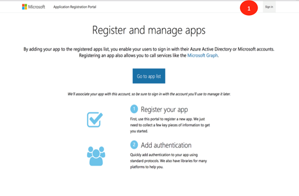  
    
2.  Enter the Email and Password, shown as 2 in the image below. Click **Sign In** to log in to the account, shown as 3 below.  
    
    
3.  Click **Add an App** (shown as 4 ) to add a new application in your developer account.
    
    
    
4.  Enter the name of the application in the **Name** text field ( shown as 5). Click **Create Application** ( shown as 6) to start the creation of the application.
    
    
    
5.  Click **Add Platform** ( shown as 7) to select the platform that the application is targeted for.
    
    
    
6.  Select the platform as **Web** (shown as 8 below) as the application will be targeted to the web platform.
    
    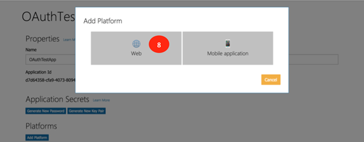
    
7.  Next, you will need to log in to your instance of Volt MX Foundry to retrieve some information that is needed to configure this app that you are creating in [https://apps.dev.microsoft.com](https://apps.dev.microsoft.com/).
    
    Log in to the Volt MX Foundry and click **Apps** to display all the apps that are configured in the Volt MX Foundry.
    
8.  Click **VoltMXSampleOAuth** application (shown as 10) to view the services that are configured for this application.
    
    
    
9.  Click **MicrosoftLogin** service ( shown as 11) to review the service details.
    
    
    
10. Copy the **Callback URL** (shown as 12) as you need this to configure the app that is created on [https://apps.dev.microsoft.com](https://apps.dev.microsoft.com/)
    
    
    
11. Enter the **Redirect URI** (shown as 14) in the web platform section of the application. Click **Add URI** to add the URI to the application.
    
    
    
12. Click **Generate New Password** (shown as 15) to generate the password for the application. The password generated is displayed in a dialog box.
    
    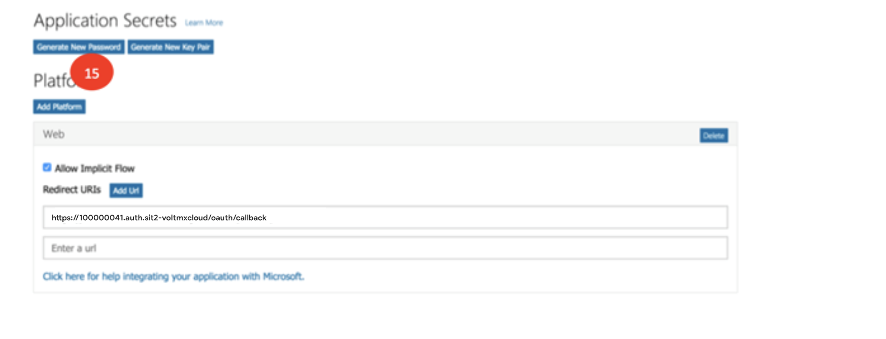
    
13. Copy the **Application Id** (shown as 16) and the **Password** (shown as 17). Click **OK** (shown as 18) to close the dialog box.  
    
14. Click **Save** (shown as 19) to save the configuration of the application on the Microsoft website.  
    
    
15. Log in to the Volt MX Foundry if not already done. Access the **MicrosoftLogin** service of the **VoltMXSampleOAuth** application. In the **Client Id** (shown as 20) and the **Client Secret** fields, (shown as 21) enter the **Application Id** and the **Password** that were generated earlier on [https://apps.dev.microsoft.com](https://apps.dev.microsoft.com/).
    
    Click **Test Login** to test the service with the new **Client Id** and **Client Secret**.
    
    
    
16. Next, you will see a screen as below, where you must enter the password (shown as 23) of the Microsoft account that was created. Enter the password and click **Sign In** (shown as 24) to sign into your account.
    
    
    
17. After successful log in using the credentials entered in the earlier step, the details of the account are displayed by the service that is set up in Volt MX Foundry. Click on the cross mark (shown as 25) to close the window.
    
    
    
18. Click **Save** to save the configuration of the MicrosoftLogin service with the new Client Id and Client Secret.
    
    
    

### Configuring Google Developer Account

This section of the document discusses the details of the Google developer account along with the associated client Id and Client Secret. You can use this client Id and client secret to configure the identity service of Google with your own account information.

1.  Enter [https://console.developers.google.com](https://console.developers.google.com/) in your browser. Enter the email address in the text box (shown as 1 below).  
      
    
2.  After your successful log in, click **I agree** (shown as 2 below) to allow Google to make changes to your account.
    
    
    
3.  Click **Create Project** (shown as 3 ) to begin the creation of the new project. You must create a new project to get the required credentials to configure the app.
    
    
    
4.  Enter the **New Project** name (shown as 4) and click **Create** (shown as 5) to begin the creation of the project.
    
    
    
5.  Click on **Credentials** (shown as 6) to begin the creation of the credentials for the application that was just created.
    
    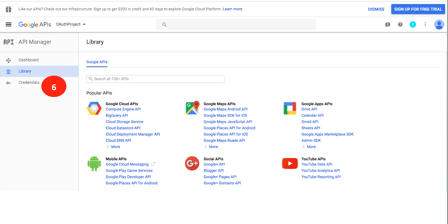
    
6.  Click the **Create Credentials** drop-down list and select **API Key** \*( shown as 7) to begin the creation of the API Key for the application.
    
    
    
7.  After the API key is created (shown as 8 ), click **Close** (shown as 9) to close the pop-up dialog box.
    
    
    
8.  Click **OAuth Client Id** in the drop-down list to begin the creation of the OAuth Clint Id and client secret for the application that was created.
    
    
    
9.  Click **Configure Consent Screen** to continue the creation of the client id and secret.
    
    
    
10. In the **OAuth Consent Screen**field, enter the name of the application in the **Product Name shown to users** field(shown as 12). Click **Save** (shown as 13) to save the settings.
    
    
    
11. Log in to your instance of Volt MX Foundry if not already done. Click **Apps** to see the list of all apps that are installed in the Volt MX Foundry instance. Click **VoltMXSampleOAuth** (shown as 15) to view the details of the application.
    
    
    
12. Click on **GoogleLogin**(shown as 16) identity service to view the details of the service.
    
    
    
13. In the details section of the identity service, make a note of the **Callback URL**(shown as 17) as this will be needed to configure the application that you are creating on the [https://console.developers.google.com](https://console.developers.google.com/) website.
    
    
    
14. Select **Web Application** as the **Application Type** (shown as 18). Enter the **Callback URL** that was noted earlier into the **Authorized Redirect URI**(shown as 19) and click **Create**. This will create the client Id and client secret for the application created.
    
    
    
15. Copy the **Client Id** and **Client Secret** (shown as 21). This client id and client secret will be used to configure the identity service in Volt MX Foundry.
    
    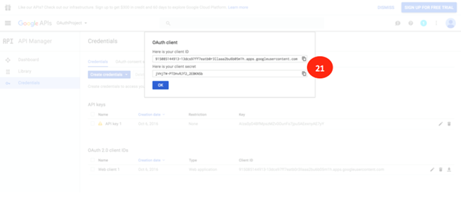
    
16. Log in to Volt MX Foundry if not already done. Select the **GoogleLogin** service and enter the **Client Id** (shown as 22) and **Client Secret** (shown as 23). Click **Test Login**(shown as 24) to test the service with the credentials entered.
    
    
    
17. Click **Allow** (shown as 25) for the identity service to retrieve the details of your Google account.
    
    
    
18. After the details are successfully retrieved the information will be displayed in the **Identity Response** section. Click on the cross mark (shown as 26) to close the window.
    
    
    
19. Click **Save** to save the newly configured identity service.
    
    
    

### Configuring LinkedIn Developer Account

This section of the document discusses the details of the creation of the LinkedIn developer account and the associated client Id and Client Secret. You can use this client Id and client secret to configure the Volt MX Foundry’s identity service of LinkedIn.

1.  Enter [https://developer.linkedin.com/](https://developer.linkedin.com/) in your browser. Click **Sign In** to create an account or log in to an existing account (shown as 1 below).  
    
2.  Enter the email address and the password (shown as 2) for the LinkedIn account that was created.  
    
    
3.  Click **My Apps** to create a new App. You must create a new app to generate a client Id and a client secret. You need the client ID and the client secret to configure LinkedIn.  
    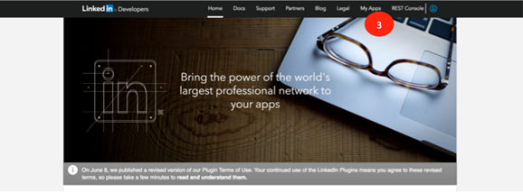
    
4.  Click **Create Application** to continue the creation of the new application.
    
    
    
5.  Enter the required information in the **Create Application** screen and click **Submit** to save the application details.
    
    
    
6.  Log in to your instance of Volt MX Foundry if not already done and select the **VoltMXSampleOAuth** application. Click **LinkedInLogin** service to review the service details. Note that **Callback URL** (shown as 6) as this is needed to configure your newly created application of LinkedIn.
    
    
    
7.  Now continue the creation of the new LinkedIn application. Please note the **Client ID** and **Client Secret** (shown as 7). Copy the **Callback URL** from Volt MX Foundry into **Authorized Redirect URLs** and click **Add** (shown as 8). Click **Update** to update the newly created application details with the URL.
    
    
    
8.  Log in to Volt MX Foundry if not already done. Select the **VoltMXSampleOAuth** App and the **LinkedInLogin** service. Copy the **Client Id** and **Client Secret** from the newly created LinkedIn app and copy the same into the Volt MX Foundry’s Client Id and Client Secret fields (shown as 10). Click **Test Login** (shown as 11) to test the newly configured service.
    
    
    
9.  Click **Allow** (shown as 11) to authorize the Volt MX Foundry identity service to access your LinkedIn account information.
    
    
    
10. After the service is successfully invoked, the response will be displayed in the **Identity Response** section. Click the cross mark ( shown as 12) to close the window.
    
    
    
11. Click **Save** ( shown as 13) to save the newly configured service with your client Id and client secret.
    
    
    

### Configuring Box Developer Account

This section of the document discusses the details of the creating a Box developer account and the associated client Id and Client Secret. You can use this client Id and client secret to configure the Volt MX Foundry’s identity service of Box.

1.  Type [https://developer.box.com/](https://developer.box.com/) in your browser of choice. Click **Log In** (shown as 2 ) or click **Sign Up** ( shown as 1) to sign up for a new account.  
    
2.  Enter your email and password (shown as 3) to log into your Box account.
    
    
    
3.  Click **Create a Box Account** (shown as 4) to create a new application. A new app is needed to generate the Client Id and Client Secret that are needed to configure the Box identity service of Volt MX Foundry.
    
    
    
4.  Enter the name of the application (shown as 5) and click on **Generate Application** (shown as 6) to begin the generation of the application.
    
    
    
5.  Log in into your instance of Volt MX Foundry if not already done. Click on **VoltMXSampleOAuth** application and select the **BoxLogin** Identity service to review the details. Note the **CallBack URL**as that is needed to configure the new Box application.
    
    
    
6.  Copy the **Callback URL** value of the Volt MX Foundry’s Box identity service to the **Redirect\_URL** (shown as 8) section of the Box application. Note down the **Client Id** and **Client Secret** from the **Outh2 Parameters** (shown as 8) section of the Box application. You need the client Id and the client secret while configuring the Volt MX Foundry service.
    
    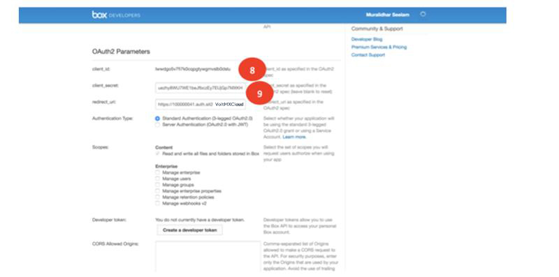
    
7.  Click **Save Application** to save the newly created Box application.
    
    
    
8.  Log in into your instance of Volt MX Foundry if not already done. Click **VoltMXSampleOAuth** application and select the **BoxLogin** Identity service to review the details. Copy the **Client Id** and **Client Secret** from the new Box application to the **Client Id** (shown as 11) and **Client Secret** (shown as 12) of the Volt MX Foundry application. Click **Test Login** to test the identity service with the new credentials.
    
    
    
9.  Click **Grant Access to Box** (shown as 13) to allow the Volt MX Foundry identity service to access the Box account details.
    
    
    
10. After the identity service has successfully logged with the credentials provided, the details are displayed in the **Identity Response** section. Click the cross mark(shown as 14) to close the response section.
    
    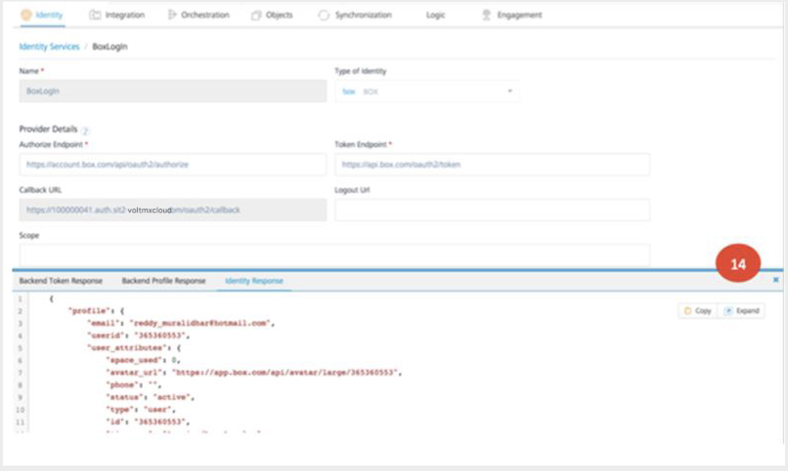
    
11. Click **Save** to save the newly configured Box identity service.
    
    
    

### Configuring Facebook Developer Account

This section of the document discusses the details of the creation of the Facebook developer account and the associated client Id and Client Secret. You can use this client Id and client secret to configure the Volt MX Foundry’s identity service of Facebook.

1.  Type [https://developers.facebook.com/](https://developers.facebook.com/) in your browser to access the developer site of Facebook. Click **Log In** (shown as 1) to log in to the developer account.  
    
2.  If you already have an account, log in using the **Email** and **Password** (shown as 2) and click **Log In** (shown as 3). If you do not have an account, click **Sign up for Facebook** to create a new account.
    
    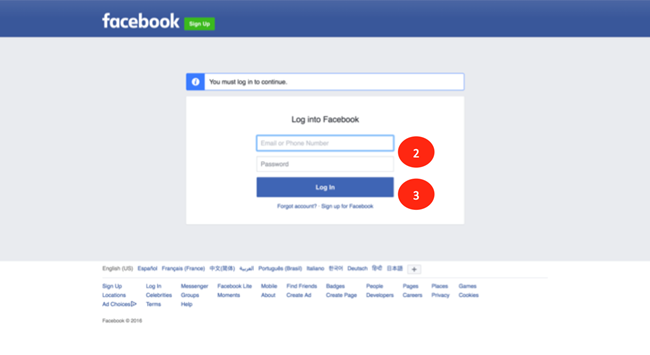
    
3.  Click on **My Apps** and **Add a New App** to begin the creation of a new app.
    
    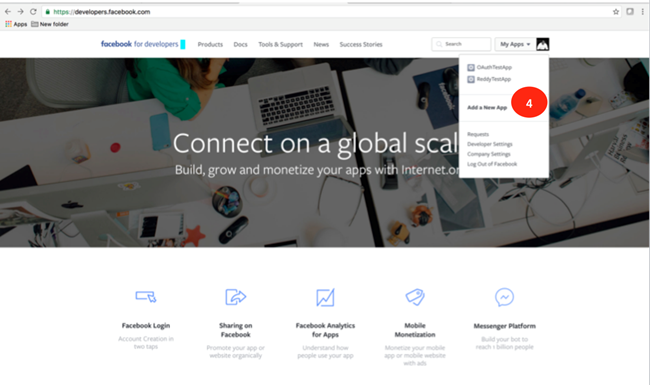
    
4.  Choose the **WWW** (shown as 5) below to create the application for the web platform.
    
    
    
5.  Enter the application name (shown as 5) and click **Create Facebook App Id** (shown as 6).  
    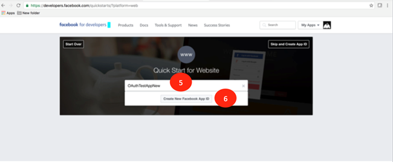  
    
6.  Enter the **Contact Email** and choose **Category** and click **Create App Id** for the new application that is being created.
    
    
    
7.  Enter the text for the security check in **Text in the Box** (shown as 10) and click **Submit** to pass the security check.
    
    
    
8.  Log in to your instance of Volt MX Foundry if not already done. Click **Apps** to see the list of all apps that are installed in the Volt MX Foundry instance. Click **VoltMXSampleOAuth** (shown as 15) to view the details of the application. Click **FacebookLogin** identity service to view the details of the service. Note the **Callback URL** as this will be needed to configure the newly created app of Facebook.
    
    
    
9.  On the developer site of Facebook, enter the **Callback URL** value in **Site URL** (shown as 13). Click **Next** (shown as 14) to continue the creation of the application.
    
    
    
10. Click **Skip to Developer Dashboard**(shown as 15) to complete the creation of the application.
    
    
    
11. Copy the **App Id** (shown as 16). Click **Show** (shown as 17) to view the **App Secret**. The App Id and App Secret are needed to configure the Facebook identity service of Volt MX Foundry with your application credentials.
    
    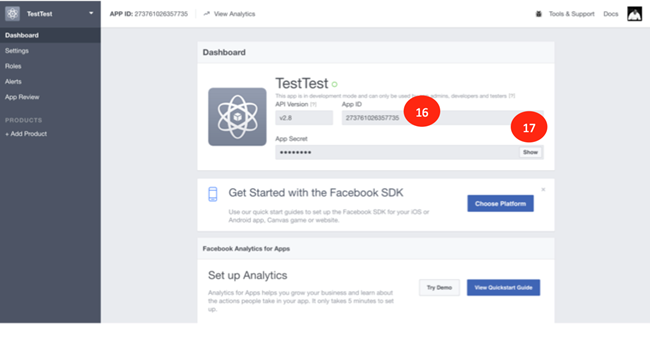
    
12. Enter the password of your Facebook account in the **password** field (shown as 18) if prompted.
    
    
    
13. Note the **App Secret** (shown as 19) as it is needed to configure the Facebook identity service of Volt MX Foundry.
    
    
    
14. Log in to your instance of Volt MX Foundry if not already done. Click **VoltMXSampleOAuth** app. Click **FacebookLogin** to view the details of the service. Enter the **App Id** that was saved earlier into the **Client Id** (shown as 20) and **App Secret** into **Client Secret** (shown as 21) fields. Click **Test Login** (shown as 22) to test the service with the configured data.
    
    
    
15. After the successful invocation of the Facebook identity service, the data that is returned is displayed in the **Identity Response** section. Click the cross mark (shown as 23) to close the window.
    
    
    
16. Click **Save** (shown as 24) to save the service new the new configuration.  
    

### Configuring Volt MX OAuth Account

This section of the document discusses the details of the creation and usage of your [manage.hclvoltmx.com](http://manage.hclvoltmx.com/) credentials in the Volt MX OAuth application. You can use the same username and password you use in the manage.hclvoltmx.com portal, to restrict access to the application.

1.  Navigate to [https://manage.hclvoltmx.com](https://manage.hclvoltmx.com/). You will see the log in screen for your Volt MX account.  
    
2.  Create your account by clicking the **Create a free account** link.
    
3.  Fill in the Account creation form and proceed to click on **Create your Account**.  
    
4.  On successful creation of your account, please proceed to use the email address you provided to activate your Volt MX Cloud account.
    
    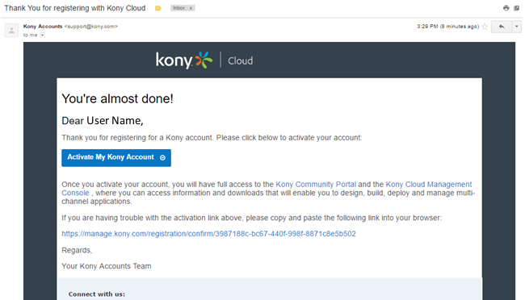
    
5.  Fill in the additional details required to create your Volt MX Cloud account. Click **Create Account** to proceed.
    
      
    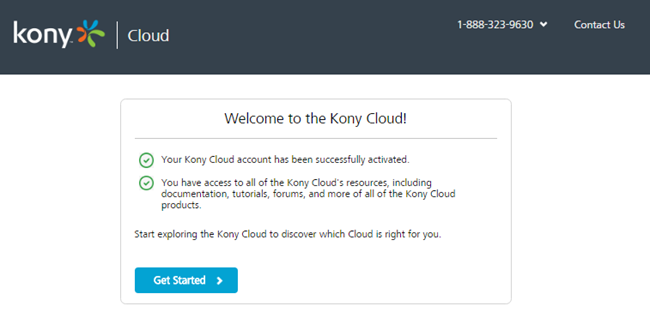
    
6.  Click on **Get Started** to start using your new account.
    
    
    
7.  Your Volt MX Cloud account is now ready to use.
    
8.  Creating Volt MX Foundry service to access Volt MX Cloud account. The Volt MX OAuth application uses an integration service to connect to the Volt MX OAuth endpoint. You can connect to this service by using the endpoint: [https://accounts.auth.voltmxcloud.com/login](https://accounts.auth.voltmxcloud.com/login).
    
    
    
9.  Add an **authenticate** operation to take in the **userid** and **password** as input parameters.
    
    
    
10. Click on **Fetch Response** to retrieve profile information for any user with a Volt MX Cloud account.
    
    
