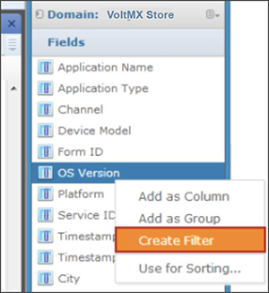
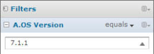
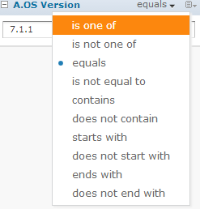
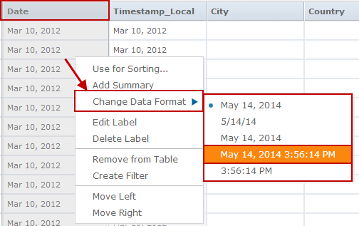
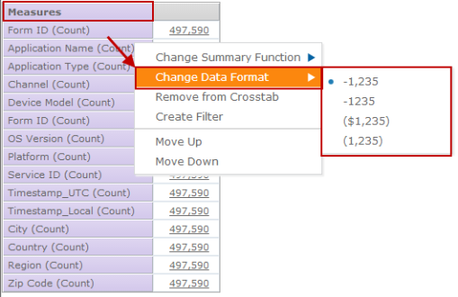

                            

Advanced Actions in Custom Reports
==================================

You can do the following advanced actions in the Custom Reports screen.

1.  [Using Filters](#using-filters)
2.  [Changing Data Format](#changing-data-format)
3.  [Creating Custom Fields](#creating-custom-fields)

Using Filters
-------------

You can use filters to configure the custom report being built.

1.  Right-click an item in the **Domain** panel and click **Create Filter**.

  
The filter appears in the **Filters** pane.  

3.  Use the fields in the filter to change its value.
4.  While using multiple filters, you can build expressions for applying filters using AND, OR and NOT operators.
    *   When all filter conditions must be true, use AND. For example, A and B and C.
    *   When any one of the filter conditions must be true, use OR. For example, A or B or C.
    *   When one of the conditions has to be not true, use NOT. For example, not A.
    *   You can use a combination of these as well. For example, (A and B ) or C.
    
    
    
5.  As you set the filters in the **Filters** pane, the data is filtered and appears in the **Canvas/Report Builder** area.

Changing Data Format
--------------------

While creating a report, you can modify the data format of fields such as Date and Timestamp.

After you add fields as Columns or Groups, you can right-click on the table/crosstab data and select **Change Data Format**.

The following picture shows the **Change Data Format** option for a table report.

The following picture shows the **Change Data Format** option for a Crosstab report.

Creating Custom Fields
----------------------

You can create new fields in an Ad Hoc View by applying mathematical formulas to a view’s existing numeric fields. For example, consider a view that includes both a Cost and a Revenue field. You could calculate the profit for each record by creating a custom field that subtracts the Cost field from the Revenue field. Create a custom field by selecting an existing field in the Measures section of the Data Source Selection panel of a table-type view. The Create Custom Field menu item appears on the context menu when you right-click a numeric field.

The Ad Hoc Editor supports three types of functions:

*   Basic functions include addition, subtraction, multiplication, and division. You can use these functions with a constant (such as multiplying the cost by two to calculate a standard 50 percent markup), or you can use them with multiple fields. Select multiple fields using Ctrl-click; the columns’ borders change color to indicate that multiple fields are selected. Right-click to open the context menu and create a custom field.
*   Advanced functions include round, rank, percent of the total, percent of row group, and percent of a column group. These functions do not take constants and do not support multiple fields.
*   Date functions can calculate the difference between two dates in a number of intervals, such as years, weeks, days, and seconds.

A custom field can include only a single function. To use more than one function, create two custom fields, with one building on the other. In this case, pay special attention to the order in which you create the custom fields, as this may affect the results. For example, rounding then multiplying is different from multiplying then rounding.

Because custom fields can build upon one another, you can create complex calculations. For example, you can divide the Profit custom field in the previous example by the Revenue field to express each record’s margin as a percent. When a custom field is the basis of another field, you cannot delete it until you delete the one that builds on it.

To create a custom field based on one field:

1.  In the **Measures** section of the **Data Source Selection** panel, right-click a numeric field and select **Create Custom Field** from the context menu.
2.  Depending on the type of function you want to create, select options in **Basic Functions** or **Advanced Functions**.
3.  In Basic Functions, you can add, subtract, multiply, or divide the field values by a constant, which you enter as a number in the selected field. This number is the constant to use in the formula.
4.  If you selected a basic function, click **Swap** to put the constant before the field in the formula. This is only useful in conjunction with ordered operations.
5.  Click **Create Field**. The custom field appears in the list of available measures.

To create a custom field based on multiple numeric fields:

1.  In the Measures section of the Data Source Selection panel, ctrl-click two or more numeric fields, right-click one of the selected fields and select Create Custom Field from the context menu.
2.  Select from the following options:
    1.  If you selected just two fields, choose **Add +**, **Subtract -**, **Multiply \***, or **Divide /**.
    2.  If you selected more than two fields, choose **Add All** or **Multiply All**.
3.  Click **Swap** from the context menu to change the order of the fields in the formula. This is only useful in conjunction with ordered functions.
4.  Click **Create Field**. The custom field appears in the list of available measures.

To create a custom field based on two date fields:

1.  In the **Data Source Selection** panel, ctrl-click two date fields.
2.  Right-click, and select **Create Custom Field** from the context menu.
3.  Select one of the **Date Difference** intervals. You can compare dates only when exactly two date fields are selected.
4.  Click **Create Field**. The custom field appears in the list of available measures.

Remember these points while creating custom fields:

*   To edit an existing custom field, right-click it and select Edit Formula from the context menu. You can then choose a different function, or enter a different value (if you are editing a basic function).
*   When you create a custom field based on a field on the panel, the new field appears in the panel. When you create a custom field from a field in Data Selection, it appears at the bottom of the list.
*   The percent functions are unique among the custom functions in that they calculate values based on the grouping defined in the view. The following limitations apply:
    *   The percent column group functions are meaningless in charts and tables. In these contexts, these functions always return 100 percent.
    *   Custom fields using the special percent functions cannot be used as a group, as a filter, or as the basis for other custom fields.
    *   The summary function for custom fields using the percent functions is always sum; this cannot be modified. The percent is always calculated on the sum of the original field, regardless of the summary function applied to the field in the table or crosstab, if any.
