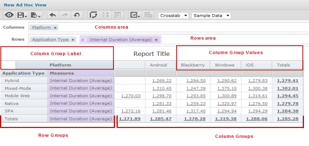
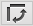

                            

Crosstab Report User Interface
==============================

The following picture illustrates a Crosstab Report in the Ad Hoc editor.

> **_Note:_** It is recommended to work only with Sample Data while building reports.

**Columns Area** - Drag dimensions and measures from the Data Selection panel to this area to create column groups. Drag fields to change the order of the groups. Measures must all be in the same area. You cannot have measures in the Columns and Row areas at the same time.

**Rows Area** - Drag dimensions and measures from the **Data Selection** panel to this area to create row groups. Drag fields to change the order of the groups. Measures must all be in the same area. You cannot have measures in the Columns and Row areas at the same time.

**Row and Column group labels** - This displays the name of each field used for grouping. Right-click the group labels to use the context menu. When no row groups are defined, the words Row Group indicate this vertical region.

**Row and Column group values** - These values are heading cells that show the group values. When there is more than one level of grouping, use the icons on the outer groups to expand or collapse the inner groups. Right-click a group value to exclude it or to keep only that value from among all group values of the same level.

You can perform the additional actions while working with Crosstab Report.

*   **Set the granularity of date groups** - When you select a date field as a group, you can specify the granularity of the group values. Right-click the group label, select **Change Grouping**, and select **Year**, **Quarter**, **Month**, or **Day**.
*   **Pivot a single group** - To pivot any group from row to column or row, select the group by clicking its label, and then drag it to the other area. You can also right-click the group label and select **Move to Column Group** for row groups or **Move to Row Group** for the column groups.
*   **Pivot entire crosstab** - To pivot all row groups to column groups at the same time, click **Switch the groups** icon .
*   **Filtering** - Right-click a group label and select **Create Filter** to filter your data by the members in that group. Note that creating a filter from a group is very similar to slicing.
*   **Keep Only** - Slice out a single group by right-clicking its group value and selecting **Keep Only**. Use Ctrl-click to select multiple members to keep.
*   **Exclude** - Remove a group value from any group by right-clicking it and selecting **Exclude**. Use Ctrl-click to select multiple members to exclude.
*   **Summaries (Totals)** - By default, the crosstab includes grand totals of all row groups, shown in a Totals row at the bottom, and of all column groups, shown in a **Totals** column to the right.
    *   To toggle the row totals, right-click the left-most row group and select **Delete Row Summary** or **Add Row Summary**. To toggle the column totals, right-click the topmost column group and select **Delete Column Summary** or **Add Column Summary**. You cannot hide the inner totals of an expanded row or column group.
*   **Change Summary Functions** - Right-click a measure label and click the **Change Summary Function** to select a summary function. For example, you may want to display an average rather than a total.
*   **Column group limits** - In some cases, the editor prompts you to confirm that you want it to return large amounts of data. When the number of column groups exceeds a configurable limit, the editor displays an ellipsis (...); its ToolTip indicates the number of remaining groups. Click the ellipsis to display them.
    
*   **Sorting** - Crosstabs support multiple levels of sorting:
    
    *   Right-click **Measures** to sort measure groups by a label.
    *   Right-click a **row** or **group** label to sort its values. When your selection contains inner groups, they are also sorted.
    *   Right-click an inmost column header to sort the column values. Sorting can only be set for one column at a time.
