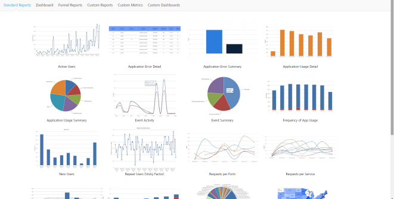
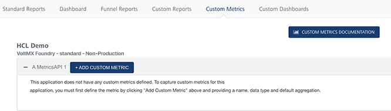
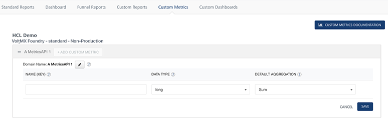
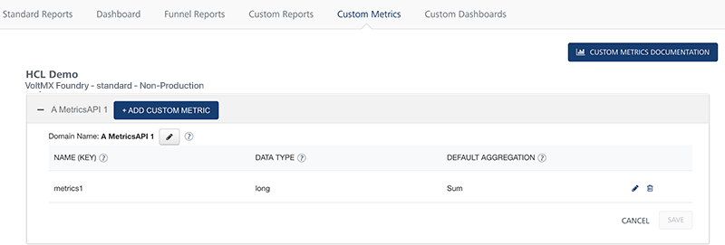
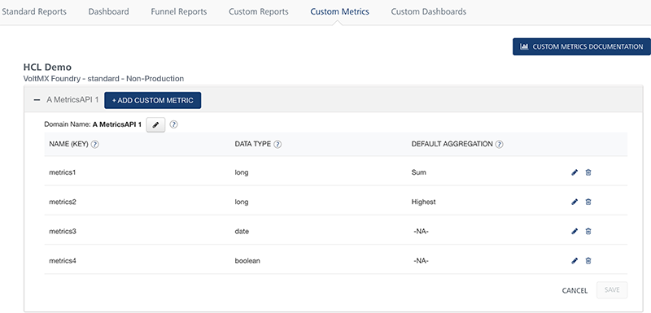
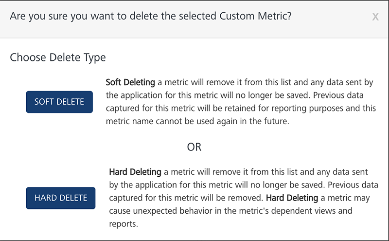

                            


You are here: [Custom Metrics](#custom-metrics) > Prerequisites

Custom Metrics
==============

Custom Metrics is a feature of Volt MX Foundry Cloud that lets you to capture custom data from an application and build reports using the custom data. You receive access to a set of standard metrics gathered from the application such as the platform and the channel. You can use these standard metrics to build custom reports. This feature is available to the application deployed to an app services server in the development cloud.

The Cloud Management portal lets you define the custom metrics. Administrators and Owners of the cloud account will see Custom Metrics and Custom Reports in the Console tab.

*   **Custom Metrics** lets you add or delete metrics that they intend to send from the application. The Custom Metrics page shows a list of development clouds (environments) in the account and a list of applications deployed in each cloud. If you deploy an application to Volt MX Foundry Cloud, it is displayed in the **Custom Metrics** page.
*   **Custom Reports** lets you create/modify/save reports with the metrics created in the **Custom Metrics** screen.
    *   You can also choose to save the reports as Private Reports or Shared Reports. Private Reports are accessible only to the creator where as the Shared Reports are accessible to all users who have permission to view custom reports in that particular account.



> **_Note:_** To access the Custom Metrics page, register at [manage.hclvoltmx.com](https://manage.hclvoltmx.com/).

Prerequisites
-------------

To create custom metrics and generate custom reports in Volt MX Cloud, meet the following prerequisites: 

1.  A working account in Volt MX Cloud.
2.  Active Volt MX Foundry Cloud.
3.  An application deployed to Volt MX Foundry Cloud.

Defining Custom Metrics in Volt MX Cloud
----------------------------------------

The Custom Metrics page enables you to define the metrics for an application. Each metric is identified by a unique key within the application. There are six types of data: String, Boolean, Long (Integer), Double, Date, and Timestamp. The page shows all development clouds and applications deployed to these clouds. To add custom metric parameters to an application, in the Reports section of the application, go to **Custom Metrics** tab , click on **\+ Add Custom Metric** button.

For applications that already have custom metrics defined, clicking on **Add +** will show the list of Parameter Names, Data Type, and Default Aggregation function.

The application can send multiple key-value pairs that will be stored as custom metrics for reporting purposes. The user must register each key sent by the application and provide the Data Type and Default Aggregation values.



To create a custom metric, follow these steps: 

1.  Click **Add Custom Metric**. The following pane appears.



3.  Enter a name in the **Name (key)** area. Each metric is identified by a key that must to be unique within the application. The application code must use the same Name for sending data in the key-value pairs in JSON string. The key is case insensitive.
4.  Select a **Data Type** from the list. The available values are Long (integer values), Double (values with decimal points like 12.5), String, and Date.

> **_Note:_** The data type mentioned here must match the data type sent from the application for the metric name.

6.  Select a **Default Aggregation** from the list. The Default Aggregation is the cumulative function you apply to the data while building the application. The available values are Sum, Average, Highest, Lowest, Count, and Distinct Count. Default Aggregation functions are only applicable for Long and Double.
7.  Click **Save**. The parameters will be defined and saved under the application name. The custom metrics defined will be sent to the application to collect data.



9.  Click **Cancel** to cancel adding custom metrics to the application.

For example, the image below shows custom metrics for one of our sample apps VoltMXStore:



To delete a custom metric, follow these steps: 

1.  Select the custom metric in the application.
2.  Click **Delete**. A warning message appears.



4.  Click **Yes, I'm sure** to delete the custom metric.

> **_Note:_** Data from an application with a key corresponding to a deleted parameter name will not be saved. Existing reports and ad hoc views already created from the domain that use the deleted parameter will work. However, creating new ad hoc views from the same domain will have the underscore \_ deleted suffix for the parameter name to denote to the developer building reports that this is currently a deleted parameter.

Rules for Custom Metrics Data Types
-----------------------------------

*   Long - Integer values
*   Double - Values with decimal point like 450.99
*   Boolean - true/false
*   String - Any string value, maximum length 500 characters.
*   Date - String value denoting date in the format yyyy-mm-dd. Example: "2014-05-01"
*   Timestamp - String value denoting timestamp. Valid formats for timestamp are shown below
    *   yyyy-mm-dd hh:mm:ss --- preferred format
    *   yyyy-mm-dd hh:mm:ssz
    *   yyyy-mm-dd hh:mm:ss+hh:mm
    *   yyyy-mm-dd hh:mm:ss-hh:mm
    *   z stands for zulu (UTC)
    *   +hh:mm is positive offset of time from UTC
    *   \-hh:mm is negative offset from UTC.
    *   Example: 
```
"2014-04-15 13:02:55"   
    "2014-04-15 13:02:55z"   
    "2014-04-15 13:02:55+05:30"   
    "2014-04-15 13:02:55-05:30"
```
