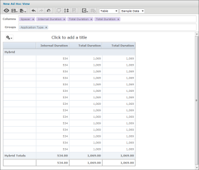
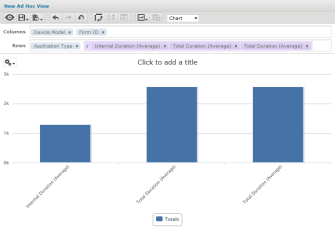
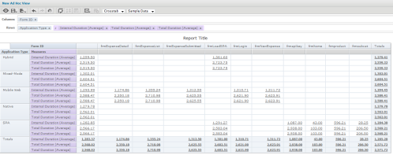

                            

You are here: Custom Reports

Custom Reports
==============

After you have defined the custom metrics for your application, you can create a custom report. A custom report can be generated in three formats: **table**, **chart**, and **crosstab**.

<table style="width: 100%;"><colgroup><col> <col></colgroup><tbody><tr class="TableStyle-Basic-Body-Body1"><td class="TableStyle-Basic-BodyE-Column1-Body1" style="font-weight: bold;text-align: left;">Table</td><td class="TableStyle-Basic-BodyD-Column1-Body1"></td></tr><tr class="TableStyle-Basic-Body-Body1"><td class="TableStyle-Basic-BodyE-Column1-Body1" style="font-weight: bold;text-align: left;">Chart</td><td class="TableStyle-Basic-BodyD-Column1-Body1"></td></tr><tr class="TableStyle-Basic-Body-Body1"><td class="TableStyle-Basic-BodyB-Column1-Body1" style="font-weight: bold;text-align: left;">Crosstab</td><td class="TableStyle-Basic-BodyA-Column1-Body1"></td></tr></tbody></table>

Click the following links to view the user interface elements of these reports.

1.  [Table](Table_Report_User_Interface.md)
2.  [Chart](Chart_Report_User_Interface.md)
3.  [Crosstab](Crosstab_Report_User_Interface.md)

> **_Note:_** You must be an owner or an administrator to create reports.

> **_Note:_** To Import and Export Custom Reports and Custom Dashboards through MFCLI, refer to [Import Custom Reports and Custom Dashboards through MFCLI](../../../Foundry/voltmx_foundry_user_guide/Content/Export_Import_Custom_Reports_Dashboards_MFCLI.md)
