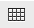

                             

Dashboard Designer Interface
----------------------------

A **Dashboard Designer** is a web-based UI for embedding reports, images and web pages into a single, interactive space. The **Dashboard Designer**  window appears when you click **Create Dashboard** from the **Custom Dashboards** window.

**The Dashboard Designer UI includes the following panels:**

*   **Existing Content**: The list of created reports are displayed in this section. You can drag the content from this pane to the dashboard canvas. The panel includes the following sections.
    
    | Section | Description |
    | --- | --- |
    | New Content | Lists the content elements you can create for your dashboard.
    | Field | Description |
    | --- | --- |
    | Free Text | A free-form text entry field. Resizing the type of the item changes the size of the font in the label. Use free text items to add titles and Instructional text to the dashboard. |
    | Web page | Used to include a web page in the dashboard. |
    | Image | Web address of an image can be added to have an image within the dashboard. |
    
     |
    | Existing Content | Lists the reports you can access from the repository. |
    | Filters | 
    
    Lists all the filters associated with any resource added to the dashboard. If multiple reports have same input controls, the controls of one report can be mapped with the other reports.
    
    > **_Note:_** This section appears only when you add an item to the dashboard.  
      
    A filter can also be termed as Input Controls or Parameters.
    
     |
    

*   **Toolbar Buttons**: The tool bar on the top of the page displays the icons used to dynamically manage the dashboard created. The following table describes the tool bar icons. **Toolbar Buttons**: The tool bar on the top of the page displays the icons used to dynamically manage the dashboard created. The following table describes the tool bar icons.

*   **Toolbar Buttons**: The tool bar on the top of the page displays the icons used to dynamically manage the dashboard created. The following table describes the tool bar icons.
    
    | Icon | Name | Description |
    | --- | --- | --- |
    |  | Preview | Click to display current dashboard as viewed by the end user. |
    |  | Undo | Click to undo the most recent action. |
    |  | Redo | Click to redo the most recent undone action. |
    |  | Undo All | Click to revert the dashboard to the most recently saved state. |
    |  | Input Control Mapping | Click to open the Input control mapping dialog. |
    |  | Dashboard Properties | Click to open the Dashboard Properties box. |
    |  | Show/Hide Grid | Click to display or hide a grid. |
    |  | Show/Hide Filter Dashlet Pop-up | Click to display or hide a filter pop-up window. The button appears only when you enable the filter dashlet pop-ups in Dashboard Properties. |
    |  | Close Preview | Click to close the preview. |
    

*   Dashboard Canvas: You can create and edit your dashboard. It includes the following sections.
    
    | Section | Description |
    | --- | --- |
    | Title Bar | Displays the name of the dashboard. |
    | Main Creation Area | Used to build the dashboard. Drag elements from the **Available Content** pane to this area to create the dashboard. |
