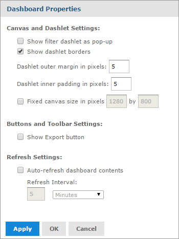

                             

Dashboard Properties
--------------------

You can view and edit the basic appearance of all the dashlets on your dashboard, and determine the refresh settings, through the **Dashboard Properties**.

To view the dashboard properties, click **Dashboard Properties**icon on the dashboard toolbar.

The **Dashboard Properties** window appears.  

The **Dashboard Properties** window displays the following properties:

  
| Property | Description |
| --- | --- |
| **Canvas and Dashlet Settings** ||
| Show filter dashlet as pop-up | Select the filter dashlet to appear as a pop-up window instead of a dashlet pinned on the dashboard. |
| Show dashlet properties | Select/deselect to show or hide the thin lines around each dashlet. |
| Dashlet outer margin in pixels | Enter the desired width, in pixels, of the margins between dashlets. |
| Dashlet inner margin in pixels | Enter the desired width, in pixels, of the padding inside each dashlet. |
| Fixed canvas size in pixels | Enter the desired width and height of the dashboard to be displayed instead of dynamically resizing based on the browser window. |
| **Button and Toolbar Settings** ||
| Show Export button | Select or deselect to show or hide the Export button in the dashboard viewer. |
| **Refresh Settings** ||
| Auto-refresh dashboard settings | Select or deselect to enable or disable the automatic refresh for your content. |
| Refresh Interval | Enter the number of minutes or seconds between each content refresh, using the text entry and menu list. |
