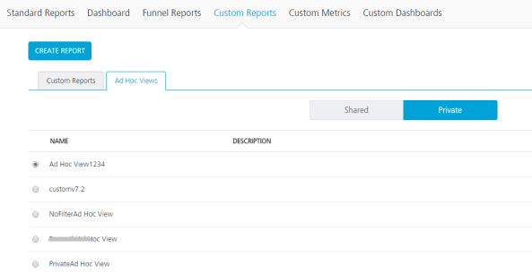
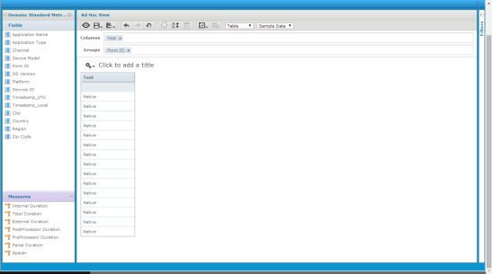

                            

Editing Ad Hoc Views
====================

After you have saved the Ad Hoc Views, you can edit the report and modify the parameters linked to the report. Follow these steps to edit the Ad Hoc Views.

1.  When you Click **Ad Hoc Views** tab, the following screen appears.

3.  Select a report from the **Shared** or **Private** folder.
4.  Click **Edit**. The Ad Hoc View screen appears.

6.  In this screen, you can edit the report by adding new columns or groups or configuring filters for the data.
7.  After you have made changes, save the report.
8.  To delete an Ad Hoc View, click the view and select **Delete**.
    
> **Note:**  
*   Ad Hoc views with dependent reports cannot be deleted, before deleting the dependent reports.  
*   Modifying the Ad Hoc View will affect reports dependent on it. Some changes such as adding new filters will get reflected on existing dependent reports. Changes such as adding new columns will not reflect on any existing report that was built with this Ad Hoc View. It is recommended that if you modify an Ad Hoc View that has reports built from it, save the report under a different name.  

