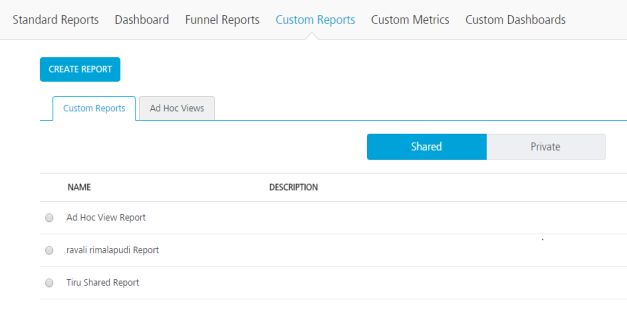
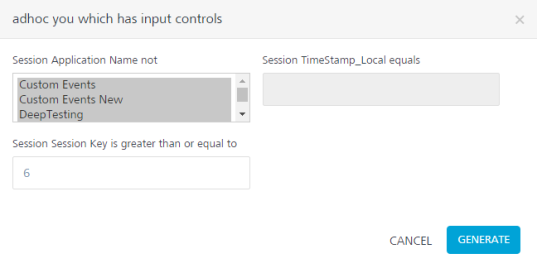
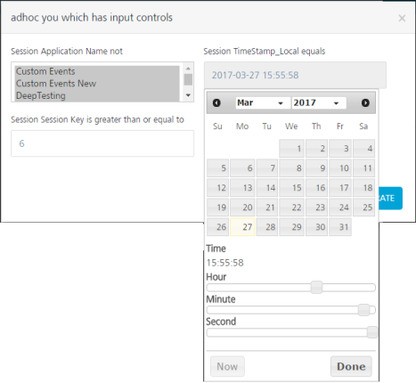
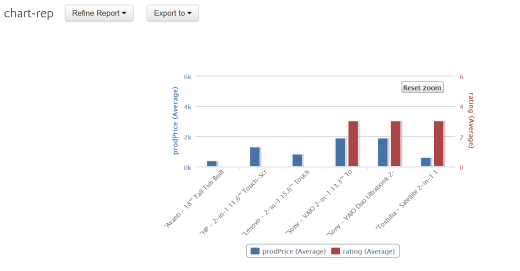

                            

Running Custom Reports
======================

After you have saved your custom reports, you can run them from the Custom Reports screen. Ensure that you have saved the report in Shared or Private folder. You can run custom reports from the **Custom Reports** screen. For this, you need to have created and saved the Report and Ad Hoc view.

1.  Click **Custom Reports** in the left-pane, the following screen appears.

3.  Select one of the folders. You can select **Shared** or **Private** folder by clicking on the respective buttons.
4.  Select a report and click **Run**.
5.  If the report has filters a pop-up will be shown as shown below with the filters (input params).
    

7.  Clicking on a filter opens the appropriate type of input.
    1.  A drop-down list is provided for selecting string.
    2.  A text box is provided for numeric values.
    3.  A calendar is provided for Timestamp values.
    
    
    
    5.  Click **Generate** after setting the filters to generate the report.
8.  If the report has no filters defined, clicking on run will directly generate the report shown below.

1.  A user can click on refine reports to modify the input parameters (Filters) and rerun the report.
2.  Export to option allows a user to export the report to a pdf.

11.  To delete a report, select a report and click **Delete**. This action cannot be undone.
