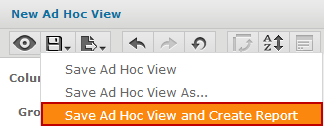
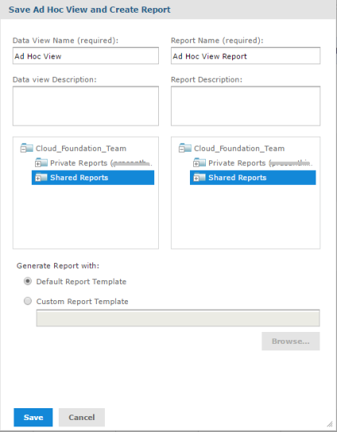

                            

Saving Custom Reports and Ad Hoc Views
======================================

1.  You can save custom reports from the report builder screen.
2.  In the Report Builder screen, click **Save** option. The following options appear.

4.  Click **Save Ad Hoc View and Create Report** option to save the Ad Hoc view and Create a Report.

The following dialog appears.

To save an Ad Hoc view and create a Custom Report, follow these steps: 

1.  You can configure the **Data View Name** and **Report Name**.
    
    > **_Note:_** Make sure that the report name does not contain a colon (:) symbol. Otherwise, the report download will fail in XLSX format.
    
2.  Enter a data view description and report description in respective text fields.
3.  Select a folder where you want to save the data view and the report name.
4.  Select a template from the **Generate Report with** area.
5.  Click **Save**.
After saving the report, you can access it from the respective folders (Shared/Private).

> **_Note:_** To close the report builder screen after saving the report, click X in the top right corner. Ensure you save your work before exiting the report builder. Any unsaved work will be lost.

> **_Note:_** Reports and Ad Hoc Views saved in Private folder are accessible only for the user that created the Private folder. Save the reports in Shared folder to be used by other users of the account that have report viewing permissions.
