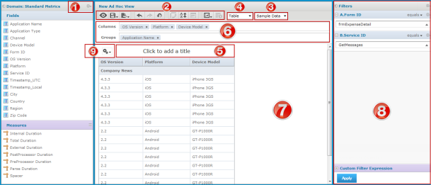
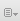
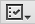

                            

Table Report User Interface
===========================

The following picture illustrates a table report and the options in the Report Builder (Ad Hoc Editor).

The **Report Builder** screen displays the following items: 

1.  **Data Selection panel** - The Data Selection panel shows the list of available fields, which can be added to any bar in the Layout Band, and measures, which are summarized values that cannot be added as groups. Typically, measures are created from numeric fields in the Topic or Domain, but in some circumstances, it makes sense to use string fields when summarized as a count. For example, you might want to display the number of unique customers that made purchases in a given quarter. Use the icon beside the set name to expand or collapse a set of fields or measures. To hide this panel, click the  icon in the top left corner; click the same icon on the minimized panel to expand it.
    1.  **Change source / Select fields** - This menu allows you to select a different Topic or Domain for your view. All data and formatting are lost when you select a different Topic or Domain. When creating a view from a Domain, you can also select different fields to change the list that appears in this panel.
2.  **Toolbar** - The toolbar at the top of the canvas provides access to many of the Ad Hoc Editor’s functions, such as saving the view or creating a report from the view, undoing and redoing changes, and changing the view’s sort order.
3.  **Data mode menu** - Click to select the amount of data displayed from the menu. Use **Sample Data** to design a view more quickly, or use **Full Data** to see all your data used in the same view. When you choose display mode, full data is displayed regardless of the selection shown in the editor.
    
    > **_Note:_** Using the **Full Data** option might decrease the performance of the report.
    
4.  **View type menu** - Click **Chart**, **Table**, or **Crosstab** to see your data in that type of view. The changes made in one type of view apply to the data displayed in another.
5.  **Title bar** - The top portion of the canvas; click to add or edit the title of the view. To remove the title, point to the **Properties** menu  and select **Toggle the Title Bar**.
    
6.  **Layout Band** - The layout band immediately below the toolbar has two boxes where you can drag and drop fields and measures from the **Data Selection** panel to add them to the canvas. You can change the order of the selected field's canvas by dragging them to a different location in the layout band. The boxes have different labels and functions, depending on the type of view. To hide the layout band, click on the **Properties** menu  and select **Hide Layout Band**.
    1.  **Columns area** - Drag fields and measures from the **Data Selection** panel to this area to create columns.
    2.  **Groups area** - Drag fields from the **Data Selection** panel to this area to create groups. The **Measures** cannot be added to the **Groups** area.
        
7.  **Canvas/Report Builder Area** - Occupies the middle area of the editor. The canvas shows your data subject to the constraints you have created. This is also a sample of how your data will appear in any report you create from the view. To see the view without interface components, click **Toggle**  for design mode.
    
8.  **Filters Panel / Filter Controls** - These menus allow you to change the display of filters, either collectively or individually. The menu on the filter panel allows you to collapse all filters or remove all filters. To minimize the view of an individual filter, click the icon beside its name. This panel displays any filters defined for the view. You can set the filter values, and see the resulting change in the canvas. To hide the **Filters** panel, click the icon in the top left corner of the panel. Click the same icon on the minimized panel to expand it again.
