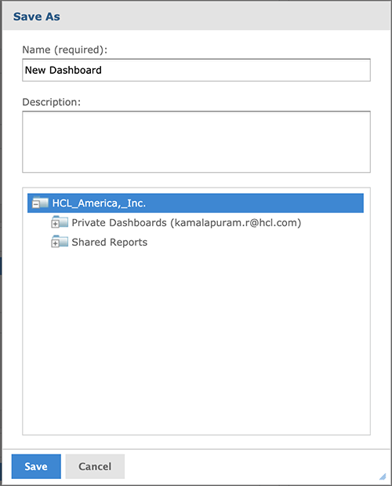
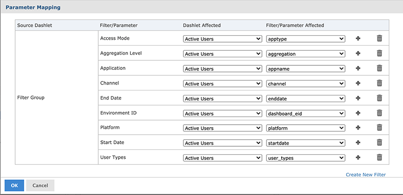
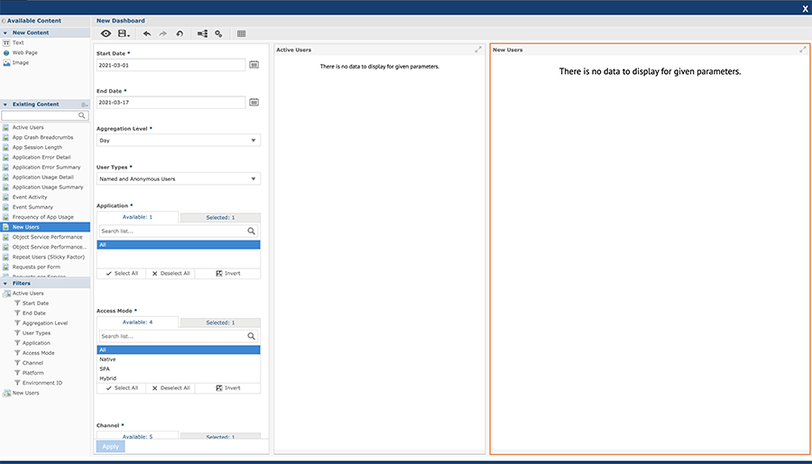

                             

Working with Custom Dashboards
==============================

Working with custom dashboards include the following:

*   [Creating a Custom Dashboard](#creating-a-custom-dashboard)
*   [Updating a Custom Dashboard](#updating-a-custom-dashboard)
*   [Deleting a Custom Dashboard](#deleting-a-custom-dashboard)
*   [Input Control (Parameter) Mapping](#input-controls-parameter-mapping)

Creating a Custom Dashboard
---------------------------

You can create a new custom dashboard from the **Custom Dashboard** screen.

To create a custom dashboard, follow these steps:

1.  Log on to **VoltMX Foundry Console** and click **Reports** from the left pane of the screen.
    
    The **Reports** screen appears.
    
2.  Click **Custom Dashboards** tab from the upper pane of the screen.
    
    The **Custom Dashboards** window appears.
    
3.  Click **CREATE NEW** to create a new dashboard.
    
    The **Dashboard Designer** appears displaying the list of accessible reports from the **Available Content** section and the **Canvas**.
    

5.  From the **Available Content**, drag one of the reports to the canvas.
    
    The dragged report appears in a frame in the upper left corner of the canvas.
    
    If a dragged report has input controls, they will appear on the left side of the canvas under filters.
    
    
    
    **Example**: If the **Active Users** report is being dragged, then input controls of the Active users will appear under filters.
    
6.  In the filter section, click **+** icon of the selected report to expand the tree and display the input controls.
7.  Drag the filters to the canvas to add them to the dashboard.

9.  Click **Preview**.
    
    The end user view of the dashboard appears.
    
10.  To close the preview and return to the **Dashboard Designer** window, click **Close Preview**.

Apart from adding reports the user can also add images or web page to the dashboard.

14.  Click **Save**.
    
    A **Save As** dialog appears.
    

Following are the UI elements displayed for the **Save As** dialog:

  
| Field | Description |
| --- | --- |
| Name | Enter the name of the dashboard. |
| Description | Enter the description for the dashboard created. |
| Folders | Select the folder to save the dashboard. |
| Save | Click to save the entered details. |
| Cancel | Click to discard the changes. |

Perform the following actions to save the created dashboard:

1.  Add the name and description for the dashboard in the text boxes provided.
2.  Select the folder in which dashboard need to be saved.
3.  Click **Save** to save the dashboard.

### Run a Custom Dashboard

You can run the dashboard created from the **Custom Dashboards** page.

**To run the created custom dashboard, follow these steps**:

1.  Go to **Custom Dashboards** page.
    
    A list of Custom Dashboards are displayed.
    
2.  Click **Options** (a circle with three dots) displayed across each row.
3.  Click **Run Report** to run the selected custom dashboard.
    
    **Dashboard View** page appears.
    
4.  Select the input controls and click **Apply** .
    
    The chart of the updated input controls gets refreshed.
    
    
    
5.  Click **X** from the upper right corner of the designer page to close the dashboard view page.

Updating a Custom Dashboard
---------------------------

You can update the custom dashboard from the **Custom Dashboards** screen.

**To edit and update a custom dashboard, follow these steps:**

1.  Log on to **VoltMX Foundry Console** and click **Reports** from the left pane of the screen.
2.  Click **Custom Dashboards** tab from the upper right corner of the **Reports** window.
    
    A list of created custom dashboards are displayed.
    
3.  Click **Options** (a circle with three dots) displayed across each row of the created custom dashboard.
4.  Click **Edit** to edit the selected custom dashboard.
    
    **Dashboard View** window appears. The view of the **Dashboard View** window is similar to the creation view of custom dashboard.
    
5.  Perform the necessary changes and click **Save** .
    
    The save option overrides the current dashboard with the new changes.
    
6.  Click **Save As** to save it as a new dashboard.
7.  Click **X** from the upper right corner of the screen to close the **Dashboard Designer** window.

Deleting a Custom Dashboard
---------------------------

You can delete the created dashboard from the **Custom Dashboards** window.

**To delete a custom dashboard, follow these steps:**

1.  Click **Custom Dashboards** tab from the **Reports** page of Volt MX Foundry Console.
    
    A list of custom dashboards created are displayed.
    
2.  Click **Options** (a circle with three dots) displayed across each record.
3.  Select **Delete** to delete the selected dashboard.
    
    A confirmation dialog appears.
    

5.  Click **DELETE**.
    
    The selected custom dashboard is deleted.
    

Input Controls (Parameter) Mapping
----------------------------------

Parameter Mapping helps you to map the filter/parameter to the dashlets and parameters affected. To access the **Parameter Mapping** window, follow these steps:

1.  Double click a dashboard from the **Custom Dashboards** window.
2.  Click **Input Control Mapping** icon from the tool bar.
    
    The **Parameter Mapping** window appears.
    

The **Parameter Mapping** window displays the filter-to-dashlet mapping with the following UI elements:

  
| Column | Description |
| --- | --- |
| Source Dashlet | Name of the dashlet from where the filter orginates. Also displays the Filter Group (multiple filters in a single dashlet) or Manually Created Filter (filter created using Parameter Mapping). |
| Filter/Parameter | Name of the filter |
| Dashlet Affected | Menu list displaying all the dashlets affected by the filter. |
| Filter/Parameter affected | Menu list including all the parameters associated with the selected dashlet in the **Dashlet Affected** column, |
| Add | Add additional dashlet/parameter combinations to a filter. |
| Delete | Deletes a dashlet/parameter combination. |

### Adding a Filter

You can add a filter to the existing list of filter from the **Parameter Mapping** window.

**To add a new filter using Parameter Mapping, follow these steps:**

1.  Open a dashboard with filters, and click **Input Control Mapping** icon.
    
    The **Parameter Mapping** window appears.
    
2.  Click **+** displayed across each filter.
    
    A new row containing affected dashlet and filter/parameter menu list appears.
    
3.  Select the dashlet and parameter combination to apply to the dashboard.
4.  Click **OK** to apply and save the changes.

### Deleting a Filter using Parameter Mapping

You can delete a created filter from the **Parameter Mapping** window.

**To delete a filter from the Parameter Mapping window , follow these steps**:

1.  Open a dashboard with filters, and click **Input Control Mapping** icon.
    
    The **Parameter Mapping** window appears.
    
2.  Click **Delete** icon displayed across each row.
    
    The selected row is deleted from the **Parameter Mapping** window.
    

### Creating a New Filter

You can create a new filter in the **Parameter Mapping** window.

**To create a new filter, follow these steps:**

1.  Open a dashboard with filters, and click **Input Control Mapping** icon.
    
    The **Parameter Mapping** window appears.
    
2.  Click **Create New Filter**.
    
    A new row is added to the window.
    
3.  In the **Filter** column, enter the name of the new filter and click outside the text box to apply the name.
4.  Click **+** and select the dashlet and parameter combination to apply.
5.  Click **OK** to apply the changes and save.

To map the parameters of one report to the other report, follow these steps:

Let us consider an example of Active Users and Named Users reports.

1.  Add Active Users and Named users reports to the dashboard.
    
    In the **Filter** section, both the Active users and New users reports input controls appears.
    

3.  Expand the folder of Active Users in the **Filter** section and drag the input controls to the **Dashboard Canvas**.

5.  Click **Parameter Mapping** icon to open parameter mapping dialog.

In the above image, you can find all the input controls are mapped only to Active users report.

8.  To map the same input controls to New users report, click **+** on each of the input control and select the dashlet (New Users) and parameter combination.

> **_Note:_** **User Types** input control of Active users cannot be mapped to New users report because New Users report do not have the same input control name.

11.  Click **OK** to apply the changes.
12.  Click **Preview** icon to run the dashboard.
13.  Select the input controls and click **Apply** to refresh both the charts.
    
    Both the charts are refreshed because input controls are mapped to both the charts.
    
14.  You can change only the user types input control and click **Apply** to refresh the active users report.

  

Similarly, you can map the custom reports which has common input controls.
