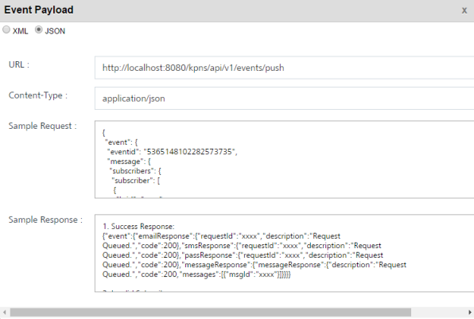

                              

Engagement Services Event Management QuickStart Guide: API Payload

API Payload
===========

The **View Events** page displays the **View API Payload** button. Click the **View API Payload** button to view the JSON/XML schema. The Event Payload window details are used as a sample only. While sending event notifications, you need to enter the values for any defined name-value pair. The event payload information is useful when you wish to distribute an event. Each event payload includes the relevant event information.

Let us understand how you receive event payload details.

1.  The Admin fetches the event ID through a device to receive the event payload.
2.  The Engagement server sends the event payload details with reference to specific event ID.
    
    In the following example, the **bankaccountno** and the **customerID** are the name-value pairs. The Admin enters the real value for the defined name-value pairs and send the event payload to the subscribed users.
    

To view the API payload, follow these steps:

1.  Click the **View API Payload** button to get details of the API call that can be used by a third-party system to send notifications.
    
2.  On the **View Event** page, click **View API Payload**.
    
    The **Event Payload** window appears.
    
    
    
3.  Click either the **XML** or the **JSON** option to view the sample API payload. By default, the API format option is set to the **XML** format, which you can modify to **JSON**. Both the formats contain the same field types. The following is the sample payload for your reference.
```
{
     "event": {
      "eventid": "5365148102282573735",
      "message": {
       "subscribers": {
        "subscriber": [
         {
          "ksid": "4927562634448402412",
          "ufid": "admin@voltmx.com",
          "deviceId": "900ABC"
         }
        ]
       },
       "content": {
        "mimeType": "text/plain",
        "priorityService": "false",
        "eventNamePairs": {
         "key": [
          {
           "name": "customerID",
           "content": "95098444"
          },
          {
           "name": "bankaccountno",
           "content": "04851050099900"
          }
         ]
        }
       }
      }
     }
    }
```
    
    The table below displays the input parameters used in the event payload:
    
| Input Parameter | Type | Description |
| --- | --- | --- |
| Event ID | long | The unique id assigned to an event |
| ksid | long | Volt MX Subscription Identification number of the application |
| ufid | string | The User Friendly Identifier or UFID is used when you subscribe to Volt MX Foundry Engagement Services. Based on your requirement, you can provide an UFID. It is alphanumeric, for example xxx@voltmx.com or 2890XZCY. It can be used to map devices to the user using the value as a reconciliation key |
| deviceId | long | A device identification, or deviceId, is a distinctive number associated with a device |
| Event Message | string | The event message in the text format |
| Event Name | string | The unique name assigned to an event |
| Event Name Value Pair | string | The unique name value pair assigned to an event. |
    
4.  Click the **X** icon to close the window. The system displays the **View Event** screen.
    
    > **_Important:_** For more details about how to invoke event notification, refer to [Event Push Message API](../../../Foundry/engagement_api_guide/Content/REST_API_Event/Event_Push_Message.md)
