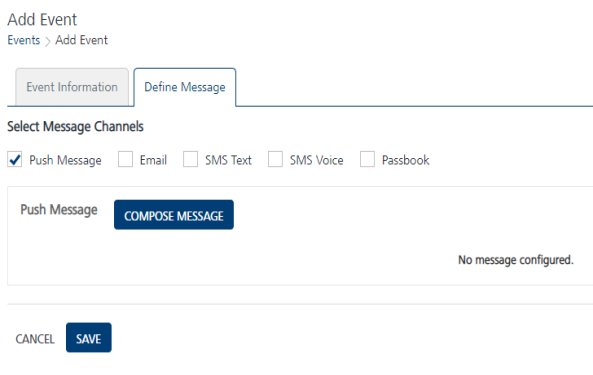
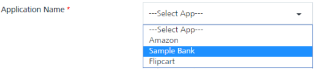
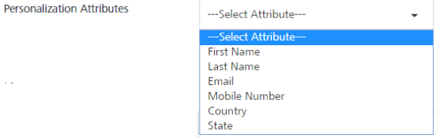
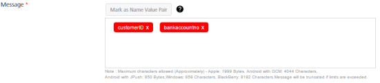
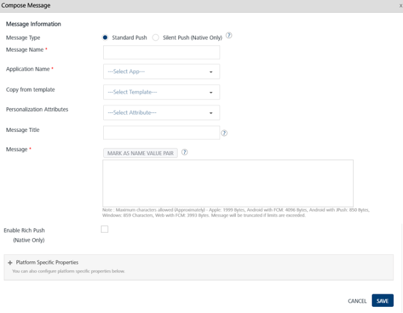
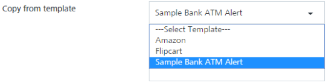
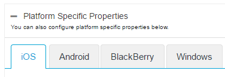

                              

Engagement Services Event Management QuickStart Guide: [Creating an Event](Adding an Event.md) > Silent Push

Push Message
------------

To configure your event message, you can use a pre-defined template or create a new push message for an event. You can do the following tasks from the **Add Event** > **Define Message** page:

1.  **Select Message Channels**: Select the type of notification as **Push Message**.
    
    The **Push Message** grid appears. The push message grid includes a push message label and the **Compose Message** button to compose push messages. If no push message is found, the system displays the message: **No message configured**.
    
    
    
2.  Click the **Compose** **Message** button to compose a new push message for an event.
    
    The **Compose Message** window appears.
    
    The **Compose Message** window includes the **Message Information** section to add a new push message. You can define a push message with the following options:
    
    *   [Silent Push](#silent-push)
    *   [Standard Push](#standard-push)
    *   [Copy from Template](#copy-from-template)
    
    By default, the **Message Type** option is set to **Standard Push**.
    
    ### Silent Push
    
    1.  **Silent Push**: Select the silent push option.
        
        > **_Note:_** The standard push notifies the user when a device receives a push notification. The silent push does not notifies the end-user. When a silent push notification reaches a device, the app is awakened in the background and takes some time to download the new content.
        
        The Compose Message window displays applicable fields: **Message Name**, **Application Name**, and the **Platform-Specific Properties**.
        
        1.  **Message Name**: Enter an appropriate name for the push message such as **ATM Transaction Message**.
            
            
            
        2.  **Application Name**: Select the required application from the drop-down list such as **Sample Bank**.

            

        3.  **Platform Specific Properties**: To add platform-specific properties, follow these steps:
            *   Click the plus icon next to the platform specific properties label.
                
                The system displays four tabs for iOS, Android, and Windows platforms. By default, the iOS platform tab is set to active.
                
                To configure platform specific properties see, [Platform-Specific Properties](#platform-specific-properties)
                
                > **_Important:_** Only iOS and Android devices are supported for silent push.
                
    
    ### Standard Push
    
    By default, the **Message Type** option is set to **Standard Push**.  
    
    **To compose a standard push message, follow these steps**:
    
    1.  **Message Name**: Enter an appropriate name for the push message such as **ATM Transaction Message**.
    2.  **Application Name**: Select the required application from the drop-down list such as **Sample Bank**.
    3.  **Personalization Attributes**: Select the attributes from the drop-down list to customize your event message.
        
        The system inserts the selected attributes at the cursor position in the **Message Box** .You can click **X** icon next to each attribute to remove the attribute from the message box.

        

        
    4.  **Mark as Name Value Pair**: To set the Name-Value pair, enter the key words in the event push message text box. Click the **Mark as Name Value Pair** button. The marked text is highlighted to indicate that the text is converted as a variable.

        

    5.  **Message Title**: Enter an appropriate title to the push message such as **Sample Bank ATM Alert**.
    6.  **Message**: Based on your requirement, place the cursor in the message box to insert the push message.
        
        
        
    
    ### Copy from Template
    
    **To copy from a template, follow these steps**:
    
    1.  **Message Name**: Enter an appropriate name for the push message.
    2.  **Application Name**: Select the application from the drop-down list to associate with the push message.
    3.  **Copy from Template**: Select the template from the drop-down list.
        
        
        
        The associated attributes and any message with the selected template appear in the message box.
        
        
        
    4.  **Message Title**: Enter an appropriate title to the push message.
    5.  **Personalization Attributes**: Select the personalization-attributes from the drop-down list to customize the push message. The selected attributes are appended in the message box.
    
    ### **Enable Rich Push**
    
    **To associate rich push content follow these steps**:
    
    1.  **Enable Rich Push**: Select the check box if you want to associate the rich push.
        
        The system displays the **Compose from Template** drop-down list, **Personalization Attributes** drop-down list and the **Rich Content** text box.

        
        *   **Compose from Template**: Select the required template from the drop-down list.
            
        
        

            
        The selected template with rich content appears in the rich content text box.
            
        
            
        *   **Personalization Attributes**: Select the personalization-attributes from the drop-down list to customize the push message. The selected attributes are appended in the message box.
        *    **Rich Content**: Enter your content. Use the text tool bar to customize the content.
    
    ### Platform Specific Properties
    
    To add platform- specific properties follow these steps:
    
    1.  Click the plus icon next to the **Platform -Specific Properties** label.
        
        The system displays the four tabs for iOS, Android, BlackBerry and Windows platforms. By default, the iOS tab is set to active.
        
        
        
        For more details about how to add platform- specific properties, refer to:
        
        \- [iOS](../../../Foundry/vms_console_user_guide/Content/Campaigns/camppushios.md)  
        \- [Android](../../../Foundry/vms_console_user_guide/Content/Campaigns/camp_push_android.md)  
        \- [BlackBerry](../../../Foundry/vms_console_user_guide/Content/Campaigns/camp_push_blackberry.md)  
        \- [Windows](../../../Foundry/vms_console_user_guide/Content/Campaigns/camp_push_window7and8.md)
        
3.  Click the **Cancel** button, if you do not want to save the composed message. The system displays the **Add Event** screen.
4.  Click **Save** to save the composed message. The saved push message appears in the push message list view under the **Define Message** tab on the **Add Event** home page.
    
    The push message list view displays the following details:
    
    
    
    | Push Message Element | Description |
    | --- | --- |
    | Message | \- **Event Push Message ID**: Displays the unique ID assigned to an event push message - Displays the push message name - Displays the push message text |
    | Open / Sent | Displays the total number of push messages sent and opened by users |
    | Delete button | The button helps you delete a push message |
    
    > **_Important:_** You can enter unlimited number of characters for the event message. However, when the push message is sent to any cloud, the number of characters accepted by the cloud depends on the platform:  
    \- Apple: 1999 bytes  
    \- Android: 4044 characters  
    \- BlackBerry: 8192 characters  
    \- Windows: 859 characters
    
5.  Click the **Cancel** button, if you do not want to save the new event. The system displays the **Events** home screen.
6.  Click **Save** to save the event. The saved event appears in the **Events** list view with the confirmation message that the event is saved successfully.
