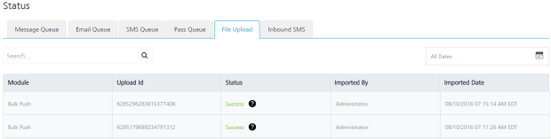

# Bulk Push

The **Bulk Push** API uploads large batches of individual messages included in a CSV format. Once the .CSV file is uploaded successfully, the messages are queued into the Volt MX Foundry Engagement Services to start sending message notifications.

## **URL**

The HTTP URL for Bulk Push API is:

```
http://xx.xx.xx.xx:8080/vpns/api/v1/bulkmessage?DELIMITER=%7c&SOURCE_FORMAT=APP_ID%2cSUBSCRIBERS_KSID%2cMESSAGE_DATA%2cSTART_TIME%2cEXPIRY_TIME%2cDEVICE_PROPRS&IGNORE_ROW=false"
```

The symbol %2c separating the column names for query parameter SOURCE_FORMAT cannot be changed. If IGNORE_ROW is set as true, it ignores the first row assuming it to be the header.

> **_Note:_**  Request Parameters.  
> DELIMITER **:** The delimiter name. The possible values are:  
> COMMA (%2C)  
> HYPHEN ( %2D)  
> SEMI_COLON (%3B)  
> PIPE (#)  
> SOURCE_FORMAT **:** The format of the input file  
> IGNORE_ROW **:** A Boolean value. If true, the first row of the file is assumed to be the header and so it is ignored.

## CSV File Format

- CSV file should have data in the following order:
  1.  APP_ID
  2.  SUBSCRIBER_KSID
  3.  MESSAGE_DATA
  4.  START_TIME
  5.  EXPIRY_TIME
  6.  DEVICE_PROPRS
- The first row in the CSV file can be with or without a header line. The ideal file format in a sample CSV file is displayed below:
```
YourAppID|8630109080499911406|This is message content|0|1611568995000|iphone#%title=Amazing offers!%customkey_applink=https\://yourwebsite?id\=2890902%customKey=customValue%badge=1:android#%title=Amazing offers!%title_loc_args=[tla1, tla2]%color=color%sound=soundname%icon=icon%title_loc_key=tlk%priority=high%click_action=onclick action%collapse_key=7298982893234%body_loc_args=[bla1, bla2]%delay_while_idle=TRUE%customkey_applink=https\://yourwebsite?id\=2890902%tag=tag
  YourAppID|8630100908499911406|Yes \| No What do you choose? |0|1611568995000|iphone#%title=10\% off on all products!!%locArgs=[locArg1, locarg2]%customkey_applink=https\://yourwebsite?id\=2890902%customKey=customValue%badge=1%actionLocKey=alk%titleLocKey=Play!%sound=soundname%launchImage=launchimage.jpg%locKey=alk2%titleLocArgs=[tla1, tla2]%category=offers:android#%title=10\% off on all products!!%title_loc_args=[tla1, tla2]%color=color%sound=soundname%icon=icon%title_loc_key=tlk%priority=high%click_action=click action%collapse_key=7298982893234%body_loc_args=[bla1, bla2]%delay_while_idle=TRUE%customkey_applink=https\://yourwebsite?id\=2890902%tag=tag
  YourAppID|7201994900097393916|Yes \| No What do you choose?|0|1611568995000|windows#%text1=10\% off on all products!!%toastScreenName=yourscreenname%text2=Yes \| No What do you choose?%windowsParams=p1=v1~p2=v2%notificationType=TOAST:windows8#%template=wnsTemplate%tileTextValue=text1~text2%text1=10\% off on all products!!%tileImageSource=image1~image2%text2=Text 2 content%wnsTileBadge=1%notificationType=TILE%fallback=wnsfallback%version=2.1:blackberry#customkey_applink=https\://yourwebsite?id\=2890902

  ```

  Every row contains one subscriber for which the push needs to be sent. The columns are separated with the Delimiter specified in the API URL.

  In this example PIPE | is the delimiter. If the delimiter needs to be used as a part of the message content or device specific properties, it has to be escaped by a backslash \\ .

  The device specific properties section under column DEVICE_PROPRS needs to be provided in a specific format only. The supported platforms are "android, iphone, androidjpush, windows, windows8, and webfcm". Only these keys are allowed to be used for platforms. There are different separators within DEVICE_PROPRS.

  - Colon : is used to separate platforms if multiple platforms are used for DEVICE_PROPRS for a row.
  - Hash # is used to separate the platform key with the list of key value pairs.
  - Percentile % is used to separate key-value pairs from each other.
  - Equal = is used to separate key from its value.

  If any of these special characters **: # % =** need to be used in the DEVICE_PROPRS block, then you need to escape them with back slash \\. However, before sending the push to a device these specific back slash characters are removed. Though multiple platforms are allowed for a row, the considered platform will be based on osType of the subscriber in that row.

  > **_Important:_** Start Time and expiry time should be given in milliseconds. Start time, if provided, refers to the time in milliseconds at which the message will be sent. If expiry time is provided, the message will not be attempted for delivery after the time in milliseconds is passed. If you provide the start time as zero, then it indicates that the push message will be sent immediately.

## Method

POST

## Headers

```
Authorization : Required
```

## Body

- uploadFile - Points to the name of the file that is uploaded.
  ```
uploadFile: filename.csv
  ```

## Input Parameters

The following fields are input parameters:

| Input Parameter | Required | Type   | Description                                                                |
| --------------- | -------- | ------ | -------------------------------------------------------------------------- |
| APP_ID          | Yes      | long   | Application ID is a unique key used to identify the subscribed application |
| SUBSCRIBER_KSID | Yes      | long   | Volt MX Subscription ID                                                    |
| MESSAGE_DATA    | Yes      | string | Contains the message to be pushed                                          |
| START_TIME      | Optional | string | Push message start time                                                    |
| EXPIRY_TIME     | Optional | string | Push message expiry time                                                   |
| DEVICE_PROPRS   | Optional | string | The platform specific properties                                           |

## Sample Response

```
{
"id" : "6284799310563122587",
"message" : "File uploaded successfully, processing is in progress."
}
```

## Response Code

| Code | Description                                                                                                                                                       |
| ---- | ----------------------------------------------------------------------------------------------------------------------------------------------------------------- |
| 200  | File uploaded successfully, processing is in progress                                                                                                             |
| 400  | The current request is not a multipart requestInvalid content in the uploaded file @ line 1Expiry Time should not be less than Current TimeInvalid Application ID |

The status of the bulk push message upload can be viewed under Settings > Status > File Upload section in console or refer Administration > [Get File Upload Status by ID API](../REST_API_Audience_Member/Get_File_Upload_Status_by_Id.md#bulk-push)


