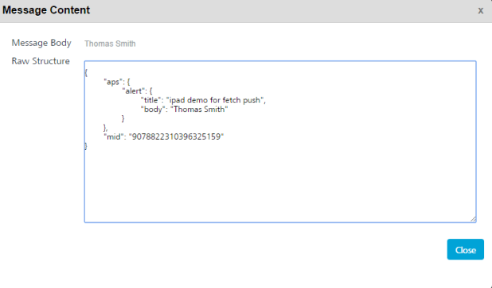

# Fetch Push Sent Payload

The **Fetch Push Sent Payload** API fetches the sent push message details.

## Use Case

The pushId that is needed to invoke this API can be retrieved from the console of the engagement server.To retrieve the pushId from console, click on Settings > Status > Message Queue list view > click the required message under the Message column to view the push ID. Here push ID is referred as mid.



## URL

The HTTP URL for Fetch Push Sent Payload API is:

```
http://<hostname/ip>:<port>/vpns/api/v1/messages/payload/<PushID>
```

## Method

GET

## Input Parameters

The following fields are input parameters:

| Input Parameter | Required | Type | Description                          |
| --------------- | -------- | ---- | ------------------------------------ |
| pushId          | Yes      | long | Unique ID assigned to a push message |

## Sample Responses

### Response for Apple

```
{
"aps": {
"alert": {
"title": "ipad demo for fetch push",
"body": "Thomas Smith"
}
},
"mid": "9078822310396325159"
}
```

### Response for Android

```
{
"collapse_key": "1",
"notification": {
"sound": "sds",
"title": "title of the Message ",
"click_action": "sds",
"body": " Body of the message "
},
"data": {
"dsd": "asfs",
"mid": "8337661549314092810"
}
}
```

### Response for Windows

```
<< ? xml version = "1.0"encoding = "utf-8" ? ><wp : Notification xmlns: wp = "WPNotification" >  
<wp: Toast >  
<wp: Text1 > title of the Message < /wp:Text1> <wp: Text2 > Body of the message < /wp:Text2> <wp: Param > ? mid = 8337662279475677599 & amp;mode = 2 < /wp:Param> </wp:Toast> </wp:Notification>

```

### Response for BlackBerry

```
  
 --mPsbVQo0a68eIL3OAxnm  
Content-Type: application/xml; charset=UTF-8

<?xml version="1.0"?>
<!DOCTYPE pap PUBLIC "-//WAPFORUM//DTD PAP 2.0//EN" "http://www.wapforum.org/DTD/pap_2.0.dtd" [<?wap-pap-ver supported-versions="2.0,1.*"?>]>
<pap>  
<push-message push-id="8678434782040504592" deliver-before-timestamp="2016-09-02T09:57:00Z" source-reference="300059-7s489985m4r07y4942o839cm344yy7457">  
<address address-value="2820ecc9"/>  
<quality-of-service delivery-method="UNCONFIRMED"/>  
</push-message>  
</pap>  
\--mPsbVQo0a68eIL3OAxnm  
Content-Type: text/plain  
Push-Message-ID: 8678434782040504592  
key2: BBKey2 Value  
key1: BBkey1 values  
Push Message content BB  
\--mPsbVQo0a68eIL3OAxnm--
```

### Response for Web

```
  
 {
"notification": {
"sound": "sds",
"title": "title of the Message ",
"click_action": "sds",
"body": " Body of the message "
},
"data": {
"dsd": "asfs",
"mid": "8337661549314092810"
}
}

```

## Response Status

| Code       | Description                                 |
| ---------- | ------------------------------------------- |
| Status 200 | Succesfully updated the message status      |
| Status 400 | Push was not delivered with the provided ID |
| Status 401 | Unauthorized request                        |
| Status 500 | Server failure to process request           |
