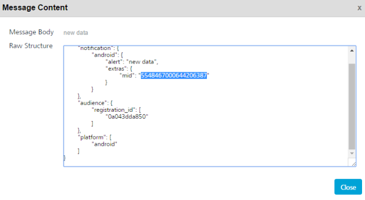

# Get Rich Content

The **Get Rich Content** API fetches rich content from the Volt MX Foundry Engagement server.

## Use Case

A user may need to retrive the rich push content of a push message to display the same in a custom built application. The Get Rich Content API requires pushId to retrieve the data.

You need to select the push ID from Settings > Status > Message Queue list view. Click the required message under the Message column to view the push ID. Here push ID is referred as mid.



## **URL**

The HTTP URL for **Get Rich Content** API is:

```
http://<host>:<port>/api/v1/messages/rich/<pushId>
```

## Method

GET

## Sample Response

```
.html>  
    <head>  
       <title></title>
    </head>
       <body>
         <p><strong>eBay Rainy Season Sale 2016</strong></p>
         <p>&nbsp;</p>  
       </body>
<.html>
```

## Response Status

| Code       | Description                                                                                                     |
| ---------- | --------------------------------------------------------------------------------------------------------------- |
| Status 200 | Rich content                                                                                                    |
| Status 400 | Invalid push ID / providedPush did not associate with rich contentRich message is not associated with this push |
| Status 500 | Server failure to process request                                                                               |
