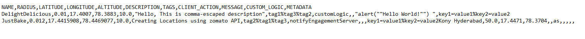

# Import Bulk Geolocation

The **Import Bulk Geolocation** API uploads large batches of individual geolocations included in a .CSV format. Once the .CSV file is uploaded successfully, the geolocations are queued into the Volt MX Foundry Engagement Services.

This API first checks if the format of the file is correct and then performs the data insert or update. After this API is executed, the return message only indicates whether or not the format of the file is correct. Use the returned ID to call the [Get File Upload Status by ID](../REST_API_Administration/Get_File_Upload_Status_by_ID.md) API to get the status of the import. To view the list of errors that may have occurred during the import, call the [Get File Errors By Pagination](../REST_API_Administration/Get_File_Errors_By_Pagination.md) API.

## CSV File Format

CSV file should have the following data columns and the corresponding data. The order of the data elements may vary.

1.  NAME
2.  LATITUDE
3.  LONGITUDE
4.  RADIUS
5.  ALTITUDE
6.  DESCRIPTION
7.  TAGS
8.  METADATA
9.  CLIENT_ACTION
10. MESSAGE
11. CUSTOM_LOGIC

The first row in the CSV file must be a header line. The ideal file format in a sample CSV file is displayed below:



## URL

The HTTP URL for Import Bulk Geolocation API is:

```
http://<<host>>:<<port>>/api/v1/geolocations/import
```

> **_Note:_**  Input Parameters.  
> \- DELIMITER : The delimiter name.  
> \- importType : Mode of import  
> \- uploadFile : The file to be uploaded

> **_Note:_** Ensure that the data in the file is properly escaped for the provided delimiter.

## Method

POST

Because this API uploads a file, you must use the "multipart/form-data" encoding format. You must also provide the following request headers with the request.

- DELIMITER

  The possible values for **DELIMITER** are:

- COMMA
- SEMI_COLON
- PIPE

- uploadFile - Points to the name of the file that is uploaded.
- importType - Default value is **insert**.

  The possible values for **importType** are:

- **insert** - This option reads the data in the CSV file and attempts to perform an insert. If the insert fails, an error is thrown.
- **upsert** - This option reads the data in the CSV file and attempts to perform an update of each record. If the update fails, the record is inserted.
- **delsert** - This option deletes all existing data and performs an insert of the data in the CSV file. It is strongly recommended that you back up your data before choosing this option.

## Input Parameters

The following fields are input parameters:

| Input Parameter | Required | Type   | Description                                                                                                                                                                                                                                                                                                                                                                                                                                                                                                                                                                                                                                                                                                                                                                                                                                                                                                                                          |
| --------------- | -------- | ------ | ---------------------------------------------------------------------------------------------------------------------------------------------------------------------------------------------------------------------------------------------------------------------------------------------------------------------------------------------------------------------------------------------------------------------------------------------------------------------------------------------------------------------------------------------------------------------------------------------------------------------------------------------------------------------------------------------------------------------------------------------------------------------------------------------------------------------------------------------------------------------------------------------------------------------------------------------------- |
| NAME            | Yes      | string | Location name                                                                                                                                                                                                                                                                                                                                                                                                                                                                                                                                                                                                                                                                                                                                                                                                                                                                                                                                        |
| LATITUDE        | Yes      | long   | The latitude value of the geolocation. Latitude is a geographic coordinate that specifies the north–south position of a location on the earth's surface. Geographic coordinate specified in decimal degrees                                                                                                                                                                                                                                                                                                                                                                                                                                                                                                                                                                                                                                                                                                                                          |
| LONGITUDE       | Yes      | long   | The longitude value of the geolocation. Longitude specifies the east–west position of a location on the earth's surface. Longitude. Geographic coordinate specified in decimal degrees                                                                                                                                                                                                                                                                                                                                                                                                                                                                                                                                                                                                                                                                                                                                                               |
| RADIUS          | Yes      | long   | The radius of the geolocation.                                                                                                                                                                                                                                                                                                                                                                                                                                                                                                                                                                                                                                                                                                                                                                                                                                                                                                                       |
| ALTITUDE        | Optional | long   | The height of a location in relation to sea level or ground level.                                                                                                                                                                                                                                                                                                                                                                                                                                                                                                                                                                                                                                                                                                                                                                                                                                                                                   |
| DESCRIPTION     | Optional | string | Description for the location.                                                                                                                                                                                                                                                                                                                                                                                                                                                                                                                                                                                                                                                                                                                                                                                                                                                                                                                        |
| TAGS            | Optional | string | An array of tags associated with the location. These tags represent additional data that is associated with the geoboundaries. The tags can be used to filter the list of geoboundaries that are returned. For example, geoboundaries can be tagged with an application name and only those geoboundaries associated with the tag can be retrieved when needed. Multiple tags should be separated by the '%' character, such as tag1%tag2%tag3.                                                                                                                                                                                                                                                                                                                                                                                                                                                                                                      |
| METADATA        | Optional | array  | An array of key/value pairs that contain metadata about the new geolocation. Key and value should be separated by the '=' character and multiple metadata should be separated by the '%' character, such as key1=value1%key2=value2%key3=value3.                                                                                                                                                                                                                                                                                                                                                                                                                                                                                                                                                                                                                                                                                                     |
| CLIENT_ACTION   | Optional | string | Possible values are: "Notify Engagement Server" - This is the default value. This means that the client application will need to update its location with the Engagement server when the geoboundary is entered. This could be used in a scenario where the Engagement server will need to send the notifications because of a location-based campaign that is set up. "Local Notification"- This value means that the client application must display a local notification when the geoboundary is entered. All the geoboundaries with this clientAction have a local notification message that is associated and this is the message that is displayed in the local notification. "Custom Client Logic" - This value is any java script code that needs to be executed by the client application. A geoboundary with this clientAction will have a java script code that is associated with it which can be executed on the client side if needed. |
| MESSAGE         | Optional | string | The message displayed when client_action is "Local Notification".                                                                                                                                                                                                                                                                                                                                                                                                                                                                                                                                                                                                                                                                                                                                                                                                                                                                                    |
| CUSTOM_LOGIC    | Optional | string | The java script code to be executed when the client_action is "Custom Client Logic".                                                                                                                                                                                                                                                                                                                                                                                                                                                                                                                                                                                                                                                                                                                                                                                                                                                                 |

## Sample Response

```
{
"id" : "6043561523913209695",
"message" : "File uploaded successfully, import is in progress."
}
```

## Response Code

| Code       | Description                                                                                  |
| ---------- | -------------------------------------------------------------------------------------------- |
| Status 200 | File uploaded successfully, import is in progress                                            |
| Status 400 | No file or empty file uploadedPlease upload a valid CSV fileInvalid delimiter value provided |
| Status 401 | Unauthorized request                                                                         |
| Status 500 | Server failure to process request                                                            |

The status of the bulk push message upload can be viewed under Settings > Status > File Upload section in console or refer Administration > [Get File Upload Status by ID](../REST_API_Audience_Member/Get_File_Upload_Status_by_Id.md#bulk-geolocation) API.
