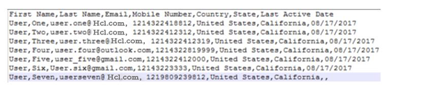

# Import Users

The **Import Users** API adds and/or updates multiple users. To do this, you create a CSV (comma separated values) file that contains a user's data.

## URL

The HTTP URL for the Import Users API is:

```
http://<host>:<port>/vpns/api/v1/audience/import
```

The service implements Gateway Filter for Authentication to authenticate access of the service by a user.

## Method

POST

Because this API uploads a file, you must use the "multipart/form-data" encoding format. You must also provide the following request headers with the request.

- DELIMITER

  The possible values for **DELIMITER** are:

- COMMA
- SEMI_COLON
- PIPE
- HYPHEN

- uploadFile - Points to the name of the file that is uploaded.
- importType - Default value is **insert**.

  The possible values for **importType** are:

- **insert** - This option reads the data in the CSV file and attempts to perform an insert. If the insert fails, an error is thrown.
- **upsert** - This option reads the data in the CSV file and attempts to perform an update of each record. If the update fails, the record is inserted.
- **delsert** - This option deletes all existing data and performs an insert of the data in the CSV file. It is strongly recommended that you back up your data before choosing this option.

## Input Parameters

The Import Users API accepts the `CSV` file. If you create a `CSV` file, then data entered in your .CSV file should have all the mandatory fields. For example, the First Name, Last Name, Email, Mobile Number, Country, State, and Last Active Date. You can use alphanumeric and special characters to fill in the data.

You can either enter the current date in the `CSV` file or ignore it. If you do not specify the date, the system takes the current date as the last active date. For example, the date is not specified for the User Seven in the sample `CSV` file displayed below:



> **_Note:_** **mobileNumber** is an optional input parameter. If **mobileNumber** is specified as the [reconciliationKey](../REST_API_Administration/Modify_Details_General_.md), then it is a required value and must be specified for all users. An empty value will cause an error.

## Sample Response

```
{
"id" : "8784592478968094060",
"message" : "File uploaded successfully, import is in progress."
}

```

## Response Status

| Code       | Description                                        |
| ---------- | -------------------------------------------------- |
| Status 200 | File uploaded successfully, import is in progress. |
| Status 400 | Please upload a valid CSV file                     |
| Status 401 | Unauthorized request                               |
| Status 500 | Server failure to process request                  |

> **_Important:_** For all the HTTP Response Statuses refer Administration > [Get File Upload Status by ID](../REST_API_Audience_Member/Get_File_Upload_Status_by_Id.md#import-users) API
