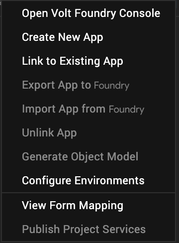

Volt MX  Offline Objects User Guide: Offline Objects with Generated Object Models

Integrating Offline Objects with Generated Object Models
========================================================

Introduction
------------

Volt MX  Iris lets you generate the app models based on the associated object services in the Volt MX Foundry app.

The generated model enables object-oriented programming into the client app. You can interact with Foundry SDK APIs (Online/Offline) through the desired model or object instances. Model files simplify the CRUD API by extracting the mode of access to the backend - online or offline (offline objects).

To generate object models in Volt MX Iris, follow these steps.

1.  On the upper-right corner of the screen, select **Data & Services**.
2.  Click the contextual menu icon . A list of options appears.
    
    
    
3.  Select **Generate Object Model**. The generated models, which represent the server app model, enable CRUD operations on the underlying Volt MX Foundry objects.

Model API enables an application to work in online and offline modes without changing the application code. App developer supplies mode (offline or online), while making API calls on the models.

The following code samples demonstrate the working with offline enabled objects through models. In the following sample codes, assume that the object service containing the following objects are enabled for offline.

> **_Note:_** get APIs are static functions that can be invoked on the model definition. You need not create an instance of a model object.

getAll API
----------

getAll API fetches records from the local device. The following sample demonstrates the fetch operation on an offline enabled object through a generated object model definition. The API does not require the creation of a model instance.

```
function commandCallback(status, response, error) {
    if (status == voltmx.mvc.constants.STATUS_SUCCESS) {
        alert(JSON.stringify(response));
    }
}

//Import the model definition, at least once
var countryModel = voltmx.mvc.MDAApplication.getSharedInstance().modelStore.getModelDefinition("country");

//options to sort country name in descending order
var options = {};
var orderByMap = [];
orderByMap.push({
    "CountryName": "DESC"
});
options.offlineObjectsOptions.orderByMap = orderByMap;

//Get all the records from the local database. This API is invoked without creating a model object instance
countryModel.getAll(commandCallback.bind(this), {
    'access': 'offline'
}, options);
```

getByPrimaryKey API
-------------------

**getByPrimaryKey** API fetches a record with the primary key(s) from the local device. The following sample demonstrates the fetch by primary key operation on an offline enabled object through a generated object model definition. The API does not require the creation of a model instance.

> **_Note:_** All primary key(s) must be supplied.

```
//providing primary key in primary key value map in getByPrimaryKey arguments
function commandCallback(status, response, error) {
    if (status == voltmx.mvc.constants.STATUS_SUCCESS) {
        alert(JSON.stringify(response));
    }
}

var options = {};

//Import the model definition, at least once
var countryModel = voltmx.mvc.MDAApplication.getSharedInstance().modelStore.getModelDefinition("country");

//get a record with a provided primary key from local database
//This API is invoked without creating a model object instance
countryModel.getByPrimaryKey({
    'CountryID': '26'
}, commandCallback.bind(this), {
    'access': 'offline'
}, options);
```

The following sample shows the usage of **getByPrimaryKey** API by providing the primary key as part of options.

```
//providing primary key as part of options in getByPrimaryKey arguments
function commandCallback(status, response, error) {
    if (status == voltmx.mvc.constants.STATUS_SUCCESS) {
        alert(JSON.stringify(response));
    }
}

//primary key is provided through options
var options = {
    'offlineObjectsOptions': {
        'primaryKeys': {
            'CountryID': '26'
        }
    }
};

//Import the model definition, at least once
var countryModel = voltmx.mvc.MDAApplication.getSharedInstance().modelStore.getModelDefinition("country");

//Get record with a provided primary key from local database
//This API is invoked without creating a model object instance
countryModel.getByPrimaryKey({}, commandCallback.bind(this), {
    'access': 'offline'
}, options);
```

removeById API
--------------

**removeById** API deletes records from the local device. The following sample demonstrates the delete operation on an offline enabled object through a generated object model definition. The API does not require the creation of the model instance.

> **_Note:_** All primary key(s) must be supplied.

```
//Providing primary key in primary key value map in removeByID arguments
function commandCallback(status, response, error) {
    if (status == voltmx.mvc.constants.STATUS_SUCCESS) {
        alert(JSON.stringify(response));
    }
}
var options = {};
//Import the model definition, at least once
var countryModel = voltmx.mvc.MDAApplication.getSharedInstance().modelStore.getModelDefinition("country");

//Removes record from local database
countryModel.removeById({
    'CountryID': "XX"
}, commandCallback.bind(this), {
    'access': 'offline'
});
```

The following sample shows the usage of **removeById** API by providing the primary keys as part of options:

```
//Providing primary key in options in removeById arguments
function commandCallback(status, response, error) {
    if (status == voltmx.mvc.constants.STATUS_SUCCESS) {
        alert(JSON.stringify(response));
    }
}

var options = {
    'offlineObjectsOptions': {
        'primaryKeys': {
            'CountryID': 'XX'
        }
    }
};

//Import the model definition, at least once
var countryModel = voltmx.mvc.MDAApplication.getSharedInstance().modelStore.getModelDefinition("country");

//Removes record from local database
countryModel.removeById({}, commandCallback.bind(this), {
    'access': 'offline'
}, options);
```

save API
--------

**save** API creates a new record on the local (SQLite) device. The following sample demonstrates the delete operation on an offline enabled object through a generated object model definition. The API requires the creation of a model instance.

```
function commandCallback(status, response, error) {
    if (status == voltmx.mvc.constants.STATUS_SUCCESS) {
        alert(JSON.stringify(response));
    }
}

//Import the model definition, at least once
var countryModel = voltmx.mvc.MDAApplication.getSharedInstance().modelStore.getModelDefinition("country");
var options = {};

//Create the record to be pushed into a country object.
var countryObj = new countryModel({
    'CountryName': 'India'
})

//Save the record to local database (offline objects). The API is invoked with a model object instance
countryObj.save(commandCallback.bind(this), {
    'access': 'offline'
});
```

update API
----------

**update** API updates records on the local device. The following sample demonstrates the delete operation on an offline enabled object through a generated object model definition. The API requires the creation of a model instance.

> **_Note:_** All primary key(s) must be supplied.

```
//Providing primary keys as part of model object creation
function commandCallback(status, response, error) {
    if (status == voltmx.mvc.constants.STATUS_SUCCESS) {
        alert(JSON.stringify(response));
    }
}
var options =   {};
//Import the model definition, at least once
var countryModel = voltmx.mvc.MDAApplication.getSharedInstance().modelStore.getModelDefinition("country");

//Provide the record ID to be updated into a country model
var countryObject = new countryModel({
    'CountryID': 'XX'
});

//updates the field for objects
countryObject.CountryName = "India";

//updates record on the local database
countryObject.update(commandCallback.bind(this), {
    'access': 'offline'
}, options);
```

The following sample shows the usage of update API by providing the primary keys as part of options:

```
//providing primary keys through options
function commandCallback(status, response, error) {
    if (status == voltmx.mvc.constants.STATUS_SUCCESS) {
        alert(JSON.stringify(response));
    }
}

//primary key is provided through options
var options = {
    'offlineObjectsOptions': {
        'primaryKeys': {
            'CountryID': 'XX'
        }
    }
};

//Import the model definition, at least once
var countryModel = voltmx.mvc.MDAApplication.getSharedInstance().modelStore.getModelDefinition("country");

//Provide the record id to be updated into country model
var countryObject = new countryModel();

//updates the field for objects
countryObject.CountryName = "India";

//updates record on the local database. This API is invoked with a model object instance
countryObject.update(commandCallback.bind(this), {
    'access': 'offline'
}, options);
```

remove API
----------

**remove** API deletes records from the local device. The following sample demonstrates the delete operation on an offline enabled object through a generated object model definition. The API requires the creation of a model instance.

```
//provide primary keys of record to be deleted as an argument to model object instance creation
function commandCallback(status, response, error) {
    if (status == voltmx.mvc.constants.STATUS_SUCCESS) {
        alert(JSON.stringify(response));
    }
}

var options = {};

//Import the model definition, at least once
var countryModel = voltmx.mvc.MDAApplication.getSharedInstance().modelStore.getModelDefinition("country");

//Provide the record id to be updated into a country model
var countryObject = new countryModel({
    'CountryID': 'XX'
});

//Removes the record from local database
countryObject.remove(commandCallback.bind(this), {
    'access': 'offline'
}, options);
```

The following sample provides the usage of remove API by providing the primary keys as part of options.

```
//Provide primary keys of record to be deleted in options
function commandCallback(status, response, error) {
    if (status == voltmx.mvc.constants.STATUS_SUCCESS) {
        alert(JSON.stringify(response));
    }
}

var options = {
    'offlineObjectsOptions': {
        'primaryKeys': {
            'CountryID': 'XX'
        }
    }
};

//Import the model definition, at least once
var countryModel = voltmx.mvc.MDAApplication.getSharedInstance().modelStore.getModelDefinition("country");

//Provide the record ID to be updated into country model
var countryObject = new countryModel();

//Removes record from the local database. This API is invoked with a model object instance
countryObject.remove(commandCallback.bind(this), {
    'access': 'offline'
}, options);
```

> **Note:**  
*   For online access, if the data needs to be sent as a valid OData filter, add the following line of code:
```
voltmx.mvc.MDAApplication.getSharedInstance().setOdataStatus(true);  
```
