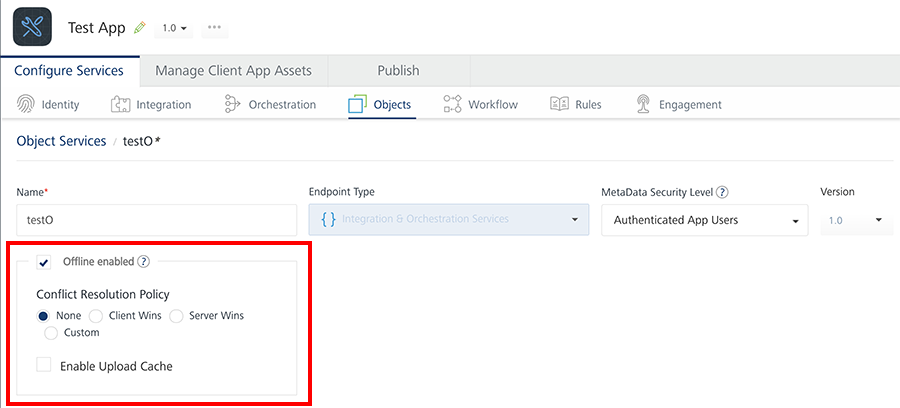

Upload Cache
============

Upload Cache feature maintains a cache of the uploaded records of offline objects in the server for a period of 24 hours.

Generally, during a synchronization process, the client app sends data with a unique request ID to the server. The server sends this data to the backend. During this process, the client app might not have received a success callback even though the data has been successfully received by the backend. This might be due to a network issue or poor network connectivity. In this case, the client app tries to resend the data to the server again and end up creating a duplicate copy. To solve this issue, the upload cache feature caches the request ID in the server. Now, when the client app tries to resend the data, the server checks the records in its database by using the request ID and updates the client app about the previous data reception.

The Upload Cache feature is helpful to the backends that are not capable of handling duplicate data. Hence, it is an optional feature.

This feature is supported for Android, iOS, Windows, Mobile Web, and Desktop Web channels from V8 SP4 Fix pack 17 onwards. The uploaded data is cached only for one day.

You can enable the upload cache feature in the Foundry Console under the Objects Service section. The **Enable Upload Cache** check box is displayed only when you select the **Offline enabled** check box.

The cached requests and responses are valid only for a period of 24 hours. This duration is not configurable. However, you can configure the following properties:

*   **upload.requestResubmitTime** is the maximum time that the client app waits before resubmitting the request to the data source. The default value for requestResubmitTime is 30 minutes.
    
    If the upload.requestResubmitTime property is not satisfied, that is if the current request is resubmitted before thirty minutes of the first request time, the following property is verified.
    
*   **upload.responseWaitTime** is the maximum time that the data source waits to re-check the cache for a response. Configure this parameter based on the approximate time taken by the back-end service to respond.

> **Note:**  
*   Make sure to enable the upload cache feature while configuring the object service. Otherwise, subsequent change to upload cache property will not reflect on the device, by default. The client app must use the [incrementalSetup](IncrementalSetup.md) or the [reset](Drop_Reset__and_Rollback.md) API in the client's sync environment.  
*   Upload Cache can have a performance impact because each request needs to be looked up in the cache.  
