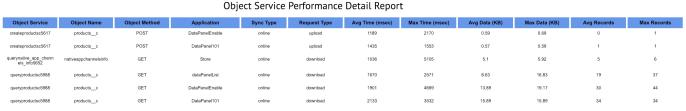
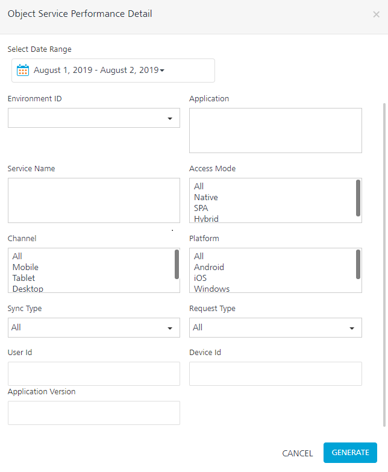
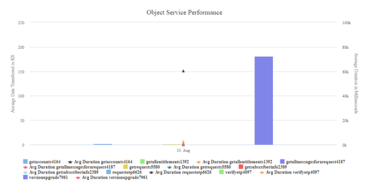
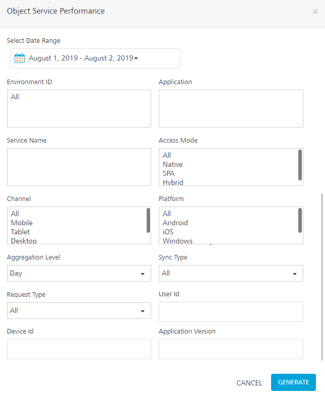

                           

You are here: Object Service Performance Detail

Offline Objects Reports
=======================

Offline Objects feature is a capability of Object Services that provides a simplified approach to synchronize data to a client app for offline access. Offline Objects improves the offline capability of apps.

From V8 SP4 onwards, you can monitor the performance of Offline Objects. Data from offline objects is captured and made available for reporting through Offline Objects Reports. You can view and assess performance parameters such as the amount of data transferred for an object or object service. These reports are displayed in the Standard Reports section as follows:

*   [Object Service Performance Detail](#object-service-performance-detail)
*   [Object Service Performance](#object-service-performance)

Object Service Performance Detail
---------------------------------

Object Service Performance Detail is a tabular report that displays the performance of object services. It gives detailed information of a transaction of an object service or an object method call.

Object Service Performance Detail displays the performance parameters such as the time taken to upload or download service in terms of **average time** and **maximum time**, data transferred in KB, and the number of records transferred.

> **_Note:_** Object Service Performance Detail Report shows only error-free transactions.

Object Service Performance Detail Report contains the following details:

*   **Object Service**: Name of the object service.
*   **Object Name**: Name of the object in the object service.
*   **Object Method**: Object Service HTTP Request method (such as POST, GET and so on).
*   **Application**: Name of the application that is used for the transaction.
*   **Sync Type**: Sync mode used for the transaction. **Online** and **Offline** are the two sync modes.
*   **Request Type**: Request type enables you to view the performance of object service separately for upload and download. **Upload** and **Download** are the two request types. The default value is both.
*   **Avg. Time**: Average time taken for a transaction to complete during the selected date range. It is represented in milliseconds.
*   **Avg. Data**: Average data transferred during the selected date range. It is represented in kilobytes.
*   **Avg. Number of Records**: Average number of records transferred during the selected date range.

> **_Note:_** `Average Time`, `Average Data` and `Average Records` are used to understand the performance of an Object Service over multiple service calls.

*   **Max Data**: Maximum data transferred during the selected date range. It is represented in kilobytes.
*   **Max Time**: Maximum time taken for a transaction to complete during the selected date range. It is represented in milliseconds.
*   **Max Number of Records**: Maximum number of records transferred during the selected date range.

> **_Note:_** `Maximum Time`, `Maximum Data` and `Maximum Records` are used to understand the deviation of the current average value from the average value in an ideal scenario.

### Filter Criteria

For more information about Filter Criteria, refer to [Reports Filter Criteria](VoltMX_Analytics_-_Standard_Reports/Reports_Filter_Criteria.md).

Object Service Performance
--------------------------

Object Service Performance is a graph or chart report that gives the performance of object services in terms of **Average Data Transferred** and **Average Time** for the service to either upload or download data per application service.

The following Object Service Performance report is the combination of a bar chart and a line chart with **Average Data Transferred in KB** whose scale is on the left side of the Y-axis and **Average Duration in Milliseconds** whose scale is on the right side of the Y-axis.

### Filter Criteria

For more information about Filter Criteria, refer to [Reports Filter Criteria](VoltMX_Analytics_-_Standard_Reports/Reports_Filter_Criteria.md).
