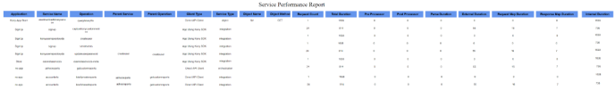
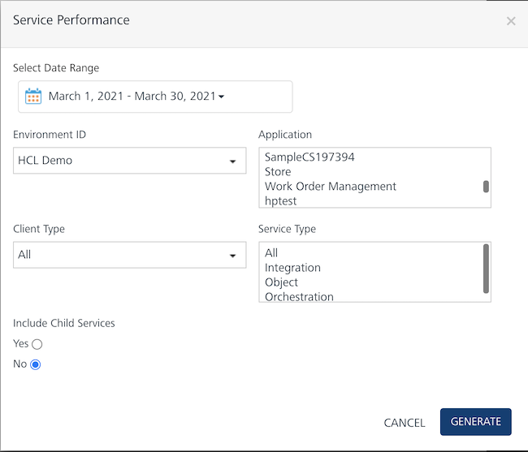
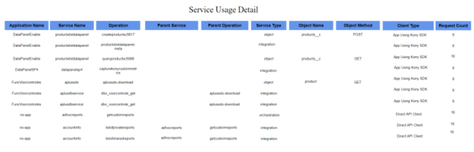
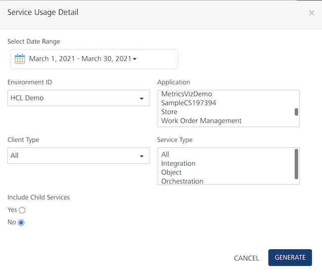
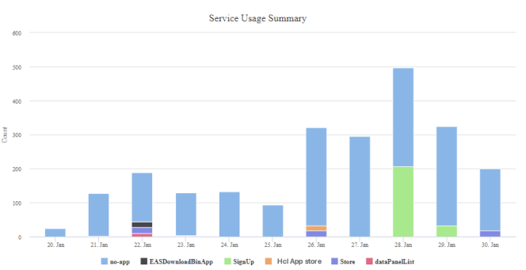
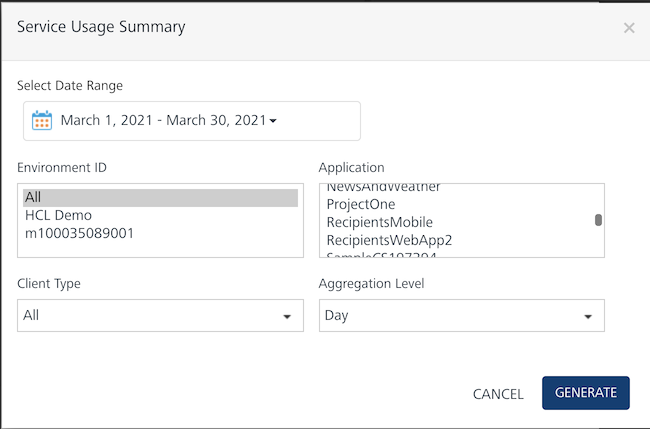

                            

You are here: Service Performance

API Management Reports
======================

Volt MX  Foundry APIs such as Integration, Orchestration, and Object Services can be invoked from a client app by using Volt MX Foundry SDK APIs. You can also invoke Volt MX Foundry APIs through HTTP calls to the service URL such as in the case of API management.

The data sent from the Direct API calls through API Management is also captured from V8 SP3 onwards. The API Management reports fetch data for both Direct API calls and Volt MX SDKs calls.

Service Performance
-------------------

Service Performance is a tabular report that displays the following information for a selected date range:

*   The services count.
*   The average duration of various phases of servicing the request per phase.
*   Data per object and operation.
*   Provides columns to differentiate the data either from Direct API or Client SDK.
*   Information about the service type such as Integration and Object services.

### Filter Criteria

For more information about Filter Criteria, refer to [Reports Filter Criteria](Reports_Filter_Criteria.md).

Service Usage Detail
--------------------

The Service Usage Detail report provides information about the API usage for a selected app and selected date range.

### Filter Criteria

For more information about Filter Criteria, refer to [Reports Filter Criteria](Reports_Filter_Criteria.md).

Service Usage Summary
---------------------

The Service Usage Summary report is a time series bar graph. It provides information about the API usage by an app for a selected environment.

### Filter Criteria

For more information about Filter Criteria, refer to [Reports Filter Criteria](Reports_Filter_Criteria.md).
