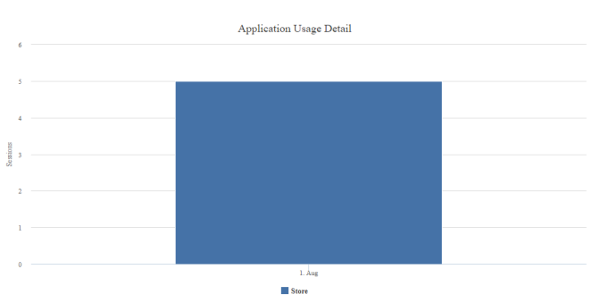
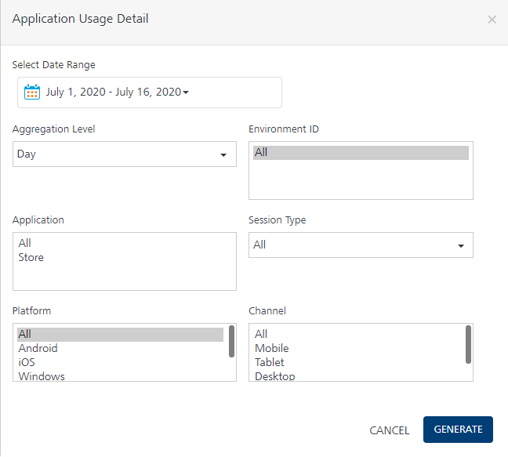
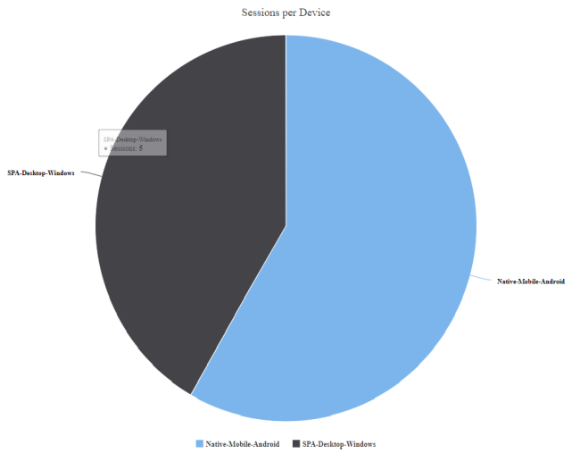
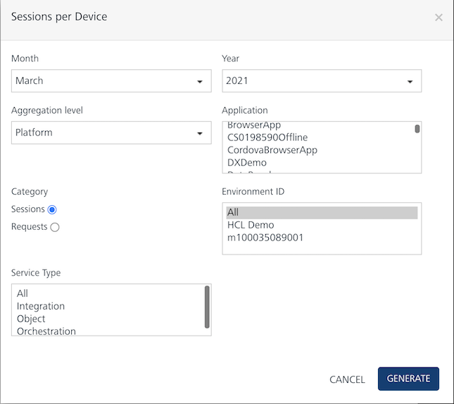
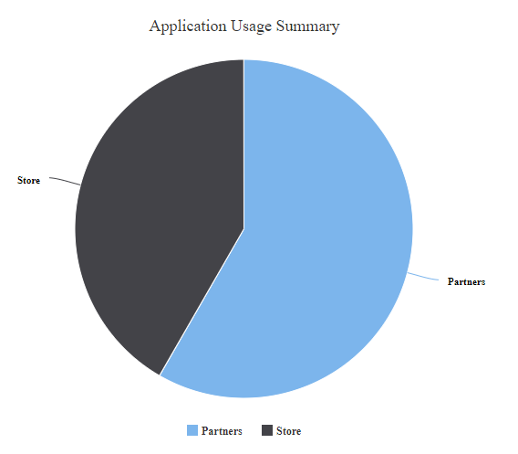
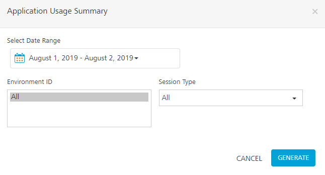
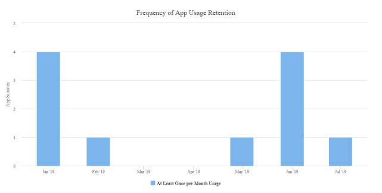
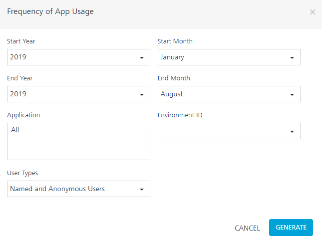

                            

You are here: Application Session

Application Activity Reports
============================

Application Session
-------------------

Application sessions are a measurement of app usage. The session creation and tracking logic are built into the client app. The client app generates a unique session ID for each session and sends it to the analytics service as part of the Volt MX metrics framework.

A session is defined as user interaction with an application either as an interactive session or triggered application logic executed in the background as a non-interactive session.

The app session begins when the app is started. It is continued until the app is idle for 30 minutes or until the user ends the app process or operating system explicitly closing the app. The maximum duration for a session is 4 hours. If an app session continues for 4 hours, a new session is automatically created by the client app from an analytics perspective, but the app functionality and ability to continue operating is not impacted.

Application Usage Detail
------------------------

Application Usage Detail report provides information about the usage of an application. It displays the data in the form of sessions per day, sessions per week, or sessions per month in a given date range.

### Filter Criteria

For more information about Filter Criteria, refer to [Reports Filter Criteria](Reports_Filter_Criteria.md).

Sessions per Device
-------------------

Sessions per Device is a pie chart that represents the application usage breakdown based on channel, application type, and platform.

### Filter Criteria

For more information about Filter Criteria, refer to [Reports Filter Criteria](Reports_Filter_Criteria.md).

Application Usage Summary
-------------------------

Application Usage Summary is a pie chart that represents the summary of user sessions grouped by an application.

### Filter Criteria

For more information about Filter Criteria, refer to [Reports Filter Criteria](Reports_Filter_Criteria.md).

Frequency of App Usage
----------------------

Frequency of App Usage report provides information about the usage of native application based on the frequency of usage. You can also view the users who used the app at least once per day, week, or month.

### Filter Criteria

For more information about Filter Criteria, refer to [Reports Filter Criteria](Reports_Filter_Criteria.md).
