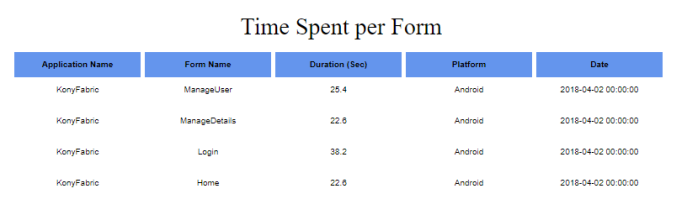

                             

You are here: Events API

Events and User Journey Reports
===============================

To track a user journey in an application, you can send data on application events by using Volt MX SDKs. User Journey provides information about pages that are visited and events fired in those pages in a sequence. This data can identify application usage patterns, such as trouble areas for end-users and aspects of the application that need improvement.

Client APIs are available to collect even data for reporting. 

Standard application events such as Form Entry, Form Exit, Service Request, Touch, Gesture, and Orientation can be reported by using the events API. Custom events from the application can also be reported.

Events API
----------

You can report the events using the following reference links:

*   [Volt MX Iris](../../../../Foundry/voltmx_foundry_user_guide/Content/VoltMXStudio/Installing_VoltMXJS_SDK.md#MetricsS)
*   [iOS](../../../../Foundry/voltmx_foundry_user_guide/Content/iOS/Installing.md#MetricsS)
*   [Android](../../../../Foundry/voltmx_foundry_user_guide/Content/Android/Installing_Android_SDK.md#InvokingMEtrics)
*   [PhoneGap](../../../../Foundry/voltmx_foundry_user_guide/Content/PhoneGap/Installing_PhoneGap_SDK.md#Invoking4)
*   [JavaScript](../../../../Foundry/voltmx_foundry_user_guide/Content/JS/Installing_JS_SDK.md#MetricsS)

> **_Note:_**  Besides the standard reports, the event data sent from API can be viewed as part of custom metrics domains to build [custom reports](../../../../Foundry/custom_metrics_and_reports/Content/CustomReports.md).

App Session Length
------------------

The App Session Length report provides the average app session length. It also provides the average app usage time per unique user ID.

> **_Note:_** To view the App Session Length report, enable the **Form Exit** event. Also, build your app with Volt MX Foundry Client SDK plug-in version V8 SP2 or later versions, and enable the application transition event for the best results.

### Filter Criteria

For more information about Filter Criteria, refer to [Reports Filter Criteria](Reports_Filter_Criteria.md).

Time Spent per Form
-------------------

The Time Spent per Form report is a tabular report that lists the average time an app user spends on each form within the application.

> **_Note:_** To view the Time Spent per Form report, enable the **Form Exit** event. Also, build your app with Volt MX Foundry Client SDK plug-in version V8 SP2 or later versions, and enable the application transition event for the best results.

### Filter Criteria

For more information about Filter Criteria, refer to [Reports Filter Criteria](Reports_Filter_Criteria.md).

Event Activity
--------------

The Event Activity report provides information about application events activity over a date range for one or multiple events. The report contains a count of events with event and event subtype information. For example, for a formEntry event, the activity shows forms entered as a subtype and shows all forms entered by the app in the selected date range.

### Filter Criteria

For more information about Filter Criteria, refer to [Reports Filter Criteria](Reports_Filter_Criteria.md).

**Custom Filter Criteria**:

In addition to standard filter criteria, the Events Activity report lets you define custom filter criteria. The custom filter criteria are optional.

You can add up to four filter criteria, and define the metric, condition, and value for the metric. The conditions to join with further custom metrics can also be chosen.

*   **Metrics** available for filtering are Event Sub Type, Flow Tag, Form ID, widgetID, Country, Region, Volt MX User ID, and Device Model.
*   **Conditions** available for filtering are <equals> and <not equals> and <like>.
*   **Value** is a text box that needs to be filled by running the report.
*   **Join** field takes **and** and **or** as values.

Event Summary
-------------

The Event Summary report is a pie chart that provides a summary of application events for an event over a selected date range.

It helps you to identify the comparative volume of an event use such as a form, service call, or custom event, enabling developers to focus on that are most used areas in the app.

### Filter Criteria

For more information about Filter Criteria, refer to [Reports Filter Criteria](Reports_Filter_Criteria.md).

Application Error Detail
------------------------

The Application Error Detail report is a tabular report that provides the details of errors, handled exceptions, and crashes that occurred in the application in a given time range.

The Application Error Detail report is best viewed when it is run for a specific narrow time stamp. Data can be exported to PDF and Excel format as the data can run into pages for error stack trace and crash reports.

The report displays the following fields:

*   **Application Name**: Name of the application in which the error occurred.
*   **Event type**: Specifies if it is an error (unhandled exception), Exception (handled exception), or Crash.
*   **Error Code**: Error code provided by error to identify the same by the application. It is an optional value.
*   **Error Message**: Error message field provided to the events API when an error is sent. It is an optional value.
*   **Time**: The time at which the error event occurred.
*   **Application Flow**: Obtained from the flowtag if the same was set when the event occurred. It is an optional value.
*   **Form ID**: The form in which the error occurred. It is an optional value.
*   **Widget**: The widget in which the error occurred. It is an optional value.
*   **Error in File**: Specifies the file in which the error occurred. This is available for JavaScript errors. It is an optional value.
*   **Error in Function**: Specifies the function in which the error occurred. It is an optional value.
*   **Error Line Number**: Specifies the line in a file where the error occurred. This is available for JavaScript errors. It is an optional value.
*   **Custom Error Message**: Any non-standard error message data sent to the events API when an error occurred will be displayed in this. It is an optional value.
*   **Stack Trace**: Stack trace of the error. It is an optional value.
*   **Crash Report**: Applicable only for crashes. It contains the crash report as sent to the API. It is an optional value. If the Crash Report's data exceeds 64KB, it will be truncated in the report.
    *   > **_Important:_** When the crash report exceeds 64KB, a text that says **(Download)** is appended to the truncated crash report data. If you click **(Download)**, the complete crash report is downloaded.  
          
        
*   **Crash ID**: It is a GUID that is used to distinguish each crash event uniquely. This field is populated only for Crash Events.
*   **Disk Memory Free**: It indicates free memory in the internal disk in MB.
*   **Disk Memory Total**: It indicates total memory in the internal disk in MB.
*   **SD Memory Free**: It indicates free memory available in SD card in MB.
*   **SD Memory Total**: It indicates total memory available in SD card in MB.
*   **Battery Charge Level**: It indicates battery level during the time of the crash. This will be a number indicator of available battery percentage.
*   **Memory usage – RAM**: It indicates the memory used when an app crashes.
*   **CPU Usage**: It indicates the percentage of CPU being used at the time of the crash.
*   **Network Type- Mobile Network vs Wifi (networktype)**: It indicates the type of network during the time of the crash. `mobilenetwork` and `wifi` are values of Network Type.

> **Note:**  
*   All fields do not have values in all scenarios. For example, an SD card is not applicable for iOS. So, the respective field will be null. Similarly, if any information is not obtained from a device during an error or crash, the same will reflect in the report.  
*   The Application Error Detail report displays a maximum of 100 records at a given time. The report is restricted to 100 records for optimal performance. If a selected time period has more than 100 records, it will display the latest/recent 100 records. The records of a specific event type can be displayed using the Event Type filter.  
*   App events (CMS or Crash reports) will be pushed to Volt MX Reports only when the events reach the batch\_size (buffer limit).      
    Default batch\_size is 50. This can be overridden using the setBatchSize(batchSize) API.  
    To push the events to Volt MX Reports irrespective of the batch\_size, the flushEvents() API can be used. Use the flushEvents() API or the appropriate batch\_size to report the events or crash data more frequently to Volt MX Reports according the requirement.
    For more information on the **setBatchSize(batchSize) API** and **flushEvents API**, refer to [Iris SDK > Invoking a Metrics Service > Configuring Application Events Reporting](../../../../Foundry/voltmx_foundry_user_guide/Content/VoltMXStudio/Invoking_Metrics_Service_Iris.md) section.  
    
### Filter Criteria

For more information about Filter Criteria, refer to [Reports Filter Criteria](Reports_Filter_Criteria.md).

Application Error Summary
-------------------------

The Application Error Summary report is a bar graph that shows error data grouped by error code in the aggregation duration over a selected time range.

This report provides information about the errors that occur and the rate at which they occur in a selected time range. This helps the business to acquire an idea of how often an application is prone to errors, and information about the type of errors in order to prioritize and fix them.

### Filter Criteria

For more information about Filter Criteria, refer to [Reports Filter Criteria](Reports_Filter_Criteria.md).

Application Crash Breadcrumbs
-----------------------------

The Application Crash Breadcrumbs is a tabular report that displays a maximum of 10 application events prior to crash events for an application.

> **_Note:_** For the App Crash Breadcrumbs report, build your app with Volt MX Foundry Client SDK plug-in version V8 SP3 or later for the best results.

### Filter Criteria

For more information about Filter Criteria, refer to [Reports Filter Criteria](Reports_Filter_Criteria.md).

### Reporting Data in App Crash Breadcrumbs

When an app crashes, some of the actual values for different platforms are not shown in the crash report.

> **_Note:_** The first time when the app crash occurs, the event is not sent with crash details to the metrics reports. Only when the user launches the app again, all the crash details are sent to the metrics reports, including Time details. The Time that is shown is when the app is relaunched.

The following table details the fields displayed in crash reporting for iOS:

  
| iOS ||
| --- | --- |
| Fields available in App Crash Report | Fields not available in App Crash Report |
| --- | --- |
| Event Type Error Type Plugin Version IDE Plugin Version Platform Crash Report Disk Memory Free Disk Memory Total Battery Charge level Memory Usage CPU Usage Network Type | Form ID widget ID Stack Trace |

The following table details the fields displayed in crash reporting for Android:

  
| Android ||
| --- | --- |
| Fields available in App Crash Report | Fields not available in App Crash Report |
| --- | --- |
| Event Type Error Type Error Code Error Message Form ID Network Type Plugin Version Platform Error in File Error in Function Error Line Number Memory Usage CPU Usage Stack Trace Crash Report Disk Memory Free Disk Memory Total SD Memory Free SD Memory Total Battery Charge Level | widget ID Time Application Flow |
| > **_Note:_** For more information on application crash reports, refer to [https://support.hcltechsw.com/csm?id=kb_article&sysparm_article=KB0083568](https://support.hcltechsw.com/csm?id=kb_article&sysparm_article=KB0083568) note: we provide values only when we are able to obtain them and is mentioned as optional in document link ||
