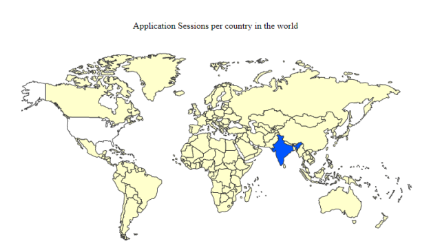
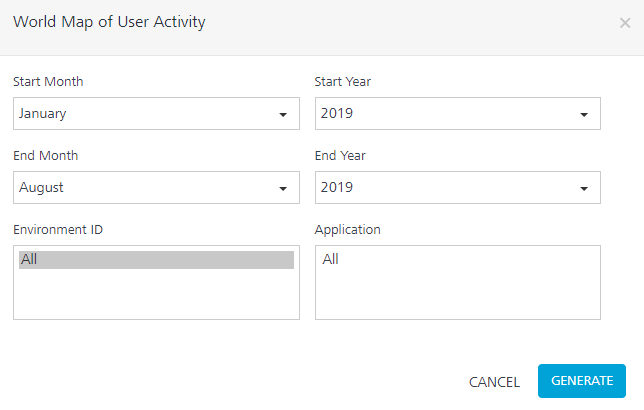
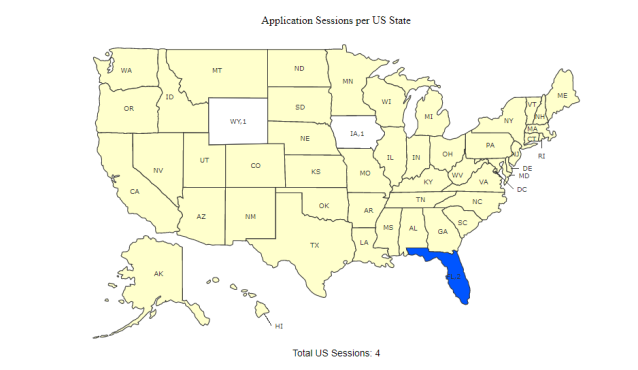
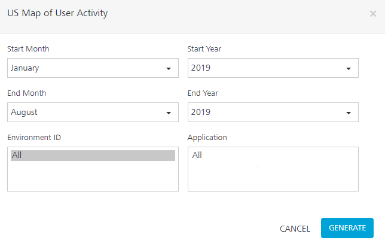

                            

You are here: World Map of User Activity

Location Reports
================

World Map of User Activity
--------------------------

The World Map of User Activity report provides information about user session based on the geolocation of a country.

The geolocation is obtained from the IP address of your device and traced to a location.

### Filter Criteria

For more information about Filter Criteria, refer to [Reports Filter Criteria](Reports_Filter_Criteria.md).

US Map of User Activity
-----------------------

The US Map of User Activity report provides information about user session based on the geolocation of a state.

The geolocation is obtained from the IP address of the end user's device and traced to a location.

### Filter Criteria

For more information about Filter Criteria, refer to [Reports Filter Criteria](Reports_Filter_Criteria.md).
