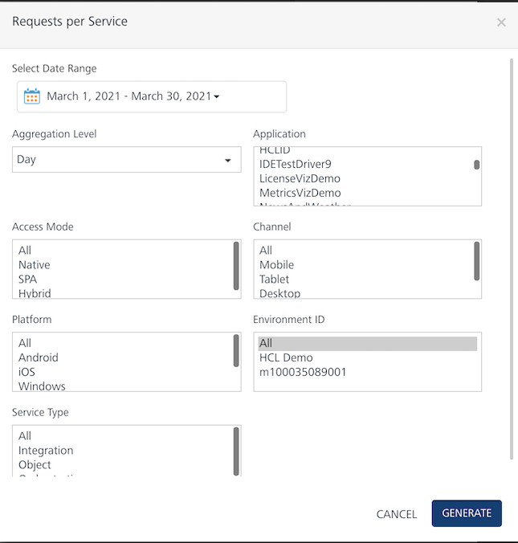

                            

You are here: Requests per Service

Sync Services Reports
=====================

Requests per Service
--------------------

The Requests per Service report provides a count of service requests based on sync service requests.

### Filter Criteria

For more information about Filter Criteria, refer to [Reports Filter Criteria](Reports_Filter_Criteria.md).

Service Duration
----------------

The Service Duration report provides the total number of calls per application service. This report includes minimum, average, and maximum time taken to download the call.

### Filter Criteria

For more information about Filter Criteria, refer to [Reports Filter Criteria](Reports_Filter_Criteria.md).

Service Duration Detail
-----------------------

The Service Duration Detail report provides the average service call duration. It is represented as a stacked bar that shows the time taken for each phase of the service call.

### Filter Criteria

For more information about Filter Criteria, refer to [Reports Filter Criteria](Reports_Filter_Criteria.md).
