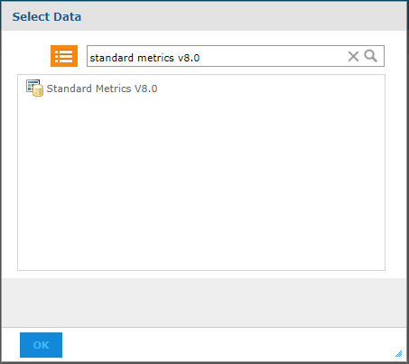

                           

You are here: [Reporting on Events](#reporting-on-events) > Standard Reports

Reporting on Events
===================

There are two types of reporting available on Events:

1.  [Standard Reports](#standard-reports)
2.  [Custom Reports](#custom-reports)

Standard Reports
----------------

You can view the events data gathered from the application through a set of standard reports.

1.  Cloud customers: Login to cloud console ([https://manage.hclvoltmx.com](https://manage.hclvoltmx.com/)) with your account credentials.  
    On-premise customers. Login to Volt MX Foundry console with your account credentials.
2.  Click the **Reports** tab in the left pane.
3.  Click the **Standard reports** tab on the secondary top pane. (this is also the default pane in reports )

Select one of the below reports

1.  Event Activity report: Allows user to view application events activity over a date range for one or more event types. The data shows a count of events with event and event subtype information.
2.  Event Summary report: a pie chart shows a summary of application events for a particular event over a date range grouped by visits, sessions, devices, or users.
    
    This allows a user to quickly identify comparative volume of use of a particular event like a form, service call, or custom event, enabling developers to focus on areas that are most used in the app.
    
3.  Application Error detail: This is a tabular report that can be used to view details of error, exception and crash events over a date range.  The level of detail available for an error or exception can vary for each error case depending on what data is available. JavaScript based errors have info on file and line of error, whereas crashes will have crash reports and could have stack traces.
    
    Check the [Events and User Journey Reports](../../../../Foundry/standard_metrics_reports_guide/Content/VoltMX_Analytics_-_Standard_Reports/Events_and_User_journey_reports.md) for more details.
    
    > **_Note:_** Typically it takes about 15 minutes for data to reflect in reports for cloud. For on-premise the data reflects in less than five minutes.
    

Custom Reports
--------------

The application events and user journey data that is collected from the client is also available for building custom reports for the application.

This can be used to track key business metrics and identify user trends or identify performance bottlenecks.

To build custom reports, follow these steps:

1.  Cloud customers: Login to cloud console ([https://manage.hclvoltmx.com](https://manage.hclvoltmx.com/)) with your account credentials.  
    On-premise customers: Login to Volt MX Foundry console with your account credentials.
2.  Click the **Reports** tab in the left.
3.  Click the **Custom Reports** tab.
4.  Click the **CREATE REPORT**.
5.  Select **Standard Metrics V8.0** in the Data Chooser pop-up so as to build custom reports for Events and Standard metrics.
    
    
    

6.  Choose table, Chart or Crosstab buttons shown at the bottom of the pop-up.
7.  Select metric fields from the left and build reports.
    
    > **_Note:_**  Refer to [Custom Reports section](../../../../Foundry/custom_metrics_and_reports/Content/CustomReports.md) for more details on building custom reports.
