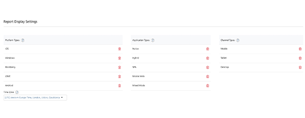
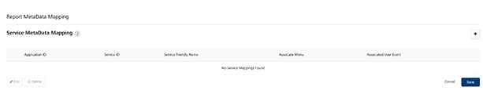
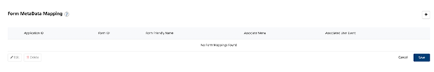

                            

Volt MX  Foundry console User Guide: [Reports](reports.md) > Configuring Report Settings

Configuring Report Settings
---------------------------

You can configure the report display settings for the following areas: 

1.  **Report Display Settings**: Configure report display settings, application types, channel types, and time zones.
2.  **Report MetaData Mapping**: Reports can display additional metadata about each service to enhance the readability of the report. The Service ID is returned from the data warehouse and you can specify a service friendly name, an associated menu which is related to the service call and/or an associated user event name which triggers at service call.
3.  **Form MetaData Mapping**: Reports can display additional metadata about each page or form within the app to enhance the readability of the report. The Form ID is returned from the data warehouse and you can specify a form friendly name, an associated menu which is related to viewing that form and/or an associated user event name that triggers the form to load.

Report Display Settings
-----------------------

Add or remove the platform types, application types, and channel types in the Report Display Settings area.

### Add or Delete Platform Type

Set the platform type names you require to be displayed in the platform aggregation selection box while creating a report.

1.  To add a platform type, click **Add**.
2.  To delete a platform type, click **Delete** across each row displayed.

### Add or Delete Application Types

Set the application type strings which you require to be displayed in the platform aggregation selection box while creating a report.

1.  To add an application type, click **Add**.
2.  To delete an application type, click **Delete**.

### Channel Types

Set the channel type names you require to be displayed in the platform aggregation selection box while creating a report.

1.  To add a channel type, click **Add**.
2.  To delete a channel type, click **Delete**.

### Time Zone

The time zone offset feature is used to calculate the delta of the timezone in which the customer wants to view the reports from UTC. The timezone offset feature is used in all queries to convert data from UTC to user’s timezone. Default will be UTC.

Report MetaData Mapping
-----------------------

The Report meta data mapping feature helps you add, edit, and delete the meta data mappings.

To add or delete a service meta data mapping, follow these steps

1.  Click **Add** to add a new row.
2.  Select an application ID from the **Application ID** drop-down list.
3.  Enter the service ID in the **Service ID** text box.
4.  Enter a service friendly name in **Service Friendly Name** box.
5.  Enter the associated menu in **Associate Menu** box.
6.  Enter the associated user event in **Associated User Event** box. : 
7.  Click **Save**. The mapping is created.
8.  To edit an existing mapping, select the mapping and click **Edit**.
9.  To delete a service meta data mapping, select the mapping and click **Delete**.

Form MetaData Mapping
---------------------

The Form meta data mapping helps you add, edit, and delete the meta data mappings of a form .

To add or delete a form meta data mapping, follow these steps: 

1.  Click **Add** to add a new row in form metadata mapping.
2.  Select the application ID from the **Application ID** drop-down list.
3.  Enter the form ID in the **Form ID** text box.
4.  Type the form friendly name in **Form Friendly Name** text box.
5.  Enter the menu associated in **Associate Menu** text box.
6.  Type the associated user event in **Associated User Event** text box.
7.  Click **Save**.
    
    The form metadata mapping is created.
    
8.  To edit an existing mapping, select the mapping and click **Edit**.
9.  To delete a service meta data mapping, select the mapping and click **Delete**.
