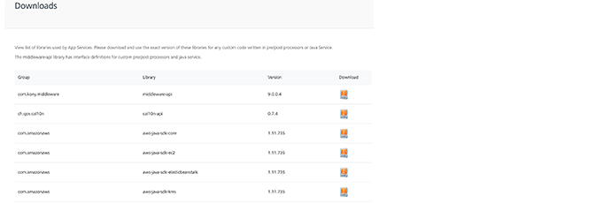

                            

Volt MX  Foundry console User Guide: Downloads

Downloads
=========

From the **Downloads** screen, you can view and download the exact version of libraries used in App Services. These libraries can be used in custom code defined for services, for example, Pre-processor, Post-processor or Java Service.

