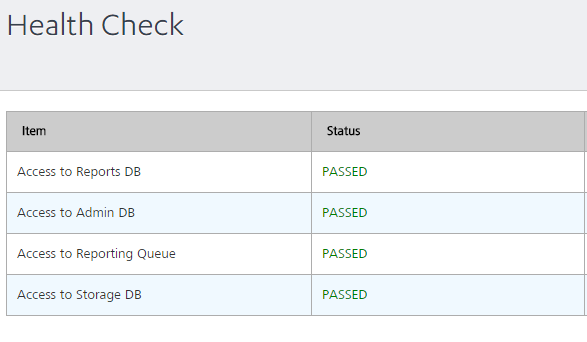

                            

Volt MX  Foundry console User Guide: Health Check

Health Check
============

Health check of App Services displays the access status of the different databases. The databases displayed in the page are responsible for retrieving the data to be displayed in the App Services.

A list of four databases with their status is displayed. The databases listed in the page are:

*   Access to Reports DB
*   Access to Admin DB
*   Access to Reporting Queue
*   Access to Storage DB



The status of the connection to the database is displayed in the health check screen. If the connection to access a particular database is lost, the status across that database is displayed as **FAILED**.

Following are the health check APIs for server :

```


For cloud
Get https://<host>/admin/healthcheck?output=json

Sample Response
{
  "healthCheck": "PASSED",
  "healthDetail": {
    "Access to Cache": "PASSED",
    "Access to Deployment Storage": "PASSED",
    "Cloud Environment Identification": "PASSED",
    "Access to Reporting Queue": "PASSED",
    "Access to Device DB": "PASSED",
    "Security Credentials": "PASSED",
    "Access to Admin DB": "PASSED",
    "Access to Storage DB": "PASSED"
  },
  "version": "xxxx"
}

For On-premises
Get http://<host>:<port>/admin/healthcheck?output=json

Sample Response
{
  "healthCheck": "PASSED",
  "healthDetail": {
    "Access to Reporting Queue": "PASSED",
    "Access to Admin DB": "PASSED",
    "Access to Reports DB": "PASSED",
    "Access to Storage DB": "PASSED"
  },
  "version": "xxxxx"
}

```
