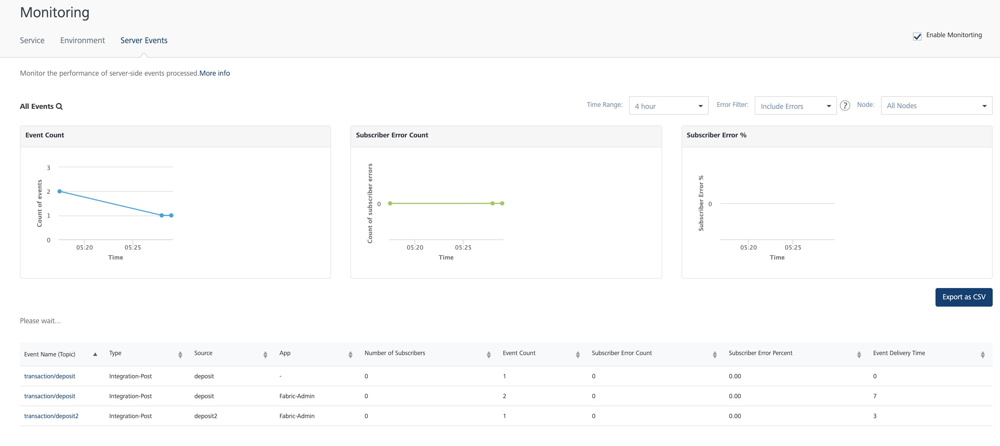
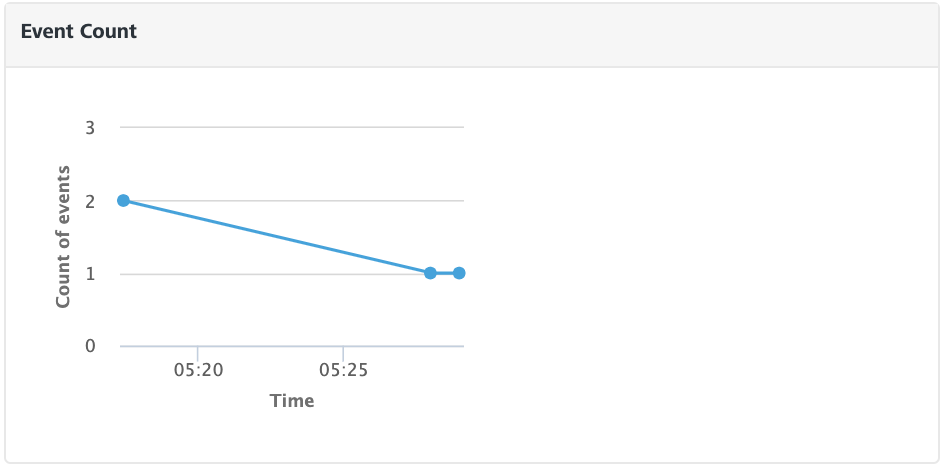
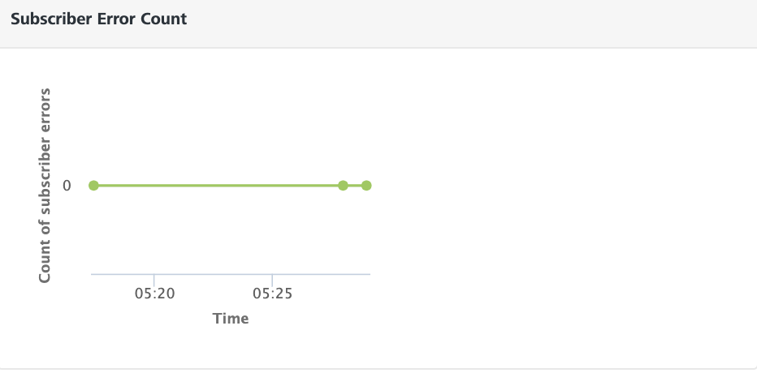
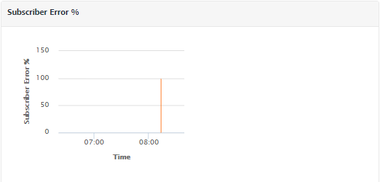
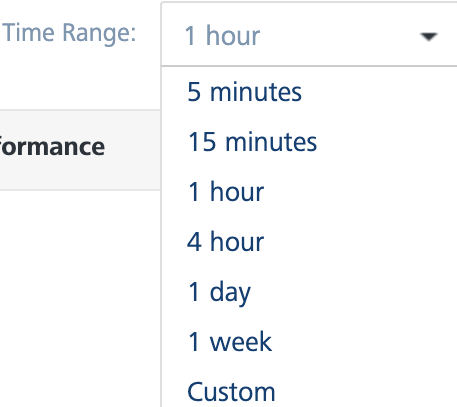
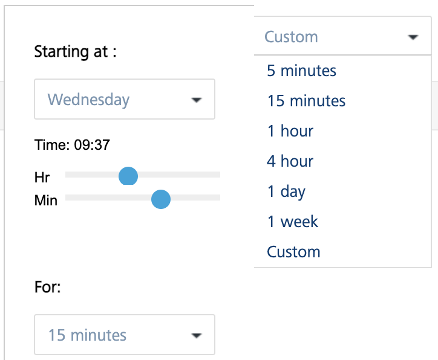
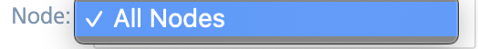

                            

Volt MX  Foundry console User Guide: [Monitoring](Monitoring.md) > Server Events

Server Events Monitoring
========================

Using App services you can monitor various details related to server events based on different filter criteria. You can monitor details like event count, subscriber error count, subscriber error count percentage, and so on. This monitoring dashboard provides real time information and, which is retained for a week.

**To access the Server Event Monitoring, follow these steps:**

1.  Log on to **App Services**. For more information on accessing App Services, refer to [Launching App Services](Launching_Admin_Console.md).
    
    Upon successful login, the **Web Apps** page appears.
    
2.  Click **Monitoring** from the left pane of the screen and select the **Server Events** tab.
    
    The **Server Events Monitoring** page appears.
    
    
    
    The **Server Events** tab displays the server events data as graphs which displays the details like event count (number of events created), subscriber error count, and subscriber error percentage as per the specified filter criteria. Use the **Search** field to view the monitoring data of the specific event. The following three graphs represent the real-time data monitoring:
    
    *   [Event Count](#eventcount)
    *   [Subscriber Error Count](#subserrorcount)
    *   [Subscriber Error Percentage](#subserrorperc)
    
    **Event Count**
    
    The graph displays the number of server events processed with respective to the selected filter criteria.
    
    
    
    **Subscriber Error Count**
    
    The graph displays the number of event subscribers that failed to process the event as per the filter criteria.
    
    
    
    **Subscriber Error Percentage**
    
    The graph displays the percentage of total number of event subscribers failed with respect to the total number of events triggered as per the selected filter criteria.
    
    
    
    Apart from the graphical view, you can also find the table that lists all the events and provides information about their related subscribers as follows:
    
    | Field | Description |
    | --- | --- |
    | Event Name (Topic) | Displays the name of topic name of the event. |
    | Type | Displays the type of service with which the event is related. For example, Integration Service, Object Service, and more. If the event is related to any custom code apart from any services, then this field displays Custom. |
    | App | Name of the foundry app related to the event. |
    | Number of Subscribers | Displays the number of subscribers listening to the event. |
    | Event Count | Displays the number of events triggered with the respective topic name. |
    | Subscriber Error Count | Displays the number of subscribers failed to process the event |
    | Subscriber Error Percentage | Displays the percentage of total number of events-subscriber fails with respect to the total number of events triggered. |
    | Event Delivery Time | Displays the total time taken to process the event. |
    

Click **Export to CSV** if you want to export the data in a CSV file format.

You can set filters to get the list of events as per your requirement. Following are the filter criteria available in the **Server Events Monitoring** tab:

*   [Time Range Filter](#time-range-filter)
*   [Error Filter](#error-filter)
*   [Node Filter](#Node)

### **Time Range Filter**

You can filter the data using the time range filter. The default time range of the processed events displayed is 15 minutes. Select a time range to view the list of processed events within the selected time range.

> **_Note:_** Any existing metrics are logged in batches into the DB at the end of every minute.

The following are the different time ranges displayed in the drop-down list:

*   5 minutes
*   15 minutes
*   1 hour
*   4 hours
*   1 day
*   1 week

**Custom Time Range**

Excluding the default time range displayed, you can also select the custom time range to view the list of processed events within the selected time range.

To select the custom time range, follow these steps:

*   In the **Time Range** drop-down list, select **Custom**.
    
    A pop-up is displayed to select the custom time range.
    
*   Select a day from **Starting at** drop-down list and select the **Hour** and **Minute** by using the slider.
*   Select the amount of time the data to be captured from **For** drop-down list.
    
    The page displays the list of processed events within the selected custom time range.
    

### **Error filter**

You can filter the events that had errors while processing within the selected time range. You can choose the options displayed from the **Error Filter** list.

*   **Include Errors**: Displays the count of the events that had errors while processing within the selected time range
*   **Exclude Errors**: Excludes the count of errors from the list of metrics displayed.
*   **Errors Only**: Displays only those processed events that have errors.

### Node Filter

Nodes represent the different server instances that comprise the environment. The name of the node is determined by the first value found from a JVM -D of VOLTMX\_SERVER\_NODE\_NAME, the host name of the machine or the MAC address with a generated hash ID.

The performance of **All** the nodes is displayed by default. You can choose the nodes you want to monitor from the **Node** drop-down list.

