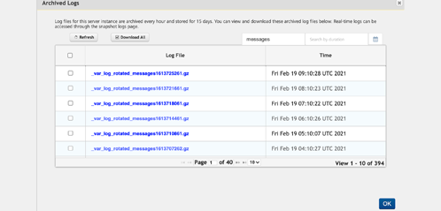

                            

Volt MX  Foundry console User Guide: [Logs](Logs.md) > Cloud Logs

Standard Logs
-------------

A log file is automatically created and maintained by the server. The log file displays the list of activities performed by the device and the server. The **Standard Logs** page in **Logs** displays the ways of tracking different types of logs which are displayed in App Services.

**Request and Response Trace Logs**: The request and respond trace logs allow you to trace all the incoming requests and response payloads from the client to middleware and middleware to the back-end server.

*   **Trace All Client Request and Response**: Click the check box to trace all the incoming requests and response payload from clients.
*   **Trace All Back-end Request and Response**: Click the check box to trace all the incoming requests and response payload from the back-end.

> **_Note:_** Enabling full request and response trace logs will impact the server performance. So, do not enable the trace for long periods or during the high traffic.

### **Log Level by Class**

In the Log Level by class, we can set the default root log level for a particular class/package.

**To configure log level for class/package**

1.  Provide the class/package name in the text box provided under the **Log level by class** section.
2.  Set the log level for each class/package by selecting the type of log level from the drop-down.
    
    The various types of log levels are:
    
    *   **TRACE**: The trace log level displays the detailed information of the server and the service operations. The information in the file includes operations performed by the client, middleware and the back-end server.
    *   **DEBUG**: The debug log level displays the detailed information which is useful to debug the incoming requests or response payloads in different log files.
    *   **INFO**: Displays the log level informational messages which highlight the progress of the application.
    *   **WARN**: Displays the warning messages which occur while capturing incoming requests and response payloads.
    *   **ERROR**: Displays the error messages which occur while capturing incoming requests and response payloads but still allows the application to continue running.
    *   **FATAL**: Displays the severe error messages which leads the application to abort.
    *   **OFF**: Turns off the logging..
3.  Click **Save** after completing all the configurations.

#### Verbose Logging for Trace and Debug Logs

When you select the **Root Logger** to **Trace** or **Debug** log levels, a **Verbose Log Duration** drop-down list is displayed for limited duration. The available options are 15, 30, and 60 mins with 30 mins is selected, by default.

After selecting the **Verbose Log Duration**, click **Save**.

> **_Note:_** **Verbose Log Duration** can only be turned on for a limited duration as it impacts the server performance.

Once the verbose log is enabled, a message **Verbose logs on until $time** is displayed with **Extend by 15 minutes** and **Verbose off** buttons.

Once the duration of the verbose log is complete, the verbose logging will be turned off.

#### Extending the Verbose Log Duration

To extend the verbose log duration, click **Extend by 15 minutes**.

Verbose log can be extended only by fifteen minutes from the current duration. If the current expiry time is greater than fifteen minutes from the current time, a message appears stating the current expiry time cannot be modified.

#### Verbose Off

You can cancel the verbose logging on duration, by clicking **Verbose Off**. A message appears asking for the confirmation. Click **Yes** to turn the verbose logging off.

### **Log Level by Client Filter**

The log level by client filter displays the server side log level for the specific request based on the user Id, app Id, device Id, client IP and service name.

**To filter the log level by client, follow these steps:**

1.  Select the parameter by clicking the drop-down menu. The parameter values are:
    
    | Field | Description |
    | --- | --- |
    | Login ID | This refers to the userID field set in the application. This can be set by using an identity service or by using `voltmx.setUserID()` in the application. Refer [VoltMX Iris SDK > setuserID API](../../../Foundry/voltmx_foundry_user_guide/Content/VoltMXStudio/Installing_VoltMXJS_SDK.md#Setting) |
    | App ID | This refers to the Volt MX Foundry appId that is available when an app is published to an environment. The AppID is available from the app service document from the Publish page for the app in Volt MX Foundry console (give example) like Refer [VoltMX Foundry > Publish > App Service Document](../../../Foundry/voltmx_foundry_user_guide/Content/Publish_LifeCycle.md#app-service-document-object-services-metadata-and-sync-client-code) |
    | Service ID | This refers to the Service Name of the service. |
    | Device ID | This refers to the deviceID of the device obtained from the client app. You can print the test value for the same using the `voltmx.os.deviceinfo.deviceid` API. For more information on DeviceID, refer [Iris API Dev Guide > voltmx.os\_objects\_deviceinfo](../../../Iris/iris_api_dev_guide/content/voltmx.os_objects_deviceinfo.md). |
    | IP Address | This refers to the external IP address of the client device. You can find the IP address of the client device in the HTTP payload returned from the device.The external IP address is also available from custom reports for service calls from a device.If you are using a test device, you can alternatively visit [https://www.whatismyip.com](https://www.whatismyip.com/) from the device to know the external IP address of the device. |
    
2.  **IP Address**: Select the **IP Address** option in **Select Parameter** drop-down and provide the client IP address in the adjacent text box.
3.  Similarly for Login ID and Service ID, select the option from the **Select Parameter** drop-down and provide the required details.
4.  Click **Enable Log Level Override from Client** checkbox to enable the log level override from client.
    
    The feature helps the client to send a request header named X-VoltMX-Log-Level-Override to the server during a service invocation. The feature further sets the server side log level for the specific request allowing the client to turn on and off debug for their session.
    
5.  Set the log level by selecting the type of log level from the drop-down list.
    
    The various types of log levels are:
    
    *   **TRACE**: The trace log level displays the detailed information of the server and the service operations. The information in the file includes operations performed by the client, middleware and the back-end server.
    *   **DEBUG**: The debug log level displays the detailed information which is useful to debug the incoming requests or response payloads in different log files.
        
        > **_Note:_** Enabling **Log Level** type as **Debug** or lower will also enable **Service Monitoring** feature in V8SP2 or higher versions of the server. If the **Service Monitoring** feature is disabled, service monitoring data is captured only for the users matching the client log filter criteria. If the **Service Monitoring** feature is enabled, the client log level set here has no effect and data is collected for all the users. For more information on Service Monitoring feature, refer [Service Monitor](Monitoring_1.md).
        
    *   **INFO**: Displays the log level informational messages which highlight the progress of the application.
    *   **WARN**: Displays the warning messages which occur while capturing incoming requests and response payloads.
    *   **ERROR**: Displays the error messages which occur while capturing incoming requests and response payloads but still allows the application to continue running.
    *   **FATAL**: Displays the severe error messages which leads the application to abort.
    *   **OFF**: Turns off the logging.
6.  Click **Save** after completing all the configurations.

Click **Save** to save the changes done in the **Logging** page.

Click **Cancel** to abort the changes.

### Cloud Logs

The **Cloud Logs** view in Volt MX Foundry App Services Console enables you to verify server logs in the cloud environment. The page displays a list of instances with Instance ID and the links to view the **Archived** and **Snapshot** Logs. If the number of logs is more than 10, you can use the Next or Previous options.

There are two types of cloud logs:

*   [Archived Logs](#archived-logs)
*   [Snapshot Logs](#snapshot-logs)

#### Archived Logs

The log files for this server instance are archived every hour and stored for fifteen days. You can view and download these archived log files. If the number of archived log files are more than ten, you can use Next or Previous options.

The screen displays the following fields.

  
| Field Name | Description |
| --- | --- |
| Refresh | Click to refresh the logs. For more information, refer [Refresh Logs](#refresh-archived-logs). |
| Download All | Click to download all the logs. For more information, refer [Download All logs](#download-all-logs). |
| Download Selected | Select any desired logs and click **Download Selected** to download the selected logs. For more information, refer [Download Selected](#download-selected-logs). |
| Search by Name | Search the logs by log name. For more information, refer [Search Archived Logs by Name](#search-archived-logs-by-name). |
| Search by Duration | Search the logs by duration. For more information, refer [Search Archived Logs by Duration](#search-archived-logs-by-duration). |
| Log file | Displays the list of archived logs . |
| Time | Displays the date and time when the logs are generated. |

You can perform the following actions in this screen:

*   [Download All Logs](#download-all-logs)
*   [Download Selected Logs](#download-selected-logs)
*   [Refresh Archived logs](#refresh-archived-logs)

*   [Search Archived Logs by Name](#search-archived-logs-by-name)
*   [Search Archived Logs by Duration](#search-archived-logs-by-duration)

##### **Download All Logs**

**To download all the archived log files, follow these steps:**

1.  On the Archived Logs page, click **Download All**.
    
    A pop-up appears with the message, **Are you sure you want to download all Log files?**.
    
    
    
2.  Click **OK** to download the selected archived log files.
    

##### **Download Selected Logs**

**To download the selected logs, follow these steps:**

1.  On the **Archived Logs** page, select the check box to the right of the log file(s) you want to download and click **Download Selected**.
    
    
    
    A pop-up appears with the message, **Are you sure you want to download selected Log files?**.
    
    
    
2.  Click **OK** to download the selected archived logs.

##### **Refresh Archived Logs**

Click **Refresh** from the Archived Logs page to refresh the logs.

The Archived Logs are refreshed.

##### **Search Archived Logs by Name**

You can search the archived logs by log name.

*   Enter a log name in the **Search** field to search for a particular log.
    
    
    
    The **Archived Logs** are filtered based on the search criteria.
    

##### **Search Archived Logs by Duration**

You can select a duration to search for the logs within a time period.

*   Click **Calendar** to the right of the **Search by Duration** field to select From and To date.
    
    Or
    
*   Enter the From and To date in the **Search by Duration** field.
    
    
    
    The Archived Logs are filtered for the selected time period.
    

#### Snapshot Logs

Snapshot Logs include the last manual log snapshot fetched from the server. The logs listed in the table are periodic snapshots of the log files and could not contain the latest log data. You can view and download the snapshot log files. You can initiate manual snapshot of all the logs on all the servers. If the number of snapshot log files are more than 10, you can use Next or Previous options.

Click **View Snapshot Logs** from the cloud logs tab to view the snapshot logs.

The screen displays the following fields.

  
| Field Name | Description |
| --- | --- |
| Refresh | Refreshes the displayed logs. |
| Download All | Select to download all the snapshot logs. For more information, refer [Download All Snapshot Logs](#download-all-snapshot-logs). |
| Download Selected Logs | Select the desired logs and click **Download Selected** to download the selected logs. For more information, refer [Download Selected Snapshot Logs](#download-selected-snapshot-logs). |
| Request Latest Logs | Click to request the latest logs. For more information, refer [Request Latest Snapshot Logs](#request-latest-snapshot-logs). |
| Search by Name | Search logs by log file name. For more information, refer [Search Snapshot Logs by Name](#search-snapshot-logs-by-name), |
| Log File | Displays the list of Snapshot logs. |
| Time | Displays the date and time when the logs generated. |

You can perform the following actions in this window:

*   [Refresh Snapshot Logs](#refresh-snapshot-logs)
*   [Download All Snapshot Logs](#download-all-snapshot-logs)
*   [Download Selected Snapshot Logs](#download-selected-snapshot-logs)
*   [Request Latest Snapshot Logs](#request-latest-snapshot-logs)
*   [Search by Snapshot Logs by Name](#search-snapshot-logs-by-name)

##### **Refresh Snapshot Logs**

Click **Refresh** from the Snapshot Logs page to refresh the logs.

The Snapshot logs are refreshed.

##### Download All Snapshot Logs

**To download all the snapshot log files, follow these steps:**

1.  On the Snapshot Logs page, click **Download All**.
    
    A pop-up appears with the message, **Are you sure you want to download all Log files?**.
    
    
    
2.  Click **OK** to download the selected snapshot log files.
    

##### **Download Selected Snapshot Logs**

**To download the selected logs, follow these steps:**

1.  On the **Snapshot Logs** page, select the check box to the left of the snapshot file(s) you want to download and click **Download Selected**.
    
    
    
    A pop-up appears with the message, **Are you sure you want to download selected Log files?**.
    
    
    
2.  Click **OK** to download the selected snapshot logs.

##### Request Latest Snapshot Logs

To refresh the snapshot logs and to reload the table with new snapshots available for download,

1.  Click **Request Latest Logs**.
    
    A pop-up appears with the message, **Are you sure you want to get latest Log files?.**
    
    
    
2.  Click **OK** to download the latest log files.
    
    The manual snapshots of the logs are typically available within five minutes.
    

##### Search Snapshot Logs by Name

You can search the archived logs by log name.

Enter a log name in the **Search** field to search for a particular log.

The **Snapshot Logs** are filtered based on the search criteria.
