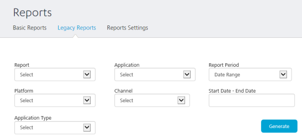

                            

Volt MX  Foundry console User Guide: [Reports](reports.md) > Using Legacy Reports

Legacy Reports
--------------

The legacy reports tab will point to legacy data source and you can generate reports on them.

> **_Note:_** To access the legacy reports database, ensure that you have configured voltmxreports.home environment property points to a valid directory and a JNDI entry for voltmxadminreports.jndi.name exists to access the Legacy reports database. Legacy Reports is only needed if you have upgraded from a 5.x Volt MX Server instance and need to run reports on data captured before the 6.x upgrade.

You can generate the following legacy reports in Volt MX Foundry Integration Service App Services portal:

  
| Report | Description |
| --- | --- |
| Traffic Report Service Requests (Native/SPA) | Traffic report for the service requests received. |
| Traffic Report Visitors (Native/SPA) | Traffic report for the session invoked by visitors. |
| Device Summary Report (Thin client) | Summary report of the page views per thin client platform with date aggregation modes day, week, and the month. |
| Traffic Report-TC-Page Views | Traffic report of the page view per thin client platform. |
| Traffic Report – TC - Visitors | Traffic report of the session invoked by visitors per thin client platform. |

To generate a legacy report, perform the following actions:

1.  Log in to the **App Services** and click **Reports** from the left pane of the screen.
    
    By default, the **Basic Reports** screen is displayed.
    
2.  In the **Basic Reports** screen, click **Legacy Reports** tab from the top pane.
    
    The **Legacy Reports** screen is displayed.
    
3.  Click the **Report** drop-down list and select the appropriate report to be generated.
4.  Click the **Application** drop-down list and select an application.
    
    All applications deployed are available in the list.
    
5.  Select the **Data Range** for which the report should be generated.
6.  Select the **Platform** under which the report should be generated.
7.  Select the **Channel** under which the report should be generated.
8.  Select the **Start Date** and **End Date** for the report to be generated.
9.  Select the **Application Type** from the drop-down list.
10.  Click **Generate** to generate a legacy report based on the criteria selected.
    
    A legacy report with the provided criteria is displayed on the screen.
    
11.  You can download the generated report by clicking on **Download as CSV** option.
