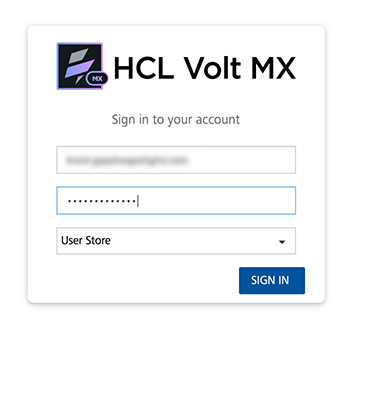
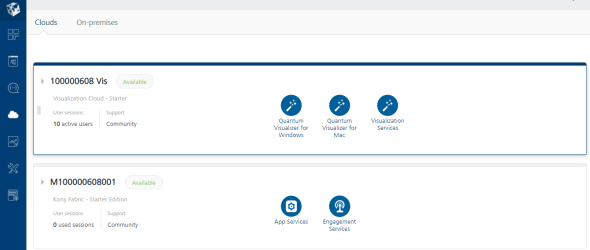
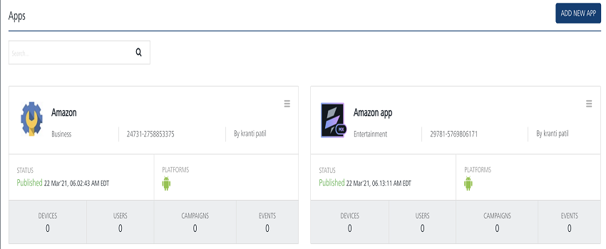
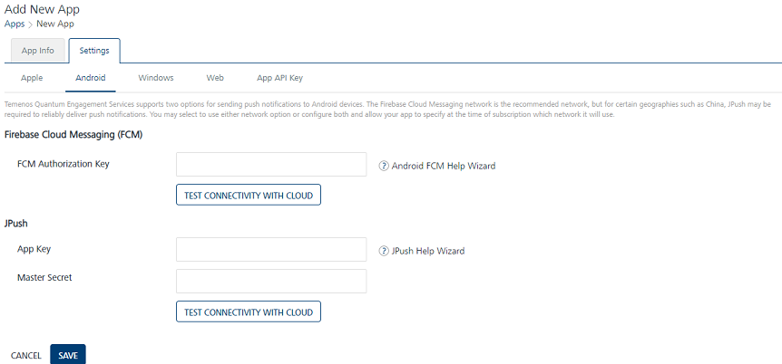
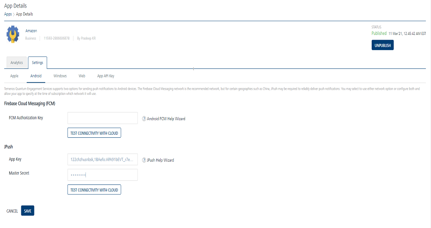
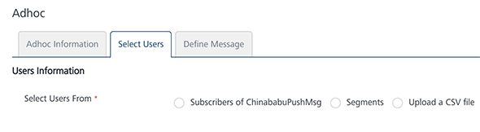
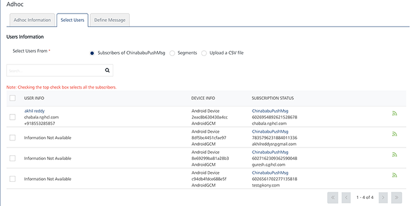
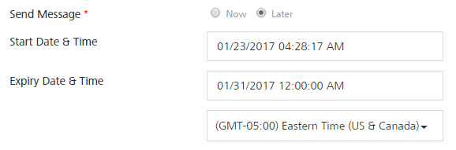

                           

Engagement Services JPush QuickStart Guide: Configuring JPush in Volt MX Foundry Engagement Services Console

Configuring JPush in Volt MX Engagement Services Console
========================================================

The section explains how to configure **JPush** in Volt MX Engagement Services Console.

To configure **JPush** in the **Engagement Services** console, follow these steps:

1.  Open an Internet browser.
2.  Enter the URL: _manage.hclvoltmx.com_ in the address field and press the **Enter** key.
    
    The **Sign in to your HCL Account** page appears.
    
    
    
3.  Enter your email address and password as log in credentials.
4.  Click **Sign in** to continue.
    
    The system displays the **VoltMX Foundry** homepage.
    
5.  On the Volt MX Foundry home page, click **Environments** in the left panel.
    
    The **Clouds** page appears.
    
    
    
6.  Click the **Engagement Services** tab next to the **Sync Services** tab.
    
    The **Engagement Services** home page (Dashboard) appears.
    
    Apps
    ----
    
7.  **Engagement** services: In the left panel,under **Overview**, click **Apps** to view the application(s) configured in the **Engagement** services console.
8.  Click the required app. For example, **VMSDempApp**, to set the **JPush** credentials.
    
    
    
    The **App Details** page appears. There are two tabs: **Analytics** and **Settings**. By default, the **Analytics** tab is set to active.
    
9.  Click the **Settings** tab.  
    The system displays four tabs: **Apple**, **Android**, **BlackBerry**, and **Windows**. By default, the **Apple** platform tab is set to active.
10. Click the **Android** tab to view the **JPush** section.
    
    
    
11. In the **JPush** section, enter the **App key** and the **Master Secret** that you received when the account was registered with **JPush**console.
    
    
    
12. Click the **Test Connectivity with Cloud** button to test the credentials. If the credentials are correct, the system displays the confirmation message dialog box: JPush server connection is successful.
13. Click **Ok** to continue.
14. Click **Save**.  
    The updated **VMSDemoApp** appears in the Apps list view.
    
    Adhoc
    -----
    
15. **Adhoc**: In the left panel, from the **Engagement** section, click **Adhoc**.
    
    The **Adhoc** page appears with three tabs: **Adhoc Information**, **Select Users**, and **Define Message**. By default, the **Adhoc Information** tab is set to active.
    
    
    
16. **Select Channel**: Select the **Push Message** channel from the drop-down list.
    
    The **Select Application** drop-down list appears.
    
    
    
17. **Select Application**: Select **VMSDemoApp** from the drop-down list.
18. Click the **Next -Select Users** button to continue. The **Select Users** tab becomes active.
    
    
    
19. Select the option as **Subscribers of VMSDemoApp**.
    
    
    
    The user list view displays the users associated with **VMSDemoApp**.
    
20. Select the users from the list view to send the push message.
21. Click **Next - Define Message** to continue.
    
    The **Define Message** tab becomes active. The screen displays the **Push Message** fields.
    
    
    
    The **Define Message** page includes the **Message Information** section to add a new push message. The **Message Type** field includes the following two options to add a new push message:
    
    *   Silent Push
    *   Standard Push  
        By default, the message type option is set to **Standard Push**.  
        
22. **Standard Push**: In the **Push Message Section**, enter the **Message Title** and the push message in the **Message Box**. If required, select the personalization attributes.
23. **Enable Rich Push**: Select the check box to associate the rich push. To customize your text, you can use the **Rich Text Editor** tool available at the top of **Rich Content** box.
24. **Silent Push**: Check the check box, if you wish to enable the silent push option. 
    
    When you check the **Silent Push** option, the system displays platform-specific properties fields only. This is because the **Message Title** and the **Message Text** fields are not applicable for silent push.
    
25. Choose the **Now** option to send the notification immediately. Click **Send** to deliver the push message.
26. Click the **API Payload** button to get details of the API call that can be used by a third party system to send notifications.
27. If you want to schedule the message delivery at a later day and time, choose the **Later** option on the **Adhoc Information** screen.
28. Select the **Start Date and Time** and the **Expiry Date and Time**.
29. Click **Schedule Notification** to schedule the message delivery later.
    
    
    
    > **_Note:_** When the expiry date is provided, the Engagement server ensures that the push message is not sent to the user after the set time.
